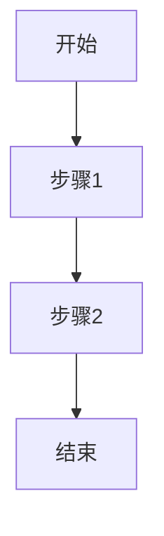

<!-- From: /home/xingwangzhe/桌面/staluxmyblog/AGENTS.md -->

# Frontmatter 写作规范

本文档描述了 stalux 博客中 `stalux/posts/` 目录下 Markdown 文章的 frontmatter 编写规范。

## 格式概述

所有文章必须使用 YAML 格式的 frontmatter，以 `---` 开头和结尾。

```yaml
---
title: 文章标题
date: "YYYY-MM-DD HH:MM:SS"
abbrlink: 短链接标识
tags:
    - 标签1
    - 标签2
categories:
    - 分类1
updated: "YYYY-MM-DD HH:MM:SS"
draft: false
---
```

## 字段说明

### 必填字段

| 字段       | 类型   | 说明                                                                 | 示例                                                 |
| ---------- | ------ | -------------------------------------------------------------------- | ---------------------------------------------------- |
| `title`    | string | 文章标题，与文件名一致（文件名去除扩展名）                           | `title: 在Linux上玩Flash网页游戏-洛克王国`           |
| `date`     | string | 发布日期，必须用双引号包裹，格式为 `YYYY-MM-DD HH:MM:SS`             | `date: "2026-03-27 14:30:00"`                        |
| `abbrlink` | string | 短链接标识，用于文章的永久链接。可以是语义化缩写，也可以是随机字符串 | `abbrlink: play-flash-luoke` 或 `abbrlink: cbab25fa` |

### 可选字段

| 字段         | 类型    | 说明                                                          | 默认值            |
| ------------ | ------- | ------------------------------------------------------------- | ----------------- |
| `updated`    | string  | 最后更新日期，格式同 `date`                                   | -                 |
| `tags`       | array   | 文章标签数组。**所有标签必须小写**。空数组使用 `tags: []`     | `[]`              |
| `categories` | string  | 文章分类，**默认只允许一个，必须小写**                        | -                 |
| `draft`      | boolean | 是否为草稿，`true` 表示不发布                                 | `false`           |
| `cc`         | string  | 版权协议                                                      | `CC-BY-NC-SA-4.0` |
| `cover`      | string  | 封面图片 URL，用于文章卡片和详情页展示，同时作为 SEO 分享图片 | -                 |

### 自动生成字段

以下字段由 remark 插件在构建时自动生成，**不需要手动填写**：

- `desc` - 文章摘要
- `minutesRead` - 预计阅读时间
- `wordCount` - 文章字数

## 格式示例

### 完整示例

```yaml
---
title: 2025年终总结
abbrlink: cbab25fa
date: "2025-12-31 18:37:55"
updated: "2025-12-31 19:37:07"
categories: 年终总结
cover: /images/2025-summary-cover.webp
tags:
    - 记录
    - 年终总结
---
```

### 简洁示例（内联数组）

```yaml
---
title: Astro 5.17构建性能优化实践：从18s到13s
abbrlink: astro-517-performance-optimization
date: "2026-02-02 19:52:00"
tags: [Astro, 性能优化, 前端, ssg]
categories: 技术
---
```

### 新文章草稿示例

```yaml
---
title: 在Linux上玩Flash网页游戏-洛克王国
abbrlink:
date: ""
categories:
tags: []
---
```

## 缩进规范

- 使用 **4个空格** 缩进（不要使用 tabs）
- 数组块格式中，`-` 后面跟一个空格再写内容
- 字符串不需要引号，除非包含特殊字符或者日期格式（日期必须用引号）

## 验证

请参考 `content.config.ts` 中的 Zod schema 进行类型校验：

- `title` 必须是字符串
- `abbrlink` 必须是字符串或可转为字符串
- `date` 必须可转为 Date 类型
- `tags` 必须是字符串数组
- `draft` 默认为 `false`

---

# 写作风格指南

本指南总结了 stalux 博客的写作风格，确保 AI 生成的内容符合博主的个人风格。

## 一、整体风格定位

### 1.1 身份定位

- **身份**：东北大学计算机专业学生、开源爱好者、技术博主、Stalux 主题作者
- **立场**：自由软件/FSF 支持者、信息安全关注者、终身学习者、反 AI 垄断
- **态度**：务实、批判性思考、乐于分享、强烈的版权与许可意识、偶尔自嘲

### 1.2 语气特征

- **亲切自然**：像和朋友聊天，不使用过于正式的学术腔
- **热情直率**：对技术有热情，观点明确不模棱两可
- **幽默诙谐**：善用网络用语、段子，自嘲式幽默
- **真诚反思**：敢于承认自己的不足和错误
- **有温度**：有情绪波动，不是冷冰冰的技术文档

## 二、语言风格

### 2.1 用词特点

#### 强调方式

- 使用 `**加粗**` 强调关键词和重要概念
- 使用反引号 ` `` ` 包裹术语或英文技术词汇
- 使用波浪线 `~~删除线~~` 表达自嘲或调侃
- **斜体仅用于引用名言**，正文中不要使用斜体

真实示例：

```markdown
相比去年肯定是**更活跃**了，而且更熟悉现代化的 `git` 工程管理与团队协作。
~~神秘角标，我只是为了复习一下md语法...~~
```

#### 中英混用规则

- **技术术语保留英文**：GitHub Actions、PR、RSS、API、LSP、SSG、CDN
- **工具名称保留英文**：Vue、React、Astro、Docker、Hexo、Fcitx5
- **项目/协议保留英文**：GPL、MIT、CC-BY-NC-SA-4.0、FLOSS
- **避免不必要的英文**：普通描述性内容使用中文
- **专有名词不翻译**：Bing、Cloudflare、Vercel、FSF、GNU

#### emoji 使用规范

**禁止使用任何 emoji**。文章中的标题、正文、列表、引用块等位置均不得出现 emoji 字符。用纯文字表达情绪和强调。

### 2.2 口语化表达库

#### 高频口头禅

- **说实话**、**不得不说** - 引出真实观点
- **怎么说呢** - 过渡到个人看法
- **遥遥领先** - 反讽或赞美某项技术
- **说来惭愧**、**不忍直视** - 自嘲
- **折腾** - 表示技术探索和调试
- **拷打** - 表示严格审查或学习压力

#### 网络梗与比喻

- **考古**、**出土文物**、**博物馆玻璃柜** - 形容古老的代码/技术
- **坟头草三米高** - 形容技术早已过时
- **锟斤拷** - 形容中文乱码问题
- **上古卷轴** - 形容非常古老的代码
- **野路子自学** - 形容非科班的自学方式

真实示例：

```markdown
这份"上古卷轴"级别的 HTML，简直可以放进博物馆玻璃柜里供人瞻仰。
Flash 坟头草三米高了，你还在 `new ActiveXObject`。
```

### 2.3 句式特点

#### 长短句结合

- 技术说明用短句，清晰直接
- 情感表达可用长句，有节奏感
- 大量使用感叹句表达情绪
- 适当使用反问句引发思考

#### 段落节奏

- 每段不要太长，3-5句为宜
- 频繁使用分割线 `---` 分隔主题
- 技术文章段落之间插入代码块或表格

## 三、格式规范（核心）

### 3.1 代码块规范

**必须添加 title 属性**，这是博主的标志性风格：

````markdown
// ✅ 正确

```typescript title="src/utils/remark-post-body.ts"
// 代码内容
```
````

// ❌ 错误（不要这样写）

```typescript
// 代码内容
```

**title 命名规范**：

- 文件路径：`title="content.config.ts"`
- 前后对比：`title="content.config.ts (优化前)"`、`title="content.config.ts (优化后)"`
- 描述性标题：`title="HMCL 桌面快捷方式配置"`
- 命令：`title="升级 Astro"`

### 3.2 Expressive Code Text Markers（行标记与语法高亮）

本博客使用 `@expressive-code/plugin-text-markers`（默认集成），支持对代码块的行和文本进行标记高亮。

#### 行标记（Line Markers）

在代码 fence 的 meta 中用 `{行号}` 标记行，支持三种类型：

| 类型   | 语法           | 效果                   |
| ------ | -------------- | ---------------------- |
| `mark` | `js {4}`       | 中性高亮（蓝色），默认 |
| `ins`  | `js ins={3-4}` | 绿色，表示插入         |
| `del`  | `js del={2}`   | 红色，表示删除         |

支持多种组合：

````markdown
```js {1, 4, 7-8}
// Line 1 - targeted
// Line 4 - targeted
// Line 7-8 - targeted
```
````

````markdown
// 混合类型

```js title="example.js" del={2} ins={3-4} {6}
function demo() {
    console.log("this line is deleted");
    console.log("this line is inserted");
    console.log("this line uses default mark");
}
```
````

`````

可添加标签（label）：

````markdown
```jsx {"1":5} del={"2":7-8} ins={"3":10-12}
`````

`````

#### Diff 语法（使用 `diff` 语言）

使用 ````diff```` 作为语言，`+` 标记插入行，`-` 标记删除行：

````markdown
```diff
+ this line will be marked as inserted
- this line will be marked as deleted
  this is a regular line
```
`````

**重要：保留语法高亮**

使用 `diff` 语言会丢失语法高亮。要同时获得 diff 标记和语法高亮，必须添加 `lang="xxx"` 属性：

````markdown
```diff lang="python" title="example.py"
- old_code()
+ new_code()
  unchanged_code()
```
````

这是本博客的**强制规范**——所有 `diff` 代码块必须指定 `lang="实际语言"`。

#### 文本行内标记（Inline Text Markers）

在 fence meta 中用引号或正则匹配行内文本：

| 语法         | 说明           |
| ------------ | -------------- |
| `"text"`     | 匹配纯文本     |
| `/regex/`    | 匹配正则表达式 |
| `ins="text"` | 绿色插入标记   |
| `del="text"` | 红色删除标记   |

示例：

````markdown
```js "return true;" ins="inserted" del="deleted"
// Multiple matches of the given text are supported
```
````

### 3.3 自定义容器

不要使用自定义容器（如 `:::tip`、`:::danger`、`:::caution` 等语法）。需要标注提示或警告时，统一使用 `> ` 引用块。

### 3.3 脚注

使用 Markdown 脚注功能：

```markdown
好久没更新了[^1]，主要是忙于期中[^2]

[^1]: 距离上次博客更新已经将近20天

[^2]: 指期中考试
```

### 3.4 站内链接规范

**联动本博客其他文章时，必须使用绝对 URL 路径**，以 `https://xingwangzhe.fun` 为前缀，禁止使用相对路径：

```markdown
// ✅ 正确
[Day4 Proposal](https://xingwangzhe.fun/posts/ai-training-agent-day4-proposal/)

// ❌ 错误（禁止相对路径）
[Day4 Proposal](/posts/ai-training-agent-day4-proposal/)
```

原因：相对路径在某些场景下（RSS 阅读器、站外引用、搜索引擎摘要等）会失效，绝对 URL 确保链接在任何上下文均可访问。

### 3.5 表格优先原则

**凡是能做成表格的内容，一律不用列表**，这是博主最核心的风格特征：

真实示例：

```markdown
| 文物编号 | 文物名称    | 年代感                | 吐槽                                                          |
| -------- | ----------- | --------------------- | ------------------------------------------------------------- |
| 001      | `<bgsound>` | 1998 年 IE 4 限定彩蛋 | 放 BGM？不，这是"网吧神曲"自动播放机，Chrome 直接当它不存在。 |
| 002      | `<marquee>` | 上古滚动神器          | 鼠标一上去就停，像极了当年 QQ 空间里"欢迎光临"的霓虹灯。      |
```

表格使用场景：

- 配置项列举
- 前后对比
- 分类信息
- 文物考古清单
- 硬件/软件信息展示
- 任何需要对齐和对比的内容

### 3.6 标题规范

- 文章内主标题使用 h2 (`##`)
- 小节使用 h3 (`###`)
- 细分使用 h4 (`####`)
- **h3 标题禁止使用 emoji**
- 避免使用 h1 (`#`)，留给页面自动生成

### 3.7 引用与转载规范

**版权意识极强**，这是博主的核心特质：

```markdown
## 转载声明

本文中所有转载内容均遵守原作者的版权协议。除特别声明外，本文其余部分默认遵守 **Creative Commons Attribution-NonCommercial-ShareAlike 4.0 International License (CC-BY-NC-SA-4.0)**。

（以上内容原文转载自 GNU Gneural Network 项目页面，遵守 Creative Commons Attribution-NoDerivatives 4.0 International License。）

> 引用的名言
> —— 作者名
```

AI 生成内容标注：

```markdown
> **⚠ 本文存在AI生成内容**(古老代码分析)
>
> 请注意辨别

前置声明：**本图文存在AI修饰**
```

### 3.8 图片规范

```markdown


> 图片下方的说明文字，可加粗强调重点
```

- 优先使用 webp 格式
- 必须有 alt 文字
- 图片下方用引用块添加说明

### 3.9 Mermaid 图表规范

**尽可能使用 TD（top-down，自上而下）布局**，避免使用 LR（left-right，从左到右）布局：

````markdown
// ✅ 推荐：TD 格式，纵向展开，适配不同屏幕宽度


````

// ❌ 避免：LR 格式，横向展开，窄屏设备可能看不清


`````

**原因**：博客阅读场景下，读者使用不同宽度的设备（手机、平板、桌面）。横向（LR）布局在窄屏幕上节点会被压缩、文字截断；纵向（TD）布局则始终沿页面长度方向展开，长度对所有设备都友好。

> mindmap 格式本身是自适应的，不受此限制。

## 四、文章结构模板

### 4.1 技术教程类

````markdown
## 前言

在维护[项目名]的过程中，我发现[问题描述]。本文将详细介绍如何通过[方案]来解决这个问题。

---

## 问题分析

[详细描述遇到的问题，可加截图]

### 性能瓶颈

| 问题      | 影响     |
| --------- | -------- |
| **问题1** | 影响描述 |
| **问题2** | 影响描述 |

---

## 解决方案

### 第一步：[步骤名]

[步骤说明]

```language title="文件名"
代码示例
`````

```

### 第二步：[步骤名]

...

---

## 效果对比

| 指标     | 优化前 | 优化后 | 提升     |
| -------- | ------ | ------ | -------- |
| 构建时间 | 18.2s  | 13.1s  | **-28%** |

## 注意事项

### 1. [注意点]

[详细说明]

## 总结

通过[方案]，我们实现了[效果]。这个方案特别适合[场景]。
如果你的项目也遇到类似问题，建议尝试这个方案。

```

### 4.2 随笔思考类

```markdown
> [引发思考的名言或标语]

## [主题引入]

当我[经历]时，我突然意识到[观点]。这让我开始思考[问题]。

## 展开分析

### [小标题1]

[详细分析]

### [小标题2]

[详细分析]

---

## 结语

[总结观点，带有个人情感色彩]

> [引用名言收尾]
> —— [作者]
```

### 4.3 年终总结/记录类

```markdown
## [总起句，有仪式感]

> 引用一句有分量的话

### [分类1]

[内容描述，有数据支撑]

### [分类2]

[内容描述，有截图]

| 类别         | 项目     | 详情          |
| ------------ | -------- | ------------- |
| **硬件信息** | 硬件型号 | HUAWEI BoF-XX |

---

## [收尾展望]

[激励性的总结，对未来的期许]

> **十年亦一瞬，一瞬亦十年**
```

### 4.4 考古吐槽类（特色文体）

这是博主标志性的文体，用于吐槽过时的技术：

```markdown
## [夸张的标题]

怎么样，第一行的`DOCTYPE`声明是否吓到了你？我们不妨拆开来说

下面这份"上古卷轴"级别的 HTML，简直可以放进博物馆玻璃柜里供人瞻仰。边看边笑，边笑边哭——

---

## 出土文物清单

| 文物编号 | 文物名称    | 年代感                | 吐槽                                                          |
| -------- | ----------- | --------------------- | ------------------------------------------------------------- |
| 001      | `<bgsound>` | 1998 年 IE 4 限定彩蛋 | 放 BGM？不，这是"网吧神曲"自动播放机，Chrome 直接当它不存在。 |

---

## 墓志铭

> "这里长眠着一段 2003 年的前端代码，它用 `<table>` 布局，用 `<bgsound>` 唱歌，用 Flash 跳舞，用 `<marquee>` 说永远爱你。  
> 它没见过 Flex，没听过 Grid，更不懂 Vue 与 React，但它把青春写进了 `ziti4.css`。  
> 安息吧，古早互联网。愿天堂没有 404。"
```

## 五、高频短语库

### 开头引入

- "说实话，..."
- "不得不说，..."
- "当我...时，我以为这是个玩笑。但它不是。"
- "怎么样，...是否吓到了你？"

### 过渡转折

- "然而，事情并没有那么简单。"
- "但问题恰恰出在这里。"
- "说到这里，不得不提另一个问题。"
- "那么，如何解决这个问题呢？"

### 总结收尾

- "总的来说，..."
- "归根结底，..."
- "一言以蔽之，..."
- "我纵有千言万语，却在这里止住，唯有深深的无奈"

### 特色表达

- "遥遥领先" - 赞美或反讽
- "说来惭愧" - 自嘲开头
- "实在是令人遗憾" - 表达失望
- "这意味着..." - 引出深层分析
- "你知道这意味着什么吗？" - 引发读者思考

## 六、禁止事项

### 6.1 绝对不要做

- ❌ 不要使用过于正式的学术腔
- ❌ 不要写没有情感的冷冰冰的技术文档
- ❌ 代码块不要忘记加 `title="文件名"`
- ❌ 可以用列表的地方不要勉强用表格（信息对比类必须用表格）
- ❌ 不要过度使用网络梗，适度即可
- ❌ 不要泄露敏感信息（服务器IP、密钥、个人隐私等）
- ❌ 不要使用任何 emoji 表情符号
- ❌ 不要使用 `:::tip`、`:::danger`、`:::caution` 等自定义容器语法（一律用 `> ` 引用块代替）
- ❌ 联动本博客其他文章时，**禁止使用相对路径**（如 `/posts/xxx/`），必须使用绝对 URL（`https://xingwangzhe.fun/posts/xxx/`）

### 6.2 避免的风格

- ❌ 不要像官方文档那样刻板
- ❌ 不要像教科书那样说教
- ❌ 不要使用任何 emoji 表情符号
- ❌ 不要没有个人观点的中立叙述
- ❌ 不要没有引用来源的转载

---

## 附录：常用分类和标签

### 分类（categories）

- 技术
- 胡思乱想
- 学校学习
- 年终总结
- GNU
- 游戏
- 记录

### 常用标签（tags）

- 学习、记录、笔记
- Astro、Vue、前端
- Linux、Ubuntu
- AI、思考
- 开源、自由软件
- 安全、隐私
- 游戏、娱乐
