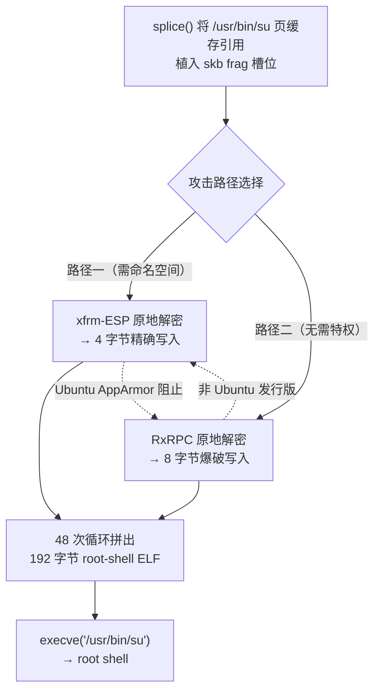

> **Dirty Frag**：Linux 内核零拷贝路径上的页缓存写入漏洞链，串联 xfrm-ESP 与 RxRPC 两个独立漏洞，2017 年以来几乎所有主流发行版均受影响，可无密码提权至 root。

**本文存在AI生成内容（漏洞技术流程分析与 PoC 解读）**

---

## 又来了？还让不让人消停了

说实话，我是真没想到这么快又要写一篇内核提权漏洞的文章。

距离上一篇 [Copy Fail](/posts/cve-2026-31431-copy-fail) 的博文过去才**八天**。八天啊朋友们！Copy Fail 的 `algif_aead` 黑名单才刚敲进终端没几天，补丁都没焐热，又砸过来一个——**Dirty Frag**。

而且更离谱的是，Copy Fail 的缓解措施对 Dirty Frag **完全无效**。因为这次打的是完全不同的内核子系统——人家走的是 xfrm-ESP 和 RxRPC 的加密路径，跟你禁不禁 `algif_aead` 没有半毛钱关系。

Dirty Pipe（2022）、Copy Fail（2026.04）、Dirty Frag（2026.05）……每次都是"2017 年以来几乎所有发行版均受影响"。你知道这意味着什么吗？意味着在过去将近十年的时间里，任何一个登录了你系统里任意一个非特权账户的人，都有机会悄悄变成 root。

但仔细想想，这真的全是内核开发者的锅吗？不尽然。

这两年 AI 辅助代码审计工具的爆发式增长，让安全研究员在**几小时内**就能扫出潜伏近十年的漏洞。以前靠人力一行一行 review 才能找到的 bug，现在 AI 一键批量扫过去，漏洞就像被秋风扫落叶一样接二连三地往外冒。Copy Fail 是被 AI 工具 Xint Code 在一小时内定位的。Dirty Frag 虽然来自韩国研究员 Hyunwoo Kim 的人工审计，但它波及的代码路径和 Copy Fail 同属一个家族——零拷贝路径上的页缓存写入——说明这类设计缺陷远不止一两个孤立案例。工具强了，效率高了，漏洞自然"变多了"。

更令人不安的是这次披露的方式。研究员原本向内核安全团队提交了漏洞详情，约定 **5 天 embargo** 给各发行版留出打补丁的时间。结果**当天**，不相关的第三方把 ESP(xfrm) 漏洞的完整详情和 exploit **直接公开发布了**。没有 CVE，没有补丁，但 PoC 所有人都能跑了。这不叫负责任披露，这叫给所有 Linux 用户后背捅一刀——打补丁的窗口直接被炸没了，所有人被迫裸奔。

好了，槽吐完了。下面来认真看看这次的漏洞到底是什么情况。

---

## 时间线

| 日期       | 事件                                                                                   |
| :--------- | :------------------------------------------------------------------------------------- |
| 2017-01    | xfrm-ESP 漏洞随 commit `cac2661c53f3` 引入内核（潜伏 **9 年**）                        |
| 2023-06    | RxRPC 漏洞随 commit `2dc334f1a63a` 引入内核                                            |
| 2026-04-29 | 韩国研究员 Hyunwoo Kim (@v4bel) 向 `security@kernel.org` 报告 RxRPC 漏洞及完整 exploit |
| 2026-05-07 | 漏洞详情提交至 linux-distros 邮件列表，约定 **5 天 embargo**                           |
| 2026-05-07 | **同日**，第三方公开发布了 ESP(xfrm) 漏洞的详细信息与 exploit，**embargo 当场破裂**    |
| 2026-05-07 | 与各发行版维护者协商后，完整 Dirty Frag 文档公开发布。此时 **无 CVE、无官方补丁**      |
| 2026-05-08 | 本文撰写时，各主要发行版仍在等待上游补丁合并                                           |

要说这次披露过程，也是够离谱的。明明约好了 5 月 12 日协调披露，结果 ESP 那块被不相关第三方提前公开了，embargo 直接炸了。这让发行版维护者们连打补丁的时间都没有——漏洞详情和 PoC 是一起出来的

---

## 危害性分析

| 指标                    | 详情                                                                               |
| :---------------------- | :--------------------------------------------------------------------------------- |
| **CVE**                 | **尚无**（embargo 破裂时 NVD 来不及分配）                                          |
| **漏洞类型**            | 确定性逻辑漏洞，非竞态条件                                                         |
| **利用成功率**          | **100%**，一次执行必定成功                                                         |
| **影响范围**            | 2017 年以来几乎所有主流 Linux 发行版（截至 2026 年 5 月，最新内核 7.0.3 亦受影响） |
| **利用方式**            | 192 字节 payload，通过 48 次 4 字节写入拼出 root-shell ELF                         |
| **磁盘痕迹**            | **无持久修改** — 仅污染内存页缓存，绕过 inotify；重启即恢复                        |
| **绕过 Copy Fail 缓解** | Copy Fail 的 `algif_aead` 禁用 **完全无效**，因为攻击的是不同子系统                |

**与历史内核 LPE 漏洞的对比：**

| 特性       | Dirty Cow (2016) | Dirty Pipe (2022) | Copy Fail (2026)     | **Dirty Frag (2026)**    |
| :--------- | :--------------- | :---------------- | :------------------- | :----------------------- |
| 竞争条件   | 需要             | 不需要            | 不需要               | **不需要**               |
| 影响范围   | 特定版本         | 5.8+              | 2017+ 全部主流发行版 | **2017+ 全部主流发行版** |
| 利用代码量 | 复杂             | 复杂              | 10 行 Python         | **单文件 C 程序**        |
| 磁盘痕迹   | 有               | 有                | 无                   | **无**                   |
| 补丁状态   | 已修复           | 已修复            | 已修复               | **暂无官方补丁**         |

**已确认受影响的发行版：**

| 发行版              | 测试内核版本      |
| :------------------ | :---------------- |
| Ubuntu 24.04.4      | 6.17.0-23-generic |
| RHEL 10.1           | 6.12.0-124.49.1   |
| CentOS Stream 10    | 6.12.0-224        |
| AlmaLinux 10        | 6.12.0-124.52.3   |
| Fedora 44           | 6.19.14-300       |
| openSUSE Tumbleweed | 7.0.2-1           |
| Arch Linux          | 7.0.3             |

从 6.12 到 7.0，从 Ubuntu 到 Arch，**全平台通杀**。是的，你装的任何主流发行版大概都跑不掉。

---

## 技术原理：为什么叫 Dirty Frag？

### 一句话核心

`splice()` 将只读文件的**页缓存引用**植入网络发送缓冲区（skb）的 frag 槽位 → 接收端内核对 frag 执行**原地加密操作**（in-place crypto，src == dst 指向同一内存） → 本应对密文的解密操作变成了**直接写只读页缓存的 STORE 原语** → 把 `su` 的机器码替换成 root-shell ELF。

"Dirty" 指的是污染页缓存，"Frag" 指的是利用 skb（socket buffer）的 fragment 机制。合在一起——**Dirty Frag**。

### 零拷贝路径上的 skb frag 污染

这部分是理解整个漏洞的关键，我们展开说。

正常情况下，你往 socket 里写数据，内核会把用户态的数据**拷贝一份**到内核的 skb 中。但是 `splice()` 走的是**零拷贝**路径——它直接把文件页缓存页面的指针（`page` 结构体 + 偏移）塞进 skb 的 `frag` 数组里，不复制数据本身：

```c title="skb frag 结构示意"
struct skb_shared_info {
    struct sk_buff  *frag_list;      // frag 链表
    skb_frag_t      frags[MAX_SKB_FRAGS];  // frag 数组，每个是 {page, offset, size}
    // ...
};
```

这里的关键在于：`splice()` 传入的 `page` 是你文件（比如 `/usr/bin/su`）在**内存中的页缓存页**——你只有读权限，但这个页面的引用已经被塞进了网络协议栈的 skb 里。

接下来，就看接收端的网络协议栈会不会"手贱"去写这个页面了。

### 漏洞一：xfrm-ESP Page-Cache Write

第一个漏洞在 IPsec ESP（Encapsulating Security Payload）的解密路径上。

`esp_input()` 函数用来解密密文数据。正常情况下，如果 skb 的数据区域会与 frag 共享，内核应该先调用 `skb_cow_data()`（Copy-on-Write）把共享的页面复制一份再操作。但是，`esp_input()` 里存在一个绕过 cow 的代码路径：

```c title="net/ipv4/esp4.c — esp_input() 的 skip_cow 绕过"
static int esp_input(struct xfrm_state *x, struct sk_buff *skb)
{
    if (!skb_cloned(skb)) {
        if (!skb_is_nonlinear(skb)) {
            // [1] 线性 skb：只有 head 数据，没有 frag，安全
            nfrags = 1;
            goto skip_cow;
        } else if (!skb_has_frag_list(skb)) {
            // [2] 有 frag，但没有 frag_list → 直接跳过 cow！
            nfrags = skb_shinfo(skb)->nr_frags;
            nfrags++;
            goto skip_cow;  // 炸弹在这里
        }
    }
    // 正常路径：复制数据，安全
    err = skb_cow_data(skb, 0, &trailer);
}
```

当 skb 是非线性的（有 frag 保存 splice 传入的页缓存），但 `frag_list` 为空时，代码就直接跳到了 `skip_cow`。然后，接下来的 `crypto_authenc_esn_decrypt()` 会在原地做 AEAD 解密——src 和 dst 指向**同一个 scatterlist**，也就是攻击者植入的那个页缓存页面。

在解密过程中，有一行特别关键的代码：

```c title="crypto/authencesn.c — 序列号高 4 字节被写入 dst SGL"
// 将序列号的高 4 字节移到 dst SGL 的末尾
scatterwalk_map_and_copy(tmp + 1, dst, assoclen + cryptlen, 4, 1);
```

这行代码向 `dst`（也就是你 `su` 的页缓存页）的 `assoclen + cryptlen` 偏移处写入了 **4 字节**。而 `tmp + 1` 的值来自 ESP 头部的序列号高 32 位——攻击者在注册 XFRM SA（Security Association）时，通过 `XFRMA_REPLAY_ESN_VAL.seq_hi` 完全控制这个值。

也就是说，攻击者同时控制了：

- **写在哪里**（文件偏移，通过调整 payload 长度定位）
- **写什么值**（4 字节，通过 `seq_hi` 指定）

只需要注册 48 个不同的 XFRM SA，每个 SA 的 `seq_hi` 存放 ELF 的一个 4 字节片段，循环 48 次，一个完整的 root-shell ELF 就被拼写进了 `su` 的页缓存。

不过这个漏洞有一个限制：注册 XFRM SA 需要 `CAP_NET_ADMIN` 权限。攻击者可以通过创建用户命名空间（`unshare(CLONE_NEWUSER | CLONE_NEWNET)`）来获得这个权限——但 Ubuntu 的 AppArmor 恰好阻止了非特权用户创建网络命名空间。

这就是为什么还需要第二个漏洞。

### 漏洞二：RxRPC Page-Cache Write

第二个漏洞在 RxRPC 协议的 Kerberos 认证解密路径上。

`rxkad_verify_packet_1()` 函数对收到的数据包前 8 字节执行原地 pcbc(fcrypt) 解密：

```c title="net/rxrpc/key.c — 原地解密，src == dst"
skcipher_request_set_crypt(req, sg, sg, 8, iv.x);
//                               ^^  ^^
//                             src==dst → 原地操作！
ret = crypto_skcipher_decrypt(req);  // 8 字节写入发生在这里
```

`skb_to_sgvec()` 直接把 skb 的 frag（其中包含攻击者 splice 进来的页缓存页）转成 scatterlist，src 和 dst 是**同一个 sg**。所以解密操作直接把 8 字节的"解密结果"写回了那个只读的页缓存页面。

与 xfrm-ESP 相比：

| 特性     | xfrm-ESP             | RxRPC                      |
| :------- | :------------------- | :------------------------- |
| 写入大小 | 4 字节               | **8 字节**                 |
| 值控制   | 直接控制（`seq_hi`） | 间接（需爆破 fcrypt 密钥） |
| 需要特权 | 用户命名空间         | **无特权要求**             |
| 引入时间 | 2017-01              | 2023-06                    |

RxRPC 方案写入的值无法直接控制——它是 `fcrypt_decrypt(C, K)` 的结果。攻击者需要先通过 `add_key("rxrpc", ...)` 注册一个密钥 K，然后在用户态爆破，找到能产出目标 8 字节明文的那个 K。好在 fcrypt 是 56-bit 密钥、8-byte 块的 Andrew File System 专用密码，爆破并不是什么大问题。

最关键的是：RxRPC 路径**完全不需要任何特权**。不需要创建用户命名空间，不需要网络命名空间，不需要 CAP_NET_ADMIN。而且 Ubuntu 默认加载了 `rxrpc.ko` 模块。

### 串联逻辑

两个漏洞互补，形成全覆盖：



| 场景                            | 使用的漏洞        | 原因                                   |
| :------------------------------ | :---------------- | :------------------------------------- |
| Ubuntu（AppArmor 阻止命名空间） | RxRPC             | `rxrpc.ko` 默认加载，无需特权          |
| RHEL / Fedora / openSUSE        | xfrm-ESP          | 命名空间可用，ESP 写入精确可控         |
| 其他发行版                      | xfrm-ESP 或 RxRPC | 根据模块加载情况选择，至少一条路径可用 |

这就是 Dirty Frag 的可怕之处——**无论你怎么配置，总有一条路能走到 root**。

---

## PoC 分析

完整的 exploit 已开源在 [github.com/V4bel/dirtyfrag](https://github.com/V4bel/dirtyfrag)，编译运行只需要一行：

```bash title="编译并运行 Dirty Frag exploit"
git clone https://github.com/V4bel/dirtyfrag.git
cd dirtyfrag && gcc -O0 -Wall -o exp exp.c -lutil && ./exp
```

核心思路并不复杂：

1. 准备一个 192 字节的精简 ELF —— 执行就提权的 root-shell
2. 将这 192 字节拆成 48 个 4 字节块（如果用 xfrm-ESP 路径）
3. 为每个 4 字节块注册一个 XFRM SA，其 `seq_hi` 设为该块的值
4. 每次通过 `splice()` 把 `su` 的页缓存送入 skb，触发一次原地写
5. 循环 48 次，`su` 的页缓存区域（前 192 字节）被完全替换为 root-shell ELF
6. `execve("/usr/bin/su")` → root shell

全程不碰磁盘文件。磁盘上的 `/usr/bin/su` 纹丝不动，md5 依旧是原来的 md5。但内核的页缓存里，它已经被偷梁换柱了

当任何进程对 `su` 发起 `execve` 时，内核从页缓存中读取——哦豁，跑的是你塞进去的二进制。root 到手。

---

## 如何应急：暂时禁用漏洞模块

截至目前（2026 年 5 月 8 日），**官方内核补丁尚未发布**。在补丁到位之前，唯一的临时缓解是卸载并黑名单三个漏洞模块。

**先确认你的系统是否受影响：**

```bash title="检查是否加载了漏洞模块"
lsmod | grep -E 'esp4|esp6|rxrpc'
```

如果有任何输出，说明你是受影响的。

**立即执行以下命令（无需重启）：**

```bash title="禁用漏洞模块（Dirty Frag 缓解）"
sudo sh -c "printf 'install esp4 /bin/false\ninstall esp6 /bin/false\ninstall rxrpc /bin/false\n' > /etc/modprobe.d/dirtyfrag.conf"
sudo rmmod esp4 esp6 rxrpc 2>/dev/null
```

```bash title="验证模块已卸载（无输出 = 安全）"
lsmod | grep -E 'esp4|esp6|rxrpc'
```

**重要：如果你怀疑 PoC 已经被执行过，必须清除页缓存：**

```bash title="清除页缓存（需 root）"
echo 3 | sudo tee /proc/sys/vm/drop_caches
```

不执行这一步的话，即使你禁用了模块，已经被污染的页缓存仍然在内存里——`su` 一跑就是 root shell。

**副作用：**

- 禁用 `esp4`/`esp6` 会**中断 IPsec VPN 隧道**。桌面用户和大多数服务器不受影响，但如果你依赖 IPsec VPN（如 strongSwan、Libreswan），请先评估影响。
- 禁用 `rxrpc` 影响极小，除非你在用 AFS（Andrew File System）。

---

## AI 加持下的漏洞军备竞赛

Dirty Frag 的暴露，让人不得不思考一个更深层的问题：**为什么最近内核 LPE 漏洞接二连三地往外冒？**

| 漏洞           | 发现时间    | 关键工具       | 从报告到公开                 |
| :------------- | :---------- | :------------- | :--------------------------- |
| Dirty Pipe     | 2022        | 人工审计       | 标准流程                     |
| Copy Fail      | 2026-04     | Xint Code (AI) | 约一个月                     |
| **Dirty Frag** | **2026-05** | 人工审计       | **8 天（embargo 当天破裂）** |

内核 LPE 漏洞从一年一个变成了一月一个，再从一月一个变成了……一周一个？

这背后是 AI 辅助代码审计工具的爆发式增长。以前靠人力一行一行 review，一个漏洞蹲十年没人发现是常态。现在 AI 几小时内就能扫完整个子系统，把所有潜在的零拷贝路径、原地操作、共享引用全部拉出来。工具强了，效率高了，漏洞自然"变多"了——不是内核突然变差了，而是藏在角落里的旧账被 AI 一笔一笔翻了出来。

更值得警惕的是披露生态的变化。Dirty Frag 的 embargo 被第三方故意打破，漏洞详情和 PoC **同一天**公开。这意味着什么？意味着从研究员向 security@kernel.org 报告漏洞到全世界黑客拿到武器，中间只隔了 **八天**。打补丁的窗口——没了。

我们可以怪那个打破 embargo 的人不道德。但现实是，这种事情以后只会越来越多。AI 让找漏洞变快了，也让武器化变快了。你不可能永远指望每个人都会遵守 embargo 约定。

而且别忘了，**同一个漏洞家族还在继续往外挖**：

| 漏洞          | 子系统              | 状态       |
| :------------ | :------------------ | :--------- |
| Copy Fail     | AF_ALG + authencesn | 已修复     |
| Dirty Frag    | xfrm-ESP + RxRPC    | **无补丁** |
| Copy Fail 2   | ESP-in-UDP          | 已公开     |
| ZCRX Freelist | io_uring ZCRX       | 已公开     |

这四个漏洞的核心原理如出一辙——`splice()` 把只读页缓存引用塞进内核子系统，子系统在 frag 上原地写入。它们暴露出来的其实是**同一类设计问题**：

| 组件       | 引入原因         | 副作用                         |
| :--------- | :--------------- | :----------------------------- |
| `splice()` | 零拷贝，性能优化 | 只读页缓存引用被送入内核子系统 |
| `AF_ALG`   | 暴露内核加密能力 | 非特权用户可直接发起加密会话   |
| xfrm-ESP   | IPsec 加速       | 原地解密，把只读页当输出缓冲区 |
| RxRPC      | AFS 网络协议支持 | 同上，连命名空间特权都不要     |

每个设计单独拿出来看，都是合理的性能优化或功能需求。但拼在一起，就是一个**任何本地用户都能无密码变 root** 的漏洞链。

除非上游内核彻底重新审视"零拷贝路径上的原地操作"这个范式本身，否则我跟你保证——**这不会是最后一个。**

对于普通用户，我的建议很简单：

1. **现在就执行上面的黑名单命令。** 等官方补丁来了再改回去。
2. **密切关注包管理器的内核更新。** 一旦有修复版本，立即升级并重启。
3. **定期 `lsmod | grep` 检查这些模块有没有被意外加载。**

---

## 参考链接

- GitHub PoC 仓库：<https://github.com/V4bel/dirtyfrag>
- LWN 报道：<https://lwn.net/Articles/1071719/>
- Phoronix 报道：<https://www.phoronix.com/news/Dirty-Frag-Linux>
- 韩语技术分析 (GeekNews)：<https://news.hada.io/topic?id=29275>
- Copy Fail 披露站：<https://copy.fail/>
- Copy Fail 2 (Electric Boogaloo)：<https://github.com/0xdeadbeefnetwork/Copy_Fail2-Electric_Boogaloo>
