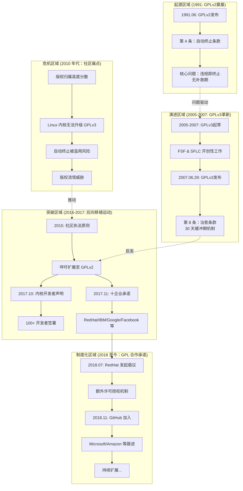

## 前言

最近为了解决一些问题，我去查阅 GitHub 文档，发现了[GitHub GPL 合作承诺](https://docs.github.com/zh/site-policy/github-company-policies/github-gpl-cooperation-commitment)这个页面


说实话我第一眼确实没看明白，反复读也没太读懂，需要再多找些资料，这才了解到**GPL2**与**GPL3**的往事...

---

## **GPL2**: 严格的**自动终止**权利

[**GPL2**](https://www.gnu.org/licenses/old-licenses/gpl-2.0.txt)在发布之初就有严格的许可限制

```
4. You may not copy, modify, sublicense, or distribute the Program
except as expressly provided under this License.  Any attempt
otherwise to copy, modify, sublicense or distribute the Program is
void, and will automatically terminate your rights under this License.
However, parties who have received copies, or rights, from you under
this License will not have their licenses terminated so long as such
parties remain in full compliance.
```

> 第四条 除非本许可证明确规定，否则你不得复制、修改、再许可或分发本程序。任何试图以其他方式复制、修改、再许可或分发本程序的行为均属无效，并将自动终止你依据本许可证享有的权利。但是，通过你依据本许可证获得副本或权利的当事方，只要该等当事方完全遵守本许可证，其许可证将不会被终止。

先不说终止条件，问题关键在于**终止是立即的**，没有挽回期。为什么？我觉得这是因为早期**GPL**项目都由**GNU协会**掌控，他们用这样强有力的条文来捍卫**软件自由**，但自由软件的发展显然超出了当初的想象。这个条款反而成了**专利讼棍**的着力点，许多项目都可能被恶意起诉

---

## **GPL3**: 允许**挽留**的机会

[**GPL3**](https://www.gnu.org/licenses/gpl-3.0.txt)的条款更为实用，也经受住了社区的实践考验

```
8. Termination.
You may not propagate or modify a covered work except as expressly provided under this License. Any attempt otherwise to propagate or modify it is void, and will automatically terminate your rights under this License (including any patent licenses granted under the third paragraph of section 11).
However, if you cease all violation of this License, then your license from a particular copyright holder is reinstated (a) provisionally, unless and until the copyright holder explicitly and finally terminates your license, and (b) permanently, if the copyright holder fails to notify you of the violation by some reasonable means prior to 60 days after the cessation.
Moreover, your license from a particular copyright holder is reinstated permanently if the copyright holder notifies you of the violation by some reasonable means, this is the first time you have received notice of violation of this License (for any work) from that copyright holder, and you cure the violation prior to 30 days after your receipt of the notice.
Termination of your rights under this section does not terminate the licenses of parties who have received copies or rights from you under this License. If your rights have been terminated and not permanently reinstated, you do not qualify to receive new licenses for the same material under section 10.
```

> 除本许可证明确允许外，您不得传播或修改任何受保护作品。任何其他方式传播或修改的尝试均属无效，并将自动终止您根据本许可证享有的权利（包括第 11 条第三款授予的任何专利许可）。
> 但是，如果您停止所有违反本许可证的行为，则您从特定版权持有人处获得的许可证将予以恢复：(a) 临时恢复，除非且直至该版权持有人明确并最终终止您的许可证；以及 (b) 永久恢复，如果该版权持有人未能在您停止违规行为后的 60 天内，以合理方式通知您该违规行为。
> 此外，如果您从特定版权持有人处获得的许可证满足以下条件，则将永久恢复：该版权持有人以合理方式通知您违规行为，且这是您首次从该版权持有人处收到关于违反本许可证的通知（针对任何作品），且您在收到通知后的 30 天内纠正了该违规行为。
> 根据本条终止您的权利，不会终止已根据本许可证从您处获得副本或权利的其他方的许可证。如果您的权利已被终止且未永久恢复，则您无资格根据第 10 条就相同材料获得新的许可证。

---

## **GPL2**该怎么办

显然，已有的**GPL2**项目面临执法困境，随着**GPL**项目不断增多，潜在风险也在不断加大，因此[**FSF** 发布了社区导向型 **GPL 执法原则**](https://www.fsf.org/licensing/enforcement-principles)，开始呼吁大家采用更温和的执法方式

```
Community-oriented compliance processes should extend the benefit of GPLv3-like termination, even for GPLv2-only works. GPLv2 terminates all copyright permissions at the moment of violation, and that termination is permanent. GPLv3's termination provision allows first-time violators automatic restoration of distribution rights when they correct the violation promptly, and gives the violator a precise list of copyright holders whose forgiveness it needs. GPLv3's collaborative spirit regarding termination reflects a commitment to and hope for future cooperation and collaboration. It's a good idea to follow this approach in compliance situations stemming from honest mistakes, even when the violations are on works under GPLv2.
```

> 面向社区的合规流程应将类似 GPLv3 的终止条款的益处扩展到所有作品，即使这些作品仅使用 GPLv2 许可。GPLv2 会在侵权发生时立即终止所有版权许可，且该终止是永久性的。GPLv3 的终止条款允许初犯者在及时纠正侵权行为后自动恢复分发权，并向侵权者提供一份需要获得其宽恕的版权所有者的详细名单。GPLv3 在终止条款方面的合作精神体现了其对未来合作的承诺和期望。即使侵权行为涉及使用 GPLv2 许可的作品，在因无心之失而导致的合规情况下，遵循这种做法也是明智之举。

为什么 Linux 内核不直接升级到 GPLv3 呢？其实内核代码的版权早就分散在数千名开发者手中，根本无法取得所有人的同意来统一重新授权。再加上 Linus Torvalds 本人一直公开反对 GPLv3，认为其中的专利条款设计不当，更愿意继续使用 GPLv2。既然直接升级走不通，那就换一条路走。

于是社区开始行动，**Linux 内核**等多个**GPL2**项目开始采纳这项建议。

## 加入 **GPL 合作承诺**

整个事件的高潮在于这个**合作承诺** — [Join the GPL Cooperation Commitment](https://gplcc.github.io/gplcc/)，**GPL2**的问题终于通过**社区合作**得到解决。业界以自觉的约束避免滥用诉讼，结束了这场潜在的危机

---

## 小结

大多数违反**GPL2**协议的情况往往都是无心之过，**社区共同行动**给了这些违规者改过自新的机会，这也是**GPL2**能够传承至今的重要原因。

### 时间线


