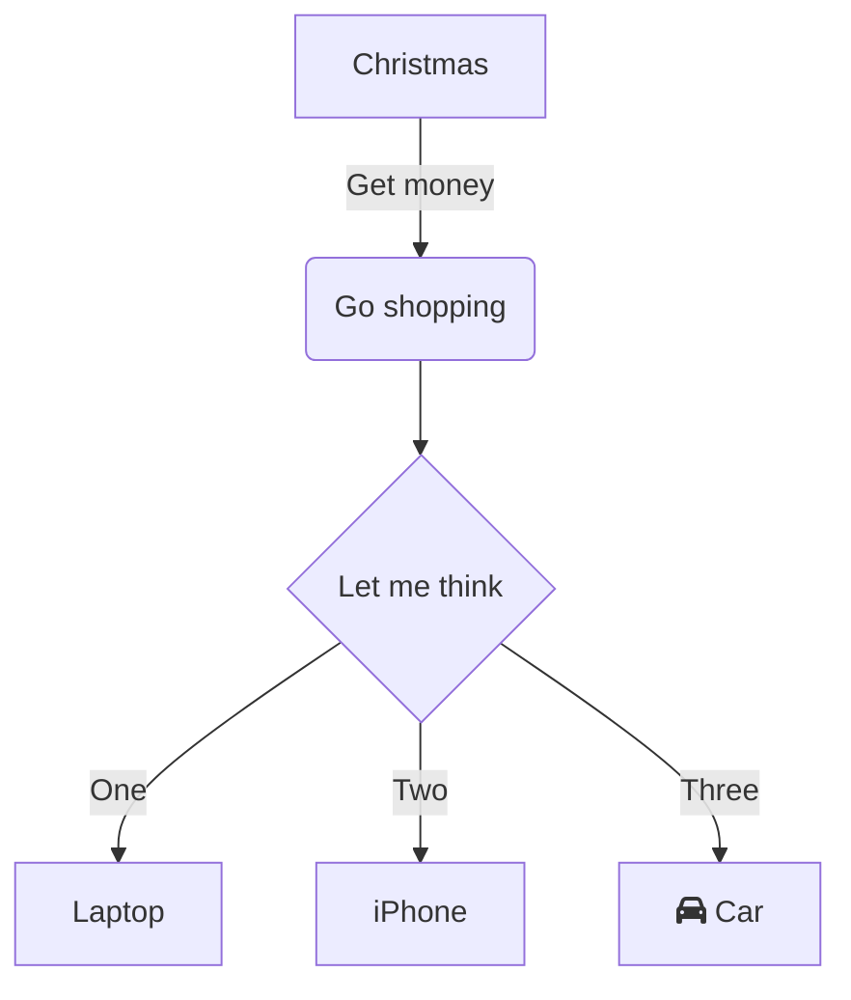

历经多次打磨和稍微的优化,终于完成了[Stalux](https://github.com/xingwangzhe/stalux)这一个astro主题,也就是当前[xingwangzhe.fun](https://xingwangzhe.fun)所使用的主题.


仓库: [xingwangzhe/stalux](https://github.com/xingwangzhe/stalux)

演示地址: [https://stalux.needhelp.icu](https://stalux.needhelp.icu)

## 主题特点

### 简洁美观

从背景图就能看到,**极简主义**（`Minimalism`） + **微妙装饰**（`subtle decorative`）的设计风格,虽然背景图每次刷新都是繁杂的物品事物平铺,但又不失简约的线条风格,正所谓繁中有简,简中有繁,有没有让你回忆起**找你妹**这个游戏呢?. 背景图来自于[figma-Telegram SVG Wallpapers](https://www.figma.com/community/file/1262473551582577153)(CC BY 4.0)

当然,主题为了保持**简洁**,只存在**暗色主题**,没有**浅色主题**的打算,很多DOM的组件几乎都是毛玻璃透明的,进一步简化了渲染的复杂度,让用户可以专注于内容本身

### 视图过渡

Astro有特点,那就是**静态站点生成**(SSG),所以在页面跳转时,会有**白屏闪烁**的问题,为了解决这个问题,主题使用了[视图过渡动画](https://docs.astro.build/zh-cn/guides/view-transitions/)的方式来实现页面的无刷新跳转,比如说导航和页脚,以及某些与页面内容无关的时间,作者信息等组件都保持状态,刷新页面时,只会更新中间的内容区域,从而达到无刷新跳转的效果

当然,某些脚本可能会出现问题,官方的[astro:page-load](https://docs.astro.build/zh-cn/guides/view-transitions/#%E8%84%9A%E6%9C%AC%E7%9A%84%E9%87%8D%E6%96%B0%E6%89%A7%E8%A1%8C)事件监听解决了问题,使得在页面跳转后,评论,导航等脚本都能正常工作

### 内容优先

支持CommonMark语法,并且内置了很多实用的功能,比如说代码高亮,Mermaid,Katex(类似于Latex)等,让用户可以专注于内容的创作,而不是花费大量时间在排版上

**注意**,不同于固定的Astro模板定义,**内容合集**不在`src/content`目录下,而是在`stalux/posts`和`stalux/about`下,这样用户可以更方便地管理自己的内容,而且也能更好地利用Astro的内容集合功能

```ts title="hello world"
function world(params: type) {
    console.log("hello world");
}
```



$E=MC^2$

### yaml配置

综合考量`ts`,`json`,`toml`等配置文件的优缺点,最终选择了`yaml`作为主题的配置文件格式,因为`yaml`相对于其他格式来说,更简洁易读,并且支持注释,方便用户理解和修改配置项

而且,`Astro`原生支持`yaml`作为内容合集,那么我就可以定义一个`config.yaml`文件,来集中管理主题的配置项,比如说站点标题,描述,作者信息,社交链接等

```ts title="src/content.config.ts"
import { defineCollection } from "astro:content";
...
const config = defineCollection({
  loader: file("config.yml"),
  schema: z.object({
    title: z.string(),
    url: z.string().url(),
    description: z.string(),
    canonical: z.string().url().optional(),
    twitterSite: z.string().optional(),
    noindex: z.boolean().optional().default(false),
    nofollow: z.boolean().optional().default(false),
    anyhead: z.string().optional(),
    favicon: z.string().optional().default("/favicon.ico"),
    author: z.object({
      name: z.string(),
      avatar: z.string(),
      bio: z.string(),
    }),
    navs: z.array(
      z.object({
        title: z.string(),
        icon: z.string(),
        link: z.string(),
      }),
    ),
    typetexts: z.array(z.string()).optional(),
    mediaLinks: z
      .array(
        z.object({
          icon: z.string(),
          link: z.string(),
        }),
      )
      .optional(),
    links: z.object({
      title: z.string(),
      description: z.string(),
      sites: z.array(
        z.object({
          name: z.string(),
          description: z.string(),
          icon: z.string(),
          link: z.string(),
        }),
      ),
    }),
    footer: z
      .object({
        startYear: z.number().optional(),
        icp: z.string().optional(),
        pubsec: z.string().optional(),
        pubsecNumber: z.string().optional(),
        buildtime: z.string().optional(),
        copyright: z
          .object({
            enabled: z.boolean().optional().default(true),
            startYear: z.number().optional(),
            customText: z.string().optional(),
          })
          .optional(),
        theme: z
          .object({
            showPoweredBy: z.boolean().optional().default(true),
            showThemeInfo: z.boolean().optional().default(true),
          })
          .optional(),
        beian: z
          .object({
            icp: z
              .object({
                enabled: z.boolean().optional().default(false),
                number: z.string().optional(),
              })
              .optional(),
            security: z
              .object({
                enabled: z.boolean().optional().default(false),
                text: z.string().optional(),
                number: z.string().optional(),
              })
              .optional(),
          })
          .optional(),
        badges: z
          .array(
            z.object({
              label: z.string(),
              message: z.string(),
              color: z.string().optional(),
              style: z.string().optional(),
              alt: z.string().optional(),
              href: z.string().optional(),
            }),
          )
          .optional(),
        custom: z.string().optional(),
      })
      .optional(),
    comment: z
      .object({
        enabled: z.boolean().optional().default(false),
        waline: z
          .object({
            serverURL: z.string().url().optional(),
            lang: z.string().optional().default("zh-CN"),
            locale: z.any().optional(),
            emoji: z
              .array(z.string())
              .optional()
              .default(["https://unpkg.com/@waline/emojis@1.1.0/weibo"]),
            reaction: z.boolean().optional().default(false),
            meta: z.array(z.string()).optional().default(["nick", "mail", "link"]),
            requiredMeta: z.array(z.string()).optional().default([]),
            login: z.string().optional().default("enable"),
            recaptchaV3Key: z.string().optional(),
            turnstileKey: z.string().optional(),
            dark: z.union([z.string(), z.boolean()]).optional().default(true),
            noCopyright: z.boolean().optional().default(false),
            commentSorting: z.string().optional().default("latest"),
            imageUploader: z.any().optional(),
            highlighter: z.any().optional(),
            texRenderer: z.any().optional(),
            search: z.any().optional(),
            wordLimit: z.number().optional().default(200),
            pageSize: z.number().optional().default(10),
          })
          .optional(),
      })
      .optional(),
  }),
});
```

看起来非常地多,但实际上写`yaml`配置的适合,还是很轻松的,而且得益于`内容集合`,配置项即使出现错误,丢失,也会有`content.config.ts`的`类型校验`来保障配置的正确性

### 丰富的功能

waline评论区配置,社交媒体链接 使用`simple-icons`图标库,导航图标 使用`lucide`图标库,多种徽章支持,等等就不一一列举

## 结语

总的来说,如果你喜欢SSG类型的博客,并且想要一个简洁美观,功能丰富的主题,那么Stalux绝对是一个不错的选择,希望大家能够喜欢这个主题,并且在使用过程中提出宝贵的意见和建议,让这个主题变得更加完善和优秀.
