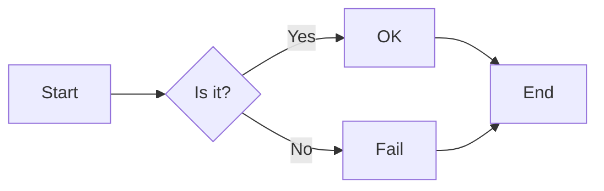
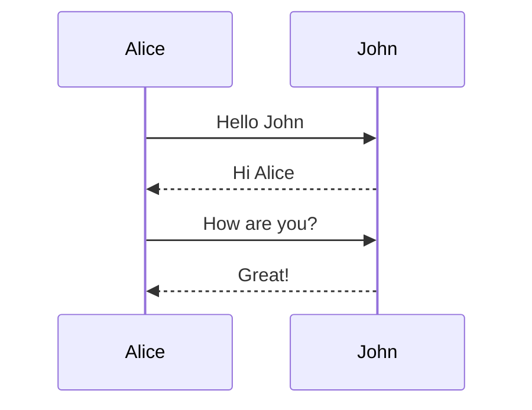
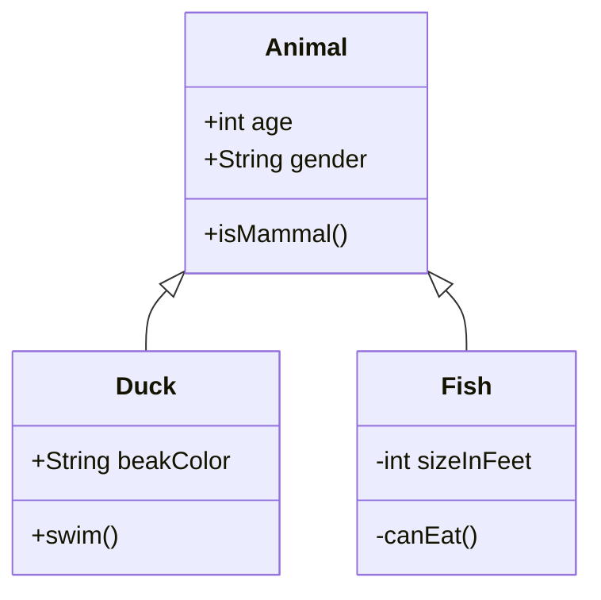
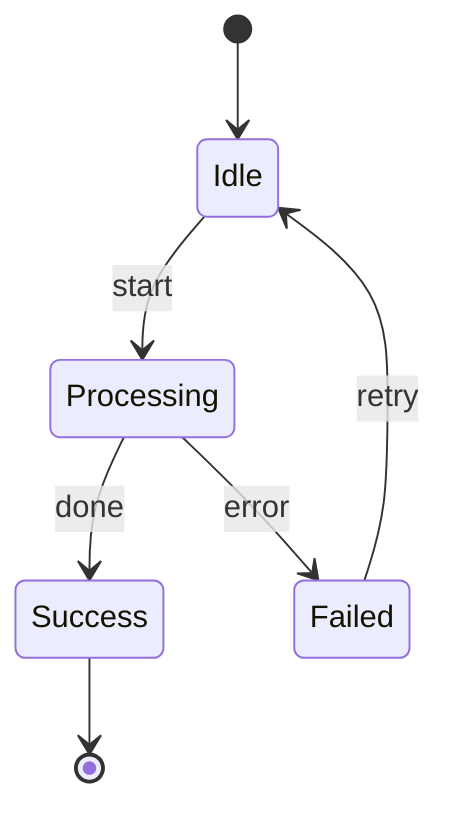
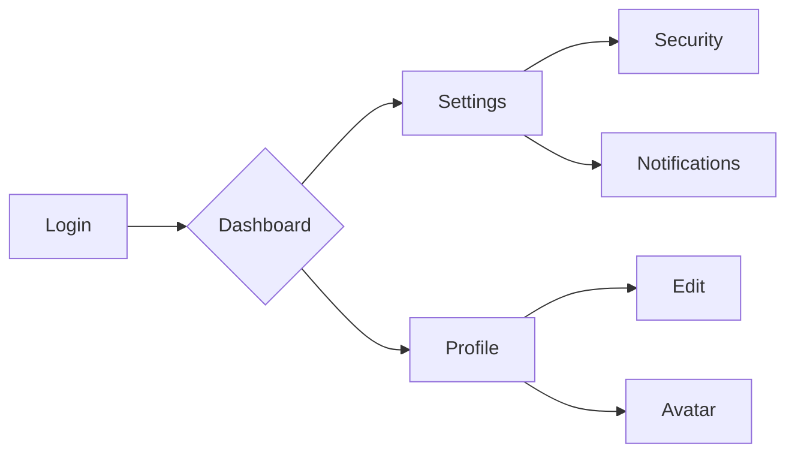

# Comprehensive Markdown Syntax Guide

## Basic Syntax

### Headings

# Heading 1

## Heading 2

### Heading 3

#### Heading 4

##### Heading 5

###### Heading 6

### Emphasis

_Italic_ or _Italic_
**Bold** or **Bold**
**_Bold Italic_** or **_Bold Italic_**
~~Strikethrough~~
<u>Underline</u>

### Lists

#### Unordered Lists

- Item 1

* Item 2

- Item 3

#### Ordered Lists

1. Item 1
2. Item 2
3. Item 3

#### Task Lists

- [x] Completed task
- [ ] Incomplete task

### Links and Images

[Link text](http://example.com)


### Blockquotes

> This is a blockquote
>
> > This is a nested blockquote
> >
> > > Triple nested blockquote

### Code

Inline code `var example = "hello";`

```javascript title="This is a code example"
// Code block
function example() {
    return "Hello, world!";
}
```

### Horizontal Rules

---

---

---

### Tables

| Header 1 | Header 2 | Header 3 |
| :------- | :------: | -------: |
| Left     |  Center  |    Right |
| Cell     |   Cell   |     Cell |

## Advanced Nesting Examples

### Nested Lists

1. First level
    - Second level
        - Third level
            - Fourth level
    - Back to second level
2. Back to first level

### Nested Blockquotes and Formatting

> First level blockquote
>
> > Second level blockquote
> >
> > **Bold text** with _italics_ inside
> >
> > 1. List within blockquote
> > 2. Second item
> >
> > `Code within blockquote`
>
> Back to first level

### Formatting in Tables

| Feature | Syntax        | Result      |
| ------- | ------------- | ----------- |
| Bold    | `**text**`    | **text**    |
| Italic  | `*text*`      | _text_      |
| Code    | `` `code` ``  | `code`      |
| Link    | `[link](url)` | [link](url) |

### HTML Mixing

<div>
    <h4>HTML Block</h4>
    <p>This is an <em>HTML paragraph</em> mixed with <strong>Markdown</strong></p>

- Markdown list within HTML
- Second item

> Markdown blockquote within HTML

</div>

### Footnotes

Here is a footnote[^1], and another one[^2].

[^1]: This is the content of the first footnote.

[^2]:
    This is the second footnote, which can span multiple lines.
    Indented content belongs to the footnote.

### LaTeX Math Formulas

Inline formula: $E=mc^2$

Block formula:

$$
\frac{d}{dx}(e^x) = e^x
$$

### Mermaid

**Flowchart**



**Sequence Diagram**



**Class Diagram**



**State Diagram**



**Flowchart**



## Special Character Escaping

\* Escaped asterisk
\\ Escaped backslash
\` Escaped backtick
\_ Escaped underscore
\{ \} Escaped curly braces
\[ \] Escaped square brackets
\( \) Escaped parentheses
\# Escaped hash
\+ Escaped plus
\- Escaped minus
\. Escaped period
\! Escaped exclamation mark
