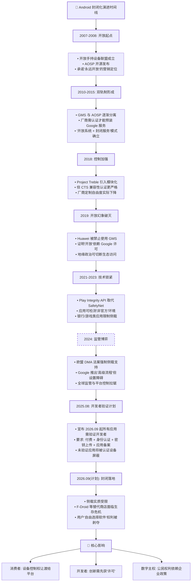

## Android的开放性正备受挑战

虽然我已经很多年不搞Android机了，想起小时候`root`就是为了开挂，下载MT管理器喜欢拆包改支付逻辑玩

突然我想浏览一下[F-Droid](https://f-droid.org/)看看有没有什么好玩的，发现了一个醒目的条幅

看来Android在它自由的路上正在加速开倒车,[安卓将成为一个封闭平台!](https://keepandroidopen.org/zh-CN/)

## Google 意图

所谓的以安全为名如此熟悉，归根结底还是**Google想要更多的商业利益**。作为世界上绝对数量最多的移动操作系统，Google认为应用商店的盈利很多被其它开放应用市场分流了，看来Google也眼馋iOS的应用市场垄断了!

## 欧盟`DMA`法案的困局

欧盟的`DMA`（数字市场法案）强制要求Google允许第三方侧载应用，本意是为了打破平台垄断保护用户选择自由，但实际效果可能与初衷背道而驰。Google表面上配合推出了侧载支持，但实际上通过各种技术设置抬高了侧载的门槛，比如频繁弹出安全警告、默认禁止未知来源、要求用户放弃系统安全更新等。

更有意思的是，这次**开发者验证计划恰恰是在`DMA`法案落地之后推出的**——就算你能侧载，应用开发者本身需要通过Google验证才能发布，否则应用就会被系统识别为「不安全」并默认屏蔽。这种「上有政策下有对策」的操作，相当于**绕过了欧盟对于应用分发渠道的监管，从源头控制了应用的准入资格**。

## 国内情景的复杂性

其实中国市场的情况比欧美更加复杂：早年间Android进入中国的时候，因为Google服务无法正常访问，**Google实际上默认了各个厂商去掉`GMS`直接发售手机**。到后来国产厂商出海才需要重新过Google `CTS`认证，预装上`GMS`。

现在Google这套开发者验证+屏蔽侧载的政策，对于中国市场来说本身就是早已存在的状态——国内用户本来就不用`Google Play`，应用都是从厂商自带的应用商店下载。但这里存在一个**政策悖论**：

- 如果Google出于政治或商业原因，给中国市场做出豁免，允许厂商在中国不执行这套政策，**那这套政策本身的权威性就会破产**，总有人会想办法买到「中国版」绕过限制。
- 如果不豁免，那**等于直接把这块市场彻底拱手让给国内厂商**，第三方应用商店反而会因为没有Play分发更加不受控制，这对Google来说也是无法接受的结果。

## 小结

Android从当初以 **"永远开放"之姿打破塞班的封闭垄断**，走到今天一步步自己也变成了当初自己所反对的样子。历史总是如此相似。

对于我们国内用户来说，很多人可能觉得这件事和我们关系不大——我们早就习惯了没有Google服务的日子。但实际上，**国内厂商对系统的控制早就越来越紧了**：限制`BL`解锁、禁用`root`、预装应用无法卸载，这些年玩机圈早就感受到了这种趋势。而Google在全球范围关上开放大门，只会进一步加速这个过程：

- Google关上了全球范围的开放大门
- 国内厂商本来就在收紧控制，只会变本加厉
- **F-Droid**这个最大的开源应用商店今天能面临生存危机
- 明天那些我们曾经热爱的`Xposed`、`Magisk`、各种第三方修改版，只会更加难以生存

我作为一个早就不玩机的老人，看着这一步一步走来，从当年开放打破封闭，到今天Android自己也走向封闭，历史转了一圈，还是想说：

**我们这一代人因开放而自由，不能让下一代人因封闭而失去自由。为了自由Android，为了自由软件，行动起来！**

### 时间线

