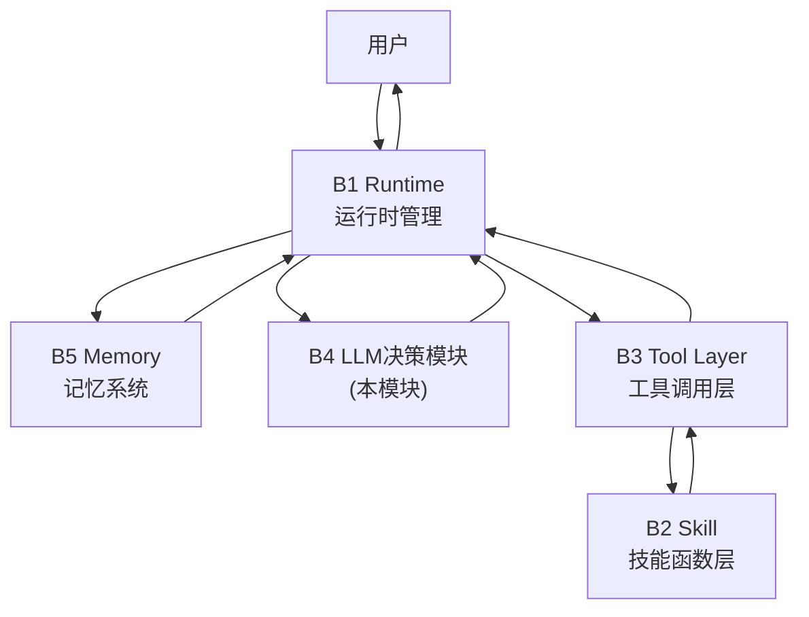
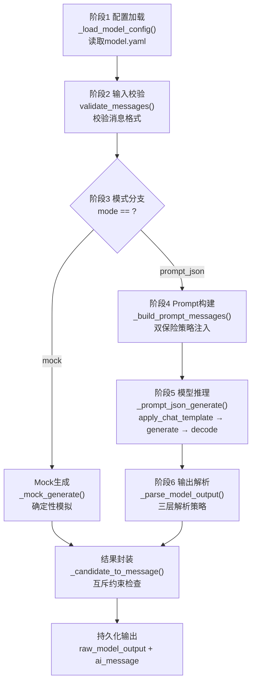
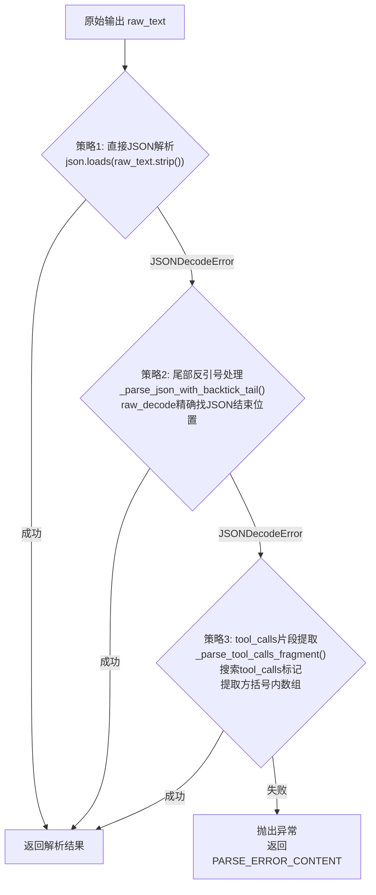
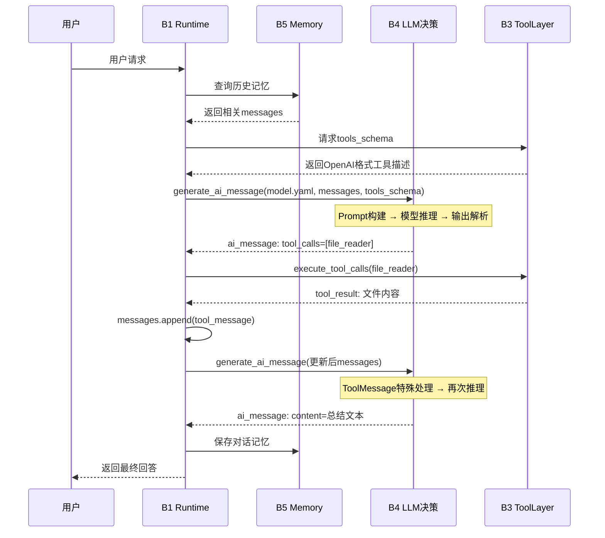

前置声明：**本图文存在AI辅助整理**

说实话，前三天的实训从搭环境到做 SFT/DPO 对齐，再到上手 Agent 工具调用，算是把整个大模型应用链路走了一遍。今天到了**重头戏**：我们要为一个完整的 Agent 智能体系统撰写 Proposal，而我负责的模块是 **B4 LLM 决策模块**——一个需要让 4B 小模型稳定执行工具调用决策的核心模块。


## 个人模块 Proposal

## 1. 基本信息

小组名称 / 项目名称：Agent智能体系统（方向B）

选择的模块名称：B4 Agent LLM决策模块

合并的系统名称：Agent智能体系统

---

## 2. 项目整体背景与个人模块定位

### 2.1 项目整体目标

本项目面向个人本地知识处理与智能文档分析场景，尝试解决在无外部API依赖下，利用本地4B参数小模型实现稳定工具调用和自主任务执行的问题。整体系统包括B1 Agent Runtime（运行时编排）、B2 Skill（技能函数层）、B3 Tool Layer（工具调用层）、B4 LLM决策模块（本模块）、B5 Memory（记忆系统）等模块，最终希望实现用户在本地环境中通过自然语言指令完成文件读取、数据分析、信息检索等复杂任务的完整Agent能力。

### 2.2 个人模块在整体系统中的定位



该模块属于系统中的**认知决策层**，是系统中唯一与大语言模型直接交互的模块，承担着将自然语言的不确定性转化为结构化确定性输出的核心职责。系统整体遵循ReAct（Reasoning + Acting）范式[2]：B1作为编排者接收用户输入并维护消息序列，管理Agent Loop的状态转换和工具执行分发；B5负责记忆的存储、检索和注入，使Agent具备跨会话的上下文感知能力[5]；B4调用本地部署的Qwen3.5-4B模型[1]进行推理决策，分析对话上下文和可用工具描述，生成明确的下一步行动指令；B3作为Skill与LLM之间的桥接层，将B4的决策转化为实际工具执行并调用B2的Skill函数；工具结果回传后B4再次决策，直至生成最终回答。整个系统的核心设计哲学是"模型驱动、模块解耦"——B4作为唯一接触LLM的模块，其设计质量直接决定了整个Agent系统的可用性。

该模块接收以下输入：来自B1的messages（包含SystemMessage、HumanMessage、AIMessage、ToolMessage的完整对话历史序列）、来自B3（经B1中转）的tools_schema（OpenAI function calling格式的工具描述列表）、以及model.yaml（模型配置，包含模型路径、精度、解码策略等参数）。

该模块输出标准化的AIMessage（包含content或tool_calls之一，但不会同时存在或同时为空），以及status（"success"或"error"）和error（错误详情字典，含type和message字段）。当status为"error"时，ai_message内容为"模型输出解析失败，无法生成有效工具调用或最终回答。"

该模块为整体系统提供LLM推理和决策能力，决定"是否调用工具""调用哪个工具""传递什么参数""是否直接回答"，是连接自然语言理解与结构化工具执行的核心桥梁。没有B4，系统有工具、有记忆、有运行框架，但缺乏做出判断的"大脑"，只能做简单问答，无法完成从用户目标到工具执行的闭环。B4的设计质量直接决定了整个Agent系统的可用性——如果B4无法稳定输出合法的tool_calls，B3就无法执行工具，B1的Agent Loop就会陷入停滞。

---

## 3. 模块要解决的具体问题

本模块主要解决**本地部署的4B参数小模型如何稳定执行工具调用决策**的问题。由于商用大模型（GPT-4/Claude等）通过专用API实现原生function calling[4]，而本地Qwen3.5-4B[1]仅有40亿参数，直接使用通用文本生成接口会导致输出格式不稳定、工具调用成功率低。因此，本模块需要实现一套完整的prompt工程、输出解析和错误处理机制，弥合小模型能力与工具调用需求之间的差距。

该模块面对的具体任务是：将对话消息序列与工具描述编码为模型输入，驱动模型在"直接回答用户"和"请求调用工具"之间做出明确决策，并将模型生成的纯文本输出解析为结构化的AIMessage。原始问题中有四个核心难点：

| 问题                                   | 说明                                                                                                                                                                                                                                                                                             |
| -------------------------------------- | ------------------------------------------------------------------------------------------------------------------------------------------------------------------------------------------------------------------------------------------------------------------------------------------------ |
| **小模型工具调用能力限制**             | 4B参数模型在理解复杂工具描述、判断调用时机、构造正确参数方面存在瓶颈，面临意图识别（判断用户请求是否需要工具）、工具选择（多个相似工具中选最合适的）、参数构造（从上下文提取正确的参数值）三重困难。商用大模型通过专用function calling API和大量微调数据解决了这些问题，但本地小模型缺乏这些优化 |
| **结构化JSON输出的鲁棒性**             | 模型输出常见三类错误：markdown代码块包裹（`json...`）、JSON前后附加解释文字、CoT思考标签（`<\|thinking\|>`）破坏JSON语法，导致下游解析失败。这些问题在4B模型上尤为突出，因为小模型的指令遵循能力较弱，容易偏离预设的输出格式                                                                     |
| **Prompt工程与4096 token上下文的矛盾** | 工具schema（500-800 token）+ 格式说明（300-400 token）大量消耗上下文窗口，挤压对话历史空间，长对话中前几轮上下文可能被截断。这导致Agent能处理的对话轮数和工具复杂度受到严格限制                                                                                                                  |
| **content与tool_calls的互斥决策**      | 模型必须在"直接回答"（schema A：content非空+tool_calls为空）和"请求调用工具"（schema B：content为空+tool_calls非空）之间明确二选一，模糊状态（如两者都非空或两者都为空）会导致B1控制流混乱，无法判断下一步走向                                                                                   |

如果没有本模块，整体系统将失去决策能力——有工具、有记忆、有运行框架，但缺乏做出判断的"大脑"，无法完成从用户目标到工具执行的闭环，最终只能做简单问答。

本模块的预期目标是：实现稳定的tool_calls生成与解析，支持至少一轮"LLM→Tool→LLM"闭环，在prompt_json模式下工具调用格式合规率达到可用水平，并为B1提供明确的status字段用于状态机转换。验收时要求B4和完整演示必须使用prompt_json模式完成真实模型演示，mock仅作为无GPU或模块联调时的调试模式。

---

## 4. 技术方案与实现路径

### 4.1 技术选型

| 类型         | 名称                        | 用途           | 选择原因                                                                                    |
| ------------ | --------------------------- | -------------- | ------------------------------------------------------------------------------------------- |
| 编程语言     | Python 3.10                 | 模块开发       | 类型提示支持完善（`str \| None`语法）、成熟的科学计算生态、与实验室框架统一                 |
| 基础模型     | Qwen3.5-4B-Instruct         | LLM推理        | 4B参数，中文能力强，支持工具调用场景，本地部署路径`/root/siton-pub/assignment_B/Qwen3.5-4B` |
| 推理框架     | HuggingFace Transformers[7] | 模型加载与推理 | `AutoModelForCausalLM` + `AutoTokenizer`，`apply_chat_template`自动处理ChatML格式           |
| 深度学习后端 | PyTorch 2.x                 | 模型推理后端   | Transformers依赖，支持bfloat16精度和device_map自动分配                                      |
| 配置解析     | PyYAML                      | model.yaml解析 | 模型参数与代码逻辑分离，运维人员可调整行为而无需改代码                                      |
| 数据序列化   | json（标准库）              | 输入输出标准化 | messages、tools_schema和输出文件均使用JSON，与B1/B3接口统一                                 |
| 数值精度     | bfloat16                    | 模型权重存储   | 相比float16避免梯度下溢，相比float32节省50%显存                                             |
| 设备映射     | device_map: auto            | GPU/CPU分配    | 自动分配模型层到可用设备，适配不同显存配置                                                  |

核心配置参数（来自model.yaml）：

| 配置项            | 值          | 说明                                                |
| ----------------- | ----------- | --------------------------------------------------- |
| torch_dtype       | bfloat16    | 稳定性与显存效率平衡                                |
| local_files_only  | true        | 完全离线运行，不从HuggingFace Hub下载，保障数据安全 |
| trust_remote_code | true        | 加载Qwen模型的自定义架构代码和chat template         |
| do_sample         | false       | 贪心解码，工具调用场景确定性优先                    |
| temperature       | 0           | 同上                                                |
| max_new_tokens    | 1024        | 限制单次生成长度，防止模型失控时无限生成            |
| max_input_tokens  | 4096        | 上下文窗口上限，超长输入需要截断                    |
| tool_calling.mode | prompt_json | 通过prompt注入工具描述，非原生function calling API  |
| save_raw_output   | true        | 保存模型原始输出供调试                              |
| save_ai_message   | true        | 保存标准化AIMessage                                 |

### 4.2 模块流程设计

B4的处理流程分为六个严格顺序执行的阶段：



| 阶段       | 核心函数                    | 输入                        | 输出                    | 关键设计决策                                                 |
| ---------- | --------------------------- | --------------------------- | ----------------------- | ------------------------------------------------------------ |
| 配置加载   | `_load_model_config()`      | model_config路径            | 配置字典                | YAML驱动，支持相对路径解析，与代码逻辑解耦                   |
| 输入校验   | `validate_messages()`       | messages, tools_schema      | 校验结果                | 复用schemas.py确保消息格式合规，tools_schema必须为list       |
| 模式分支   | `generate_ai_message()`内部 | mode参数                    | 路由结果                | "mock"用于调试和CI测试，"prompt_json"用于生产                |
| Prompt构建 | `_build_prompt_messages()`  | messages, tools_schema      | prompt_messages         | 双保险策略+ToolMessage特殊处理+enable_thinking=False         |
| 模型推理   | `_prompt_json_generate()`   | config, prompt_messages     | raw_text                | \_MODEL_CACHE缓存复用+只解码新token+无梯度推理               |
| 输出解析   | `_parse_model_output()`     | raw_text                    | (candidate, ai_message) | 三层递进解析（直接JSON→尾部反引号→tool_calls片段），由严到宽 |
| 结果封装   | `_candidate_to_message()`   | candidate                   | ai_message              | unknown_key检查+schemas深度校验+content/tool_calls互斥       |
| 持久化     | `generate_ai_message()`尾部 | artifact_dir, artifact_stem | 两个调试文件            | 完整推理过程可追溯，artifact_stem按llm_call_001递增          |

异常情况处理：模型加载失败（显存不足/文件缺失）→ 捕获OSError/RuntimeError，返回status="error"；输入格式错误（messages非数组/tools_schema非列表）→ 前置校验raise ValueError，避免浪费模型计算；模型输出无法解析 → 三层解析策略逐级降级，全部失败则返回PARSE_ERROR_CONTENT和status="error"；content与tool_calls同时存在或同时为空 → 互斥检查失败，返回status="error"。所有错误路径最终都收敛到统一的错误响应格式，确保B1能以一致的方式处理B4的所有故障情况。

### 4.3 具体实施方案设计

**函数式架构与模型缓存机制**

B4采用函数式无状态架构，核心入口`generate_ai_message()`不依赖任何外部对象的状态。唯一的状态载体为模块级全局变量`_MODEL_CACHE`，用于在Agent Loop中避免重复加载模型。实现如下：

```python title="模型缓存设计"
_MODEL_CACHE: dict[tuple[str, ...], tuple[Any, Any]] = {}

def _model_cache_key(model_path, tokenizer_path, local_only,
                     trust_remote_code, dtype, device_map, max_memory):
    """构造缓存键，覆盖所有可能影响模型行为的配置参数"""
    return (str(model_path), str(tokenizer_path), str(local_only),
            str(trust_remote_code), str(dtype), str(device_map), str(max_memory))

def _load_model_bundle(auto_model, auto_tokenizer, model_path,
                       tokenizer_path, **kwargs):
    cache_key = _model_cache_key(...)
    cached = _MODEL_CACHE.get(cache_key)
    if cached is not None:
        print("model_cache=hit", file=sys.stderr)
        return cached
    print("model_cache=miss", file=sys.stderr)
    tokenizer = auto_tokenizer.from_pretrained(...)
    model = auto_model.from_pretrained(...)
    _MODEL_CACHE[cache_key] = (tokenizer, model)
    return tokenizer, model
```

缓存键的设计思路是：包含模型路径、tokenizer路径、local_files_only、trust_remote_code、dtype、device_map、max_memory等参数，切换任何配置会自动触发cache miss，加载新模型，无需手动清空缓存。在典型Agent任务中（3-5轮工具回路），缓存可将总推理时间从数十秒缩短到数秒。缓存值设计为存储`(tokenizer, model)`元组，因为tokenizer和模型总是一同使用、一同切换，绑定存储可避免不一致风险。选用模块级全局变量而非类实例属性的考量在于：B4的目标是函数式接口，B1只需调用函数即可，无需维护类的实例，降低B1的复杂度。

**Prompt双保险策略**

设计了`_build_prompt_messages()`函数，通过双重冗余约束最大化4B模型输出合法JSON的概率：

第一保险`format_instruction`以长格式注入system message，包含完整的JSON格式说明、两个schema的示例（schema A为最终回答`{"content":"...","tool_calls":[]}`，schema B为工具调用`{"content":"","tool_calls":[{"id":"call_001","name":"file_reader","args":{...}}]}`）、顶层key约束（`content`为string，`tool_calls`为array）以及多项禁止事项（禁止markdown、禁止代码块、禁止解释文字、禁止嵌套tool_calls到content中）。选择system message作为载体的原因是模型对system message中的指令遵循度通常较高。

第二保险`envelope_reminder`以短格式追加到最后一个user message，核心信息高度浓缩——强调首字符必须是`{`、末字符必须是`}`、禁止任何反引号和markdown、使用精确的顶层key、二选一schema。将其放在user message而非system message中的设计考量是：对于Qwen等ChatML格式的模型，user message在`apply_chat_template`后的token序列中位置更靠近生成起点，模型对其注意力权重通常更高。双保险的设计确保即使模型忽略了一层约束，仍有另一层作为后备。

第三层加入了ToolMessage特殊处理——当对话最后一条是tool message（即刚完成一轮工具执行）时，B4追加一条引导性user message，明确指示"ToolMessage已包含工具结果，如果信息充足请用schema A回答，且不要重复已完成的工具调用"。这有效缓解了模型在工具执行后仍重复发起相同工具调用的常见错误模式，是提升多轮调用成功率的关键优化。

同时，配置中设置了`enable_thinking=False`关闭Qwen3.5的CoT思考模式，避免`<\|thinking\|>`标签污染JSON输出。`trust_remote_code=True`确保能正确加载Qwen模型的自定义架构和chat template。

**模型加载与缓存优化**

模型加载是B4性能的关键环节。通过`_load_model_bundle()`使用`_MODEL_CACHE`全局缓存字典避免在Agent Loop的多轮调用中重复加载模型。缓存键的构造包含所有可能影响模型行为的配置参数（模型路径、tokenizer路径、local_files_only、trust_remote_code、torch_dtype、device_map、max_memory），这意味着切换任何配置（如从bfloat16改为float16，或更换模型路径）会自动触发cache miss，加载新模型，而无需手动清空缓存。在典型Agent任务中（3-5轮工具回路），缓存可将总推理时间从数十秒缩短到数秒。此外，通过向`sys.stderr`打印`model_cache=hit`或`model_cache=miss`提供可观测性，便于开发阶段的性能调优。

选用模块级全局变量而非类实例属性的设计考量在于：B4的目标是函数式接口——`generate_ai_message()`不依赖任何外部对象的状态。如果使用类来管理缓存，则B1需要维护类的实例并在每次调用时传入，增加了B1的复杂度。模块级缓存将状态管理完全封装在B4内部，B1无需关心模型是否已加载、是否需要释放，只需调用函数即可。这种设计在Agent Loop的上下文中尤为重要，因为B1的核心逻辑已经足够复杂（状态机转换、工具执行分发、记忆管理），不应再承担资源管理的职责。

**模型推理流程**

模型推理在`_prompt_json_generate()`中完成，流程如下：

```python title="模型推理流程"
inputs = tokenizer.apply_chat_template(
    prompt_messages,
    tokenize=True,
    add_generation_prompt=True,
    return_tensors="pt",
    return_dict=True,
    enable_thinking=False,
)
device = next(model.parameters()).device
inputs = inputs.to(device)
input_length = inputs["input_ids"].shape[-1]
options = {
    "max_new_tokens": int(gen_cfg.get("max_new_tokens", 1024)),
    "do_sample": bool(gen_cfg.get("do_sample", False)),
}
with torch.no_grad():
    generated = model.generate(**inputs, **options)
new_tokens = generated[0][input_length:]
return tokenizer.decode(new_tokens, skip_special_tokens=True)
```

设计要点包括：（1）`apply_chat_template`自动处理ChatML格式转换，确保对话消息符合Qwen3.5的模板要求；（2）`add_generation_prompt=True`在输入末尾添加assistant角色的起始标记，引导模型以助手身份回复；（3）`torch.no_grad()`消除梯度计算，节省显存并加速推理；（4）只解码`input_length`之后的token，避免将输入prompt重复解码，确保返回纯生成内容；（5）`skip_special_tokens=True`移除`<|endoftext|>`、`<|im_end|>`等特殊token，使下游JSON解析器能直接处理纯文本。

`do_sample: false`与`temperature: 0`的组合实现贪心解码——模型在每一步选择概率最高的token。这在工具调用场景至关重要：非确定性采样可能导致相同输入产生不同的工具选择或参数值，使得Agent行为不可复现、难以调试。

**三层输出解析策略**

设计了三层递进的输出解析策略，由严到宽逐步降级：



策略一处理直接合法JSON，时间复杂度O(n)，是最快的路径。策略二使用`json.JSONDecoder().raw_decode()`精确找到JSON对象的结束位置，处理模型输出markdown代码块闭合标记的情况，能正确处理JSON内部嵌套大括号。策略三搜索`"tool_calls":[`或转义的`"tool_calls":[`标记，提取方括号内数组，包装为`{"content":"","tool_calls":[...]}`，针对模型输出混合文本的情况。三层形成由严到宽的容错梯度，任何一步失败则向上抛出异常。

**AIMessage互斥约束**

```python title="AIMessage互斥校验"
def _candidate_to_message(candidate: dict) -> tuple[dict, dict]:
    if not isinstance(candidate, dict):
        raise ValueError("model output JSON must be an object")
    expected_keys = {"content", "tool_calls"}
    unknown_keys = set(candidate) - expected_keys
    if unknown_keys:
        raise ValueError(f"model output JSON contains unknown keys: {unknown_keys}")
    message = {
        "role": "assistant",
        "content": candidate.get("content", ""),
        "tool_calls": candidate.get("tool_calls", []),
    }
    validate_ai_message(message)
    has_content = bool(message["content"].strip())
    has_tool_calls = bool(message["tool_calls"])
    if has_content == has_tool_calls:
        raise ValueError("must contain either final content or tool calls, but not both")
    return {"content": message["content"], "tool_calls": message["tool_calls"]}, message
```

实现了四层校验层层递进：类型检查确保顶层结构合法；unknown_key检查防止模型输出多余字段；`validate_ai_message()`调用schemas.py对每个tool_call进行`normalize_tool_call()`标准化，兼容OpenAI风格`{"function":{"name":...,"arguments":...}}`和简写风格`{"name":...,"args":...}`两种格式；互斥约束确保模型必须做出明确决策——要么有内容直接回答，要么有工具调用需要外部数据。函数返回两个对象——简化字典用于后续处理，完整message用于持久化。

**Mock模式**

Mock模式通过`_mock_generate()`在无模型环境下提供确定性输出。首次调用时返回file_reader工具调用且参数固定（模拟"先读取文件再总结"的决策模式），获得工具结果后根据状态分支——工具执行成功则调用`_three_points()`函数将内容总结为三条中文要点，工具执行失败则返回包含错误详情的错误消息。这种确定性输出使得B1的状态机转换可以被精确测试，无需等待模型推理，也无需GPU资源，可极大加速集成调试的迭代速度。同时，Mock模式也作为CI/CD流水线中自动化测试的基础，确保代码修改不会破坏B1与B4的接口契约。

**错误处理**

B4的错误处理遵循快速失败加隔离墙原则。所有内部异常（模型加载失败、JSON解析失败、校验不通过）被`generate_ai_message()`的try-except块捕获，统一返回`ai_message`（内容为PARSE_ERROR_CONTENT）、`status="error"`、`error={type, message}`。B1在调用B4后检查`llm_status`，若为"error"则设置`status="llm_parse_error"`并终止Agent Loop。这种设计确保一个解析错误不会导致整个系统崩溃或进入无限循环，用户至少能获得"模型输出解析失败"的明确反馈而非无响应或异常堆栈。

`PARSE_ERROR_CONTENT`使用中文直接面向终端用户（"模型输出解析失败，无法生成有效工具调用或最终回答。"），是B4为数不多的面向用户的字符串，体现模块在错误场景下保持用户友好的设计哲学。从系统架构角度看，B4作为B1与LLM之间的隔离墙，其错误处理机制保护了整个Agent系统的稳定性——即使模型输出完全失控（如生成无限长文本、输出非法字符等），B4也能将其限制为一次失败的LLM调用，而不会导致B1状态机混乱或系统资源耗尽。

---

## 5. 与其他模块的连接和融合方式

**模块接口关系**

| 连接方向        | 数据流                                                                  | 说明                                                                  |
| --------------- | ----------------------------------------------------------------------- | --------------------------------------------------------------------- |
| B1 → B4         | model_config, messages, tools_schema, mode, artifact_dir, artifact_stem | B1通过lazy import代理调用B4，传递完整上下文                           |
| B4 → B1         | ai_message, status, error                                               | B1检查status决定继续循环或终止，检查tool_calls决定执行工具或输出答案  |
| B3 → B4(via B1) | tools_schema                                                            | B3将YAML工具定义转为OpenAI function calling格式，经B1传递给B4         |
| B5 ↔ B4(间接)   | messages中含B5注入的历史记忆                                            | B5不直接与B4交互，记忆通过B1维护的messages间接传递                    |
| B2 — B4         | 无直接交互                                                              | B2提供具体Skill函数实现，B4通过B1→B3→tools_schema链路间接了解可用工具 |

输入输出字段已统一：B4的输入messages遵循OpenAI chat completions格式（role/content/tool_calls），tools_schema遵循OpenAI function calling格式（type/function/name/description/parameters），ai_message输出同样遵循该格式。这种格式统一是模块间无缝协作的基础——B1无需关心B4内部使用什么模型、什么推理框架，只需按照标准格式准备输入和解析输出；B4也无需关心messages中的内容来自用户原始输入还是B5注入的历史记忆，只需按照标准格式处理。B1在调用B4前后负责维护messages列表的完整性，将新的AIMessage和ToolMessage按顺序追加，确保每一轮LLM调用都能看到完整的对话上下文。

B4与B5的间接协作体现了记忆管理的优雅设计。B5的记忆内容（历史对话摘要、全局知识）通过B1注入到messages中，B4对这些消息的来源完全透明——它看到的只是标准的user/assistant/tool消息序列，无需关心哪些是原始对话、哪些是记忆注入。这种透明性使得B4的逻辑保持纯粹，不需要关心消息的来源和生成方式，同时也允许B5灵活调整记忆注入策略而不影响B4的实现。

B4与B2之间虽然没有直接交互，但通过tools_schema形成了紧密的协作关系。B2中的每个Skill函数（file_reader、calculator等）都通过B3注册为可用工具，B3将函数签名、描述、参数类型信息编码为OpenAI function calling格式的JSON schema，传递给B4。B4根据这些描述理解每个工具的功能和参数要求，在决策时选择合适的工具并构造正确的参数。这种间接关系使得B4可以专注于决策逻辑，而无需关心工具的具体实现细节，符合关注点分离的设计原则。



B1调用B4的代理机制采用lazy import，避免了B1与B4之间的循环依赖问题，同时确保Mock模式下不加载transformers等大型库：

```python
def generate_ai_message(*args, **kwargs):
    from b4_local_agent_llm import generate_ai_message as b4_generate_ai_message
    return b4_generate_ai_message(*args, **kwargs)
```

B1对返回结果的检查逻辑如下：若`status != "success"`则设置`status="llm_parse_error"`并终止Agent Loop；若`tool_calls`为空则提取`content`作为最终回答并终止循环；否则调用B3执行工具并将ToolMessage追加到messages，继续下一轮循环。`artifact_stem`采用`llm_call_{序号:03d}`的命名规范，确保多轮调用时文件名按字典序排列，方便事后分析完整的决策链条。两个调试文件（`raw_model_output.json`、`_ai_message.json`）共同构成了每次LLM调用的完整快照，是排查模型行为问题的关键证据。当`artifact_stem=None`时（例如独立运行而非被B1调用时），输出文件以当前时间戳命名，保证每次运行不覆盖之前的输出。

---

## 6. 实验计划

### 6.1 运行环境

| 配置项          | 值                                                                           |
| --------------- | ---------------------------------------------------------------------------- |
| 操作系统        | Ubuntu 22.04 LTS                                                             |
| Python版本      | 3.10                                                                         |
| 主要依赖        | transformers 4.40+, torch 2.1+, PyYAML                                       |
| GPU             | NVIDIA GPU，显存 ≥ 12GB                                                      |
| CUDA版本        | 12.1+                                                                        |
| 模型            | Qwen3.5-4B-Instruct，本地路径`/root/siton-pub/assignment_B/Qwen3.5-4B`       |
| 精度            | bfloat16                                                                     |
| 设备映射        | auto                                                                         |
| 最大输入token   | 4096                                                                         |
| 最大新生成token | 1024                                                                         |
| 解码策略        | do_sample=false, temperature=0, top_p=1（贪心解码）                          |
| 工具调用模式    | prompt_json                                                                  |
| 可用工具        | calculator, file_reader, local_file_search, table_analyzer, format_converter |
| 运行模式        | local_files_only=true, trust_remote_code=true                                |
| 调试输出        | save_raw_output=true, save_ai_message=true                                   |

### 6.2 测试数据或输入样例

**场景一：初始请求生成tool_call**

```bash
python b4_local_agent_llm.py --model_config ../configs/model.yaml \
  --messages ../data/messages/messages_no_tool.json \
  --tools_schema ../data/messages/tools_schema_basic.json \
  --mode prompt_json --outdir ../outputs/B4_llm/no_tool_real
```

输入messages包含SystemMessage和HumanMessage（用户请求"帮我阅读docs/agent_intro.txt，总结三条中文要点"）。验证要点：模型能否正确判断需要调用file_reader工具，生成含正确参数的tool_calls（path指向docs/agent_intro.txt，max_chars为2000），content为空字符串。同时检查raw_model_output.json首字符为`{`、末字符为`}`，其中可见双保险格式说明。

**场景二：基于ToolMessage生成最终回答**

```bash
python b4_local_agent_llm.py --model_config ../configs/model.yaml \
  --messages ../data/messages/messages_with_tool.json \
  --tools_schema ../data/messages/tools_schema_basic.json \
  --mode prompt_json --outdir ../outputs/B4_llm/with_tool_real
```

输入messages追加了上一轮AIMessage（含file_reader的tool_call）和ToolMessage（含文件读取结果）。验证要点：模型能否利用ToolMessage中的文件内容生成高质量中文摘要，tool_calls为空列表，不再重复调用工具。检查第二轮raw_model_output.json中可见ToolMessage特殊处理追加的引导消息。

**场景三：工具调用失败处理**

```bash
python b4_local_agent_llm.py --model_config ../configs/model.yaml \
  --messages ../data/messages/messages_with_error_tool.json \
  --tools_schema ../data/messages/tools_schema_basic.json \
  --mode prompt_json --outdir ../outputs/B4_llm/error_tool_real
```

输入messages中的ToolMessage包含status="error"（文件不存在）。验证要点：模型能否正确处理错误ToolMessage，生成用户友好的错误说明，不尝试重复调用已失败的工具。检查ai_message.json中content包含错误说明，tool_calls为空。此场景验证B4在工具链路异常时的鲁棒性——真实使用中文件不存在、路径错误等情况经常发生，B4需要 gracefully 处理这些异常而非崩溃或陷入死循环。

**进阶验证方向**

| 方向             | 实验内容                         | 预期改进                                       |
| ---------------- | -------------------------------- | ---------------------------------------------- |
| 多tool_calls支持 | 测试单轮生成多个tool_calls的解析 | 提升复杂任务的并行处理能力                     |
| Plan-and-Execute | 实现先规划再执行的模式           | 参考HuggingGPT论文[3][6]，提升多步骤任务成功率 |
| 模型切换         | 支持根据任务需求切换不同本地模型 | 简单任务用轻量模型，复杂任务用大模型           |
| Prompt方式对比   | 对比prompt注入与内置传参的效果   | 确定最优工具描述传递方式                       |
| 成功率统计       | 统计不同场景下工具调用的成功率   | 量化评估模型表现，指导优化方向                 |

## 8. 参考文献

[1] Qwen3.5-4B Model. [https://www.modelscope.cn/models/Qwen/Qwen3.5-4B](https://www.modelscope.cn/models/Qwen/Qwen3.5-4B)

[2] Yao S, Zhao J, Yu D, et al. ReAct: Synergizing Reasoning and Acting in Language Models. [arXiv:2210.03629](https://arxiv.org/abs/2210.03629), 2022.

[3] Shen Y, Song K, Tan X, et al. HuggingGPT: Solving AI Tasks with ChatGPT and its Friends in Hugging Face. [arXiv:2303.17580](https://arxiv.org/abs/2303.17580), AAAI 2024.

[4] Qin Y, Liang S, Ye Y, et al. ToolLLM: Facilitating Large Language Models to Master 16000+ Real-world APIs. [arXiv:2307.16789](https://arxiv.org/abs/2307.16789), 2023.

[5] Packer C, Fang V, Patil S G, et al. MemGPT: Towards LLMs as Operating Systems. [arXiv:2310.08560](https://arxiv.org/abs/2310.08560), 2023.

[6] Wu Q, Bansal G, Zhang J, et al. StateFlow: Enhancing LLM Task-Solving through State-Driven Workflows. [arXiv:2403.11322](https://arxiv.org/abs/2403.11322), 2024.

[7] HuggingFace. Transformers Documentation. [https://huggingface.co/docs/transformers](https://huggingface.co/docs/transformers)
