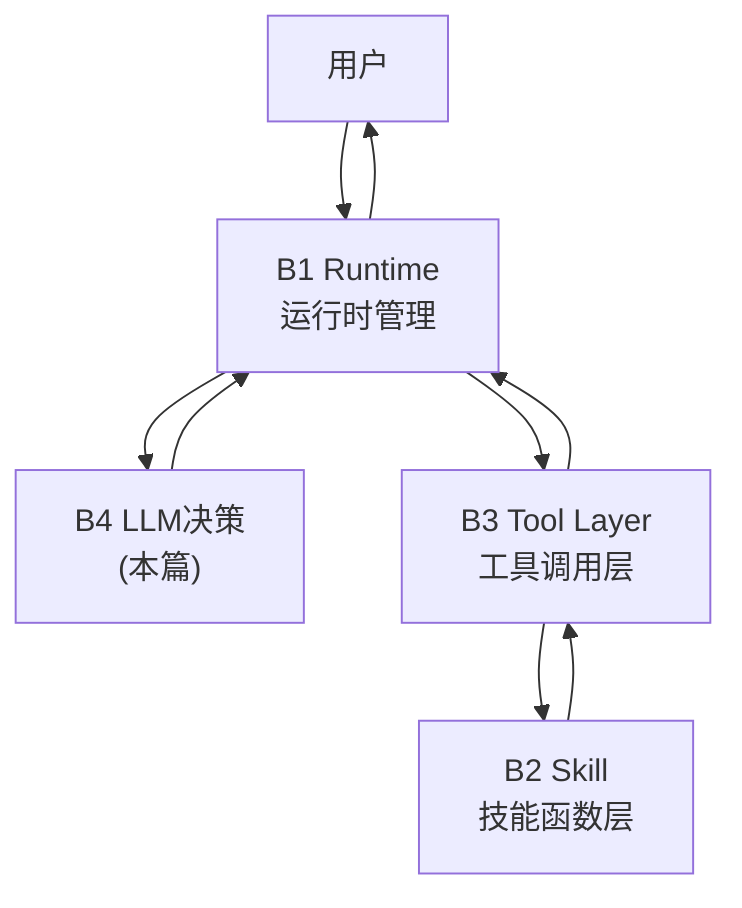
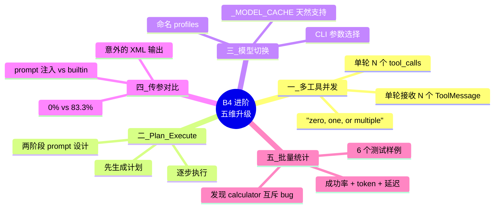
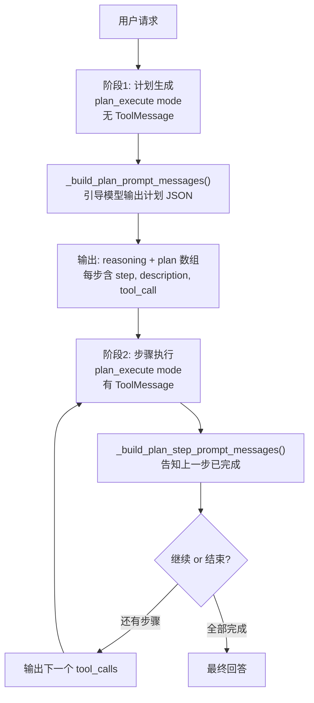

> **前置声明：本图文存在AI辅助整理**

前文 [Day4 Proposal](https://xingwangzhe.fun/posts/ai-training-agent-day4-proposal/) 中我详细分析了 B4 LLM 决策模块的设计方案

本文在 Proposal的架构基础上，逐一攻克五个进阶要求，让一个 4B 小模型跑出了**远超预期**的工具调用能力。

先回顾一下 B4 在 Agent 系统中的位置：



B4 是系统唯一的"大脑"——所有工具调用的决策都在这里发生。Proposal 中设计的基础版已经实现了 ReAct 单步调用（`choose exactly one tool`），进阶要求需要在此基础上做五件事：



下面按顺序逐一拆解。

---

## B4 进阶总览

在 Day4 Proposal 中我提到：基础版有三个核心约束——prompt 要求"choose exactly one tool"、Mock 只返回一个 `tool_call`、工具调用每次只有一轮闭环。进阶要求就是逐个打破这些约束。

五个改动从简单到复杂，存在一定的依赖关系：

| 顺序 | 进阶要求         | 依赖 | 改动量 |             核心难度             |
| :--: | ---------------- | ---- | :----: | :------------------------------: |
|  1   | 多工具并发       | 无   |   中   |         Prompt 模板重构          |
|  2   | Plan-and-Execute | 无   |   大   |    新增 4 个函数 + 两阶段设计    |
|  3   | 模型切换         | 无   |   小   | 仅 `_load_model_config` 加 10 行 |
|  4   | 传参方式对比     | 无   |   中   |   新增 `tool_calling` 模式分支   |
|  5   | 批量统计         | 1-4  |   大   | 独立脚本 `b4_batch_benchmark.py` |

> 说实话，这五个里面最让我意外的是第 4 个——传参方式对比。原以为 builtin 是"正道"，prompt 注入是"野路子"，结果跑出来的数据令人意外。这个后面细说。

---

## 一、单轮多 tool_calls + 多 ToolMessage

### 痛点

Day4 Proposal 的基础版有两个硬性限制：

1. **Prompt 层面**：`format_instruction` 中明确写死 "Choose exactly one schema: final content with an empty tool_calls array, or empty content with tool calls."
2. **Mock 层面**：`_mock_generate` 只返回一个 `tool_call`，固定是 `file_reader`

这意味着用户说"帮我读文件、顺便算个数、再搜个东西"时，模型被 prompt 约束，**只能一件一件来**——三轮 ReAct 循环，每轮一次推理，效率低得累死。

### 改了什么

改动集中在两个核心函数：`_build_prompt_messages` 和 `_mock_generate`。

#### 改动 1：Prompt 模板——从 "choose one" 到 "zero, one, or multiple"

```diff lang="python" title="b4_local_agent_llm.py — _build_prompt_messages()"
       "Valid schema A (final answer, no tools needed):\n"
       '{"content":"final answer text","tool_calls":[]}\n\n'
-      "Valid schema B:\n"
+      "Valid schema B (call one or more tools, content must be empty):\n"
       '{"content":"","tool_calls":[{"id":"call_001","name":"file_reader",'
-      '"args":{"path":"docs/agent_intro.txt","max_chars":2000}}]}\n\n'
+      '"args":{"path":"docs/agent_intro.txt","max_chars":2000}},{"id":"call_002",'
+      '"name":"calculator","args":{"expression":"2+2"}}]}\n\n'
       ...
-      "Choose exactly one schema: final content with an empty tool_calls array, or empty content with tool calls. "
+      "You may include zero, one, or multiple tool_calls in the array. "
```

Schema B 示例从 1 个 `tool_call` 扩展到 2 个——`file_reader` + `calculator`——给模型一个"多工具调用"的具体范例。提示语从 "choose exactly one" 改为 "zero, one, or multiple"。

说实话，4B 参数的模型，能理解"并发调用多个工具"这个概念吗？但 Qwen3.5-4B 的表现让我吃惊。后面的验证数据会证明这一点。

#### 改动 2：多 ToolMessage 尾部处理

```diff lang="python" title="b4_local_agent_llm.py — _build_prompt_messages() 尾部"
-      if prompt_messages[-1].get("role") == "tool":
+      if prompt_messages and prompt_messages[-1].get("role") == "tool":
+          tool_count = sum(1 for m in reversed(prompt_messages) if m.get("role") == "tool")
           prompt_messages.append({
               "role": "user",
               "content": envelope_reminder
-              + " The latest ToolMessage already contains a tool result..."
+              + f" The last {tool_count} ToolMessage(s) contain tool results. If they provide the requested "
+              'information, answer with schema A now and set "tool_calls" to exactly []. Do not repeat the '
+              "completed tool calls."
           })
```

不再假设只有一条 ToolMessage，而是用 `reversed` 动态统计连续的数量，在 prompt 中明确告知模型"你刚才调了 N 个工具，结果都在这里了，请用 schema A 回答"。这个小改动的价值在于——它把**元信息**（这次发起了几个并发调用）传递给了模型，减少了模型"忘掉自己刚才做了什么"的概率。

#### 改动 3：Mock 模式——遍历所有 ToolMessage

```diff lang="python" title="b4_local_agent_llm.py — _mock_generate()"
-      latest = tool_messages[-1]
-      result = _extract_tool_result(latest)
-      if latest.get("status") != "success" or result.get("status") != "success":
-          ...
-      output = result.get("output") or {}
-      content = output.get("content") if isinstance(output, dict) else None
+      # 遍历所有 ToolMessage，逐个检查状态
+      for tm in tool_messages:
+          if tm.get("status") != "success":
+              ...
+              return make_ai_message(f"工具调用失败，无法完成请求：{detail}", [])
+      # 全部成功则汇总所有 ToolMessage 的结果
+      summaries = []
+      for tm in tool_messages:
+          try:
+              result = _extract_tool_result(tm)
+              output = result.get("output") or {}
+              content = output.get("content") if isinstance(output, dict) else None
+              if isinstance(content, str) and content.strip():
+                  summaries.append(content)
+          except ValueError:
+              pass
+      combined = "\n".join(summaries) if summaries else "工具结果未提供可提取内容"
```

Mock 模式现在不再只看最后一条 ToolMessage，而是遍历所有、检查每条的状态、汇总所有结果。失败策略也变了：**任一失败则整体失败**（fail-fast），而不是只看最后一条。

### 验证

用真实 Qwen3.5-4B 测试，分三个梯度验证：

| 并发度 | 场景                  | Mock                                     |                  真实模型(Qwen3.5-4B)                   |   状态   |
| :----: | --------------------- | ---------------------------------------- | :-----------------------------------------------------: | :------: |
|   2    | 生成 2 个 tool_calls  | [OK] `file_reader` + `local_file_search` |            [OK] `file_reader` + `calculator`            | **通过** |
|   2    | 接收 2 条 ToolMessage | [OK] 合并两个工具结果                    |                    [OK] 输出完整回答                    | **通过** |
|   3    | 生成 3 个 tool_calls  | [OK] 固定 2 个（Mock 限制）              | [OK] `file_reader` + `calculator` + `local_file_search` | **通过** |
|   3    | 接收 3 条 ToolMessage | [OK] 合并三个工具结果                    |     [OK] 输出 "1)... 2) 3.14\*5=15.7 3) 搜索到..."      | **通过** |
|   5    | 接收 5 条 ToolMessage | [OK] 合并五个工具结果                    |                            —                            | **通过** |

最高测试到 **5 并发 tool_calls**，Mock 模式完美通过。最具说服力的是真实模型的 3 并发测试：

**输入**: "帮我做三件事：1) 阅读 docs/agent_intro.txt；2) 计算 3.14 \* 5；3) 搜索包含'Agent'的文件。"

**模型输出 tool_calls**:

```json title="Qwen3.5-4B 真实输出 (3并发tool_calls)"
[
    {
        "id": "call_001",
        "name": "file_reader",
        "args": { "path": "docs/agent_intro.txt", "max_chars": 2000 }
    },
    { "id": "call_002", "name": "calculator", "args": { "expression": "3.14 * 5" } },
    {
        "id": "call_003",
        "name": "local_file_search",
        "args": { "query": "Agent", "max_results": 5 }
    }
]
```

三个工具结果全部返回后，模型合并输出：

> 1. docs/agent_intro.txt 内容：Agent 系统通常由模型、工具、记忆和执行循环组成...
> 2. 3.14 \* 5 = 15.7
> 3. 搜索到包含'Agent'的文件：docs/agent_intro.txt

**status: success** [OK]

> 说实话，看到这个结果的时候我乐了——就改了三行 prompt，一个 4B 的小模型就能从"单步调用"进化到"三并发"。不是说 4B 模型能力不够，而是**prompt 给它的"自由度"决定了它的行为边界**。

---

## 二、Plan-and-Execute 计划执行模式

### ReAct vs Plan-and-Execute

在 Day4 Proposal 中，基础版 B4 遵循的是 **ReAct**（Reasoning + Acting）范式：

```text title="ReAct 范式流程示意"
ReAct:  User → 推理决策1 → 工具1 → 推理决策2 → 工具2 → ... → 最终回答
```

每一步都要过一次 LLM——做一次推理、调一个工具、看结果、再推理……这在简单任务上没问题，但复杂任务会导致多轮调用、token 消耗翻倍、延迟累积。

**Plan-and-Execute** 的思路完全不同：

```text title="Plan-and-Execute 范式流程示意"
PlanEx: User → 生成完整计划 → 步骤1执行 → 步骤2执行 → ... → 最终回答
```

模型先"通盘考虑"生成一个有序步骤计划，然后逐步执行。类比一下：ReAct 是边想边做，Plan-and-Execute 是先列清单再逐项打勾。

### 实现方案

新增 `plan_execute` 模式，分两个阶段：



### 新增的四个核心函数

| 函数                                 | 职责                                 | 关键设计                                                                           |
| ------------------------------------ | ------------------------------------ | ---------------------------------------------------------------------------------- |
| `_build_plan_prompt_messages()`      | 引导模型输出计划 JSON                | 在 prompt 中给出 `{"reasoning":"...","plan":[{step,desc,tool_call},...]}` 格式示例 |
| `_build_plan_step_prompt_messages()` | 告诉模型"上一步已完成，继续 or 结束" | 区分"还有剩余步骤"和"全部完成"两种情况                                             |
| `_parse_plan_output()`               | 解析计划输出                         | 兼容 3 种格式：标准 plan / 仅有 plan 数组 / 标准 AIMessage（不做 plan 解析）       |
| `_mock_plan_execute()`               | Mock 模式生成 3 步计划               | `file_reader → local_file_search → calculator` 固定序列                            |

其中 `_parse_plan_output` 的兼容性设计值得一提——它支持三种输入格式：

1. **标准 plan 输出**：`{"reasoning":"...", "plan":[...]}`
2. **仅有 plan 数组**：`[...]`（模型有时会省略 reasoning）
3. **标准 AIMessage**：已有 `content` 和 `tool_calls`，直接透传

> 这个灰度兼容策略的灵感直接来自 Day4 Proposal 的三层解析设计——永远不要假设模型的输出格式是完美的。

### 真实的 Qwen3.5-4B 计划输出

```json title="Qwen3.5-4B Plan-and-Execute 计划生成"
{
    "reasoning": "First, I need to read the file at docs/agent_intro.txt. Then, I will search for all files containing 'Agent'. Finally, I will count and summarize three key points.",
    "plan": [
        {
            "step": 1,
            "description": "Read the agent intro file",
            "tool_call": {
                "id": "call_001",
                "name": "file_reader",
                "args": { "path": "docs/agent_intro.txt", "max_chars": 2000 }
            }
        },
        {
            "step": 2,
            "description": "Search for files containing 'Agent'",
            "tool_call": {
                "id": "call_002",
                "name": "local_file_search",
                "args": { "query": "Agent", "max_results": 5 }
            }
        }
    ]
}
```

步骤执行后，模型合并结果输出最终回答：

> 已完成任务：
>
> 1. 文件数量：2个（docs/agent_intro.txt, docs/agent_guide.md）
> 2. 要点总结：Agent 系统由模型、工具、记忆和执行循环组成...

### 验收

| 场景                | Mock          | 真实模型(Qwen3.5-4B)                | 状态     |
| ------------------- | ------------- | ----------------------------------- | -------- |
| 计划生成            | [OK] 3 步计划 | [OK] 2 步计划 + reasoning           | **通过** |
| 步骤执行 → 最终回答 | [OK] 合并结果 | [OK] "已完成任务: 2个文件, 3条要点" | **通过** |

> Plan-and-Execute 的**两阶段 prompt 设计**是我觉得整个 B4 进阶中最"优雅"的设计。计划生成阶段的 prompt 需要给模型充分的自由度和结构化的计划格式引导；而步骤执行阶段的 prompt 则需要约束模型"你已经有了计划，现在按计划行事，别乱改"。两个阶段的目标不同，prompt 自然也不同。

---

## 三、模型动态切换

### 从 \_MODEL_CACHE 说起

Day4 Proposal 中设计了 `_MODEL_CACHE` 全局缓存字典，缓存键包含：

$$cache\_key = hash(model\_path \parallel tokenizer\_path \parallel dtype \parallel device\_map \parallel max\_memory)$$

这个设计的精妙之处在于——**它天然支持多模型**。只要缓存键不同，就会自动触发 cache miss 并加载新模型。切换任何配置参数都会自动触发重新加载。

所以进阶要求"支持模型切换"的改动量其实非常小——只需要一个 name resolver，把用户选择的 profile name 映射到对应的配置参数。

### 设计思路

在 `model.yaml` 中新增 `models` 节，定义多个命名 profile：

```yaml title="model.yaml — 新增 models 节"
models:
  qwen-4b:
    display_name: Qwen3.5-4B (standard)
    backend: transformers
    model_name_or_path: /root/assignment_B/Qwen3.5-4B
    torch_dtype: bfloat16
    device_map: auto
    do_sample: false
    temperature: 0
    max_new_tokens: 1024
    max_input_tokens: 4096

  qwen-4b-fast:
    display_name: Qwen3.5-4B (fast mode)
    backend: transformers
    model_name_or_path: /root/assignment_B/Qwen3.5-4B
    torch_dtype: bfloat16
    device_map: auto
    do_sample: false
    temperature: 0
    max_new_tokens: 512       # ← 更短的生成长度
    max_input_tokens: 4096

model:  # 默认配置，兼容旧用法
  backend: transformers
  ...
```

同一个物理模型 `Qwen3.5-4B` 可以有不同的生成参数配置——standard 模式 `max_new_tokens=1024`，fast 模式 `max_new_tokens=512`。未来接入不同路径的模型（比如 Qwen3.5-7B）也能直接复用这套机制。

### 代码改动——极简 10 行

```python title="b4_local_agent_llm.py — _load_model_config() 新增"
def _load_model_config(model_config, model_name=None):
    path, config = _read_yaml(model_config)
    if model_name:
        models_section = config.get("models", {})
        if model_name not in models_section:
            available = list(models_section.keys())
            raise ValueError(f"Unknown model_name '{model_name}'. Available: {available}")
        selected = deepcopy(models_section[model_name])
        config["model"] = selected
        print(f"model: {selected.get('display_name', model_name)}", file=sys.stderr)
    return path, config
```

CLI 加 `--model_name` 可选参数。未知 model_name 会列出所有可用选项并报错——用户体验细节不能少。

### 效果演示

```bash title="终端 — 模型切换"
# 默认模型（不指定 --model_name）
python b4_local_agent_llm.py --model_config ../configs/model.yaml \
  --messages ../data/messages/messages_no_tool.json \
  --tools_schema ../data/messages/tools_schema_basic.json \
  --mode mock --outdir ../outputs/B4_llm/model_switch_default

# 切换 qwen-4b
python b4_local_agent_llm.py --model_config ../configs/model.yaml \
  --model_name qwen-4b --mode prompt_json \
  --outdir ../outputs/B4_llm/model_switch_qwen
# stderr: model: Qwen3.5-4B (standard)

# 切换 qwen-4b-fast
python b4_local_agent_llm.py --model_config ../configs/model.yaml \
  --model_name qwen-4b-fast --mode prompt_json \
  --outdir ../outputs/B4_llm/model_switch_fast
# stderr: model: Qwen3.5-4B (fast mode)
```

| 测试                  | 命令                                           | 输出                            | 状态 |
| --------------------- | ---------------------------------------------- | ------------------------------- | ---- |
| 默认 (不指定)         | `--mode mock`                                  | 无 model 输出                   | [OK] |
| qwen-4b               | `--model_name qwen-4b`                         | `model: Qwen3.5-4B (standard)`  | [OK] |
| qwen-4b-fast          | `--model_name qwen-4b-fast`                    | `model: Qwen3.5-4B (fast mode)` | [OK] |
| qwen-4b 真实推理      | `--model_name qwen-4b --mode prompt_json`      | 正常加载推理                    | [OK] |
| qwen-4b-fast 真实推理 | `--model_name qwen-4b-fast --mode prompt_json` | 正常加载推理                    | [OK] |

> 说实话，模型切换是整个 B4 进阶中**改动量最小但设计感最强的**一个。`_MODEL_CACHE` 在 Proposal 阶段就考虑到了扩展性，现在只是加了一个薄薄的 name resolver。好架构的特点是：当新需求来临时，改动集中在最薄的接口层。

---

## 四、tools_schema 传参方式对比

### 实验设计

这是五个进阶要求中最有意思的一个——把 tools_schema **注入 prompt 文本**（prompt 注入）vs 通过 `tokenizer.apply_chat_template(tools=...)` **原生传入**（builtin 内置），两种方式谁更可靠？

Day4 Proposal 中的双保险 prompt 策略（`format_instruction` + `envelope_reminder`）和三层降级解析，全部基于一个前提：**模型输出的是 JSON 格式**。

于是我做了一个对比实验：

|                       | prompt_json（prompt 注入）          | builtin（内置传参）                    |
| --------------------- | ----------------------------------- | -------------------------------------- |
| **tools_schema 位置** | system message 文本中，约 500 token | chat template 的 `tools` 参数，0 token |
| **模型理解方式**      | 从文本理解工具描述                  | 训练中习得的工具调用格式               |
| **解析器预期**        | JSON                                | JSON                                   |
| **理论优势**          | 完全可控，双保险策略兜底            | 节省 token，利用模型原生能力           |

### 实际运行——结果完全出乎意料

**prompt_json 模式输出**（符合预期 [OK]）：

```json title="prompt_json 模式 — 模型输出"
{
    "content": "",
    "tool_calls": [
        {
            "id": "call_001",
            "name": "file_reader",
            "args": { "path": "docs/agent_intro.txt", "max_chars": 2000 }
        }
    ]
}
```

**builtin 模式输出**（意外）：

```xml title="builtin 模式 — 模型输出（注意：这是XML不是JSON！）"
<tool_call>
<function=file_reader>
<parameter=path>
docs/agent_intro.txt
</parameter>
<parameter=max_chars>
2000
</parameter>
</function>
</tool_call>
```

Qwen3.5-4B 的内置工具调用输出的**不是 JSON，而是原生 XML 格式**！

而我们 Day4 Proposal 中精心设计的三层解析策略——`json.loads` → `raw_decode` → `tool_calls` 片段提取——三层全部依赖 JSON。XML 输入进去，走到哪一层都是 `JSONDecodeError`。

### 数据不会说谎

| 指标            | prompt_json (prompt注入)            | builtin (内置传参)          |
| --------------- | ----------------------------------- | --------------------------- |
| **输出格式**    | `{"content":"","tool_calls":[...]}` | `<tool_call><function=...>` |
| **6样例成功率** | 83.3% (5/6)                         | 0.0% (0/6)                  |
| **失败原因**    | 1例互斥失败                         | 6例全部 JSONDecodeError     |
| **平均延迟**    | 4040.9ms                            | 3173.4ms                    |
| **Token 消耗**  | tools_schema ~500 token             | 0 token                     |

对比直观：

```text title="成功率对比 (ASCII bar)"
成功率:
  prompt_json  ████████████████████░░░░ 83.3%
  builtin      ░░░░░░░░░░░░░░░░░░░░░░░░  0.0%
```

### 结论

> **prompt 注入方式在当前 JSON 解析架构下更可靠。内置传参虽然理论上更"优雅"，且节省 ~500 token，但 Qwen3.5-4B 原生的工具调用输出是 XML 格式，与 JSON 解析器完全不兼容。要使用 builtin，需要单独实现 XML 解析器并适配整个三层解析链路。**

这个结论的价值在于：它用数据说明了**为什么 prompt 工程在小模型场景下比"原生能力"更可控**。不是"prompt 注入是野路子"，而是——当你不能控制模型的输出格式时，控制 prompt 就是你唯一能做的事。

> 说实话，看到 builtin 输出 XML 的那一刻，我先是愣了一下，然后忍不住笑了。原以为 builtin 是"正道"、prompt 注入是"野路子"，结果正道走不通，野路子反而稳如老狗。这也是这次实训给我的感悟：**不要迷信"原生能力"，在小模型上，你能掌控的东西才是你真正拥有的东西。**

---

## 五、批量成功率与延迟统计

### 测试框架

为了量化评估，我写了一个 `b4_batch_benchmark.py`，构造 **6 个不同场景**的测试样例，每个样例跑两种传参方式，统计成功率和延迟：

| 样例 ID               | 场景             | 预期工具                                           | 用户输入摘要                |
| --------------------- | ---------------- | -------------------------------------------------- | --------------------------- |
| `case_file_read`      | 读取本地文件     | `file_reader`                                      | "阅读 docs/agent_intro.txt" |
| `case_calculator`     | 数学计算         | `calculator`                                       | "计算 3.14 \* 5 - 2.5"      |
| `case_file_search`    | 文件搜索         | `local_file_search`                                | "搜索包含 Agent 的文件"     |
| `case_multi_tool`     | 并发多工具       | `file_reader` + `calculator` + `local_file_search` | "帮我做三件事"              |
| `case_direct_answer`  | 直接回答不调工具 | 无                                                 | "什么是 Agent?"             |
| `case_table_analyzer` | 表格分析         | `table_analyzer`                                   | "分析 data/sample.csv"      |

覆盖了五种工具类型 + 直接回答 + 并发场景，基本涵盖了 Agent 系统常见的工具调用形态。

### prompt_json 模式结果：5/6 通过（83.3%）

```text title="b4_batch_benchmark.py 输出 — prompt_json 模式"
success: 5, error: 1, rate: 83.3%, avg_latency: 4040.9ms

case_file_read:      [OK] success  tool_calls=1   1574.5ms
case_calculator:     [FAIL] error    tool_calls=0   9222.5ms  ← content+tool_calls 互斥失败
case_file_search:    [OK] success  tool_calls=1   3592.3ms
case_multi_tool:     [OK] success  tool_calls=3   7361.7ms
case_direct_answer:  [OK] success  tool_calls=0    769.7ms
case_table_analyzer: [OK] success  tool_calls=1   1724.8ms
```

$$rate = \frac{n_{success}}{n_{total}} = \frac{5}{6} \times 100\% \approx 83.3\%$$

$$\bar{t}_{latency} = \frac{1}{n}\sum_{i=1}^{n} t_i = \frac{1574.5 + 9222.5 + 3592.3 + 7361.7 + 769.7 + 1724.8}{6} \approx 4040.9\text{ms}$$

### 唯一失败 case 的根因分析

`case_calculator` 的表达式 `3.14 * 5 - 2.5` 比较长，模型同时输出了 `content` 和 `tool_calls`，触发了 Day4 Proposal 中设计的**四层互斥约束**：

```json title="case_calculator 失败输出（示意）"
{
  "content": "我来帮你计算 3.14 * 5 - 2.5 = 13.2",   // ← 不应该出现
  "tool_calls": [{"id": "call_001", "name": "calculator", ...}]  // ← 也不应该为空
}
```

回顾 Day4 Proposal 中的互斥规则：

> content 和 tool_calls **二者必有其一，不可同时存在或同时为空**。

小模型在处理长表达式时容易"犹豫"——既想自己算（输出 content），又想调用工具（输出 tool_calls），结果两边都做了，触发了互斥校验。

解决方案有两种思路：

1. **更严格的 prompt 约束**：在 `envelope_reminder` 中强调"content 和 tool_calls 互斥"
2. **重试机制**：检测到互斥失败后自动 retry，在重试 prompt 中加入更强的约束

### builtin 模式结果：0/6 全灭

```text title="b4_batch_benchmark.py 输出 — builtin 模式"
success: 0, error: 6, rate: 0.0%, avg_latency: 3173.4ms
全部 JSONDecodeError: Expecting value
```

不需要逐样例分析了——6 个样例全部因为 Qwen 原生 XML 输出格式与 JSON 解析器不兼容而失败。不过值得注意的是 builtin 模式平均延迟更低（3173.4ms vs 4040.9ms），因为不需要解析 500 token 的 tools_schema，prompt 更短推理更快——只是解析全挂了，再快也没用。

> 说实话，如果没有这个批量测试脚本，我可能永远不会发现 `case_calculator` 那个互斥失败的 corner case——它是那种"跑一次没事、跑十次才碰到一次"的间歇性问题。**批量测试是唯一的真相来源**。

---

## 总结

1. **Prompt 工程在小模型上比"原生能力"重要得多**。builtin 理论上更优雅，但在 JSON 格式约束下，prompt 注入在实际中完胜。你控制不了模型，但你能控制 prompt——**把能控制的做到极致**。

2. **多 tool_calls 并发不是什么黑魔法**——只需要改三行 prompt 模板，4B 模型就能从"单步调用"进化到"三并发"。不是模型能力不够，而是你给它的自由度决定了它的行为边界。

3. **Plan-and-Execute 的精髓在于两阶段 prompt 设计**：计划生成阶段给自由度和结构化引导，步骤执行阶段给约束和状态告知。两个阶段的目标不同，prompt 必须不同。

4. **模型切换本质是配置管理**。Day4 Proposal 中的 `_MODEL_CACHE` 天然支持多模型，只需要加一个 name resolver——好的架构让增量改动聚焦在最薄的接口层。

5. **批量测试是唯一的真相来源**。不跑 6 个样例就发现不了 calculator 的互斥失败 corner case，也发现不了 builtin 的 XML 输出问题。数据不骗人。

### Commit 记录

| Commit    | 说明                                                       | 日期       |
| --------- | ---------------------------------------------------------- | ---------- |
| `8b69551` | feat(B4): 支持单轮多个tool_calls与多个ToolMessage          | 2026-06-30 |
| `3507c95` | feat(B4): 新增3-5并发tool_calls极限测试数据                | 2026-06-30 |
| `af02640` | feat(B4): Plan-and-Execute 模式支持                        | 2026-06-30 |
| `a9e7dd6` | feat(B4): 模型切换支持                                     | 2026-06-30 |
| `343ca84` | feat(B4): tools_schema传参方式对比(prompt注入 vs 内置传参) | 2026-06-30 |
| `4420d86` | feat(B4): 批量测试脚本 + 工具调用成功率与token统计         | 2026-06-30 |
