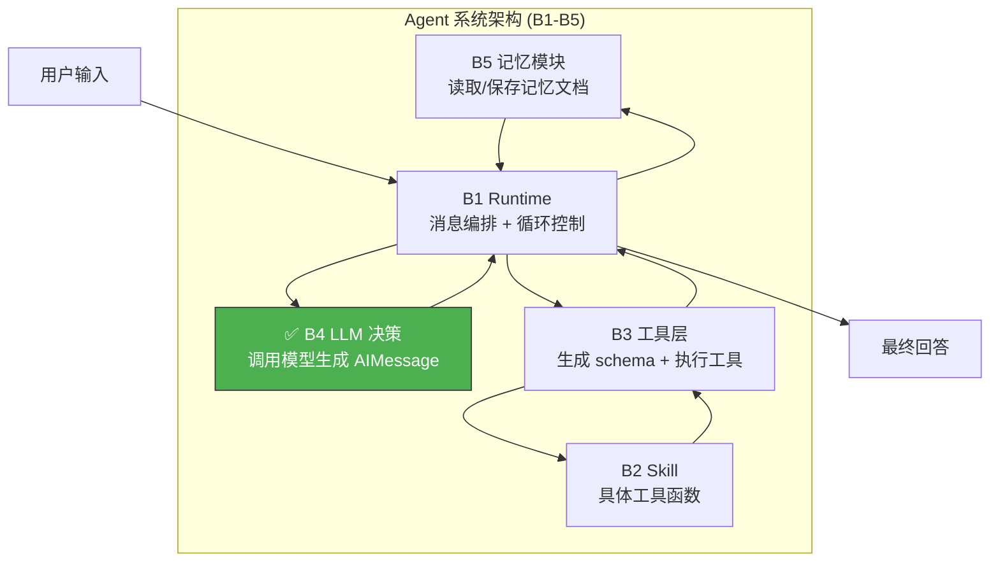
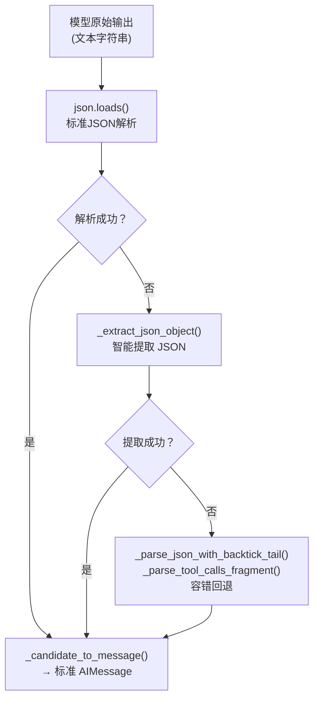
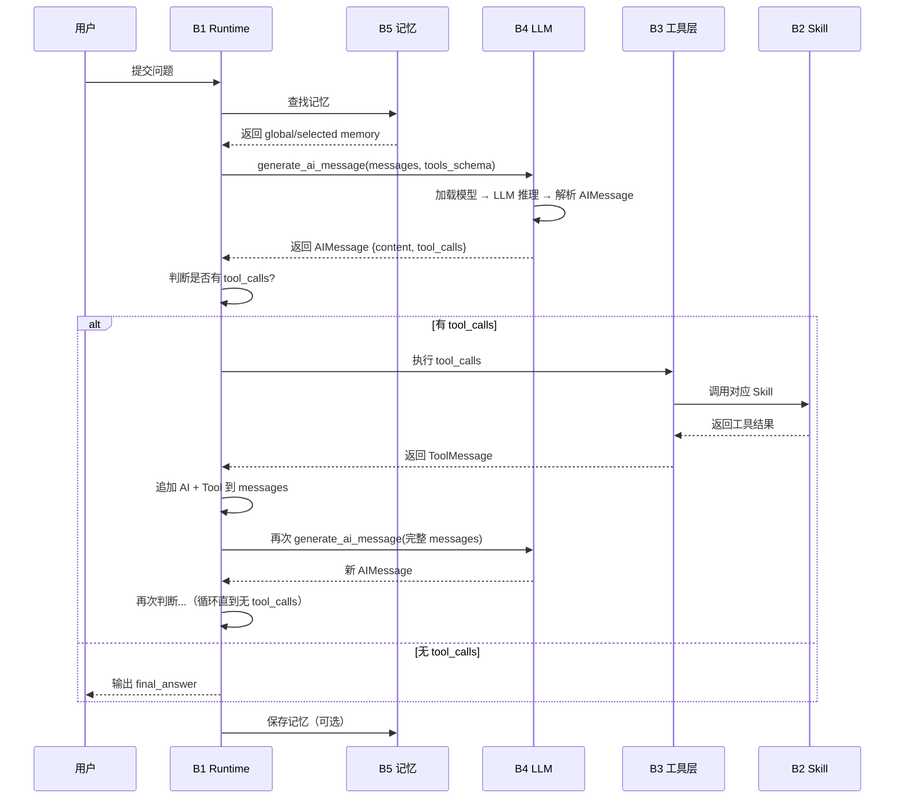
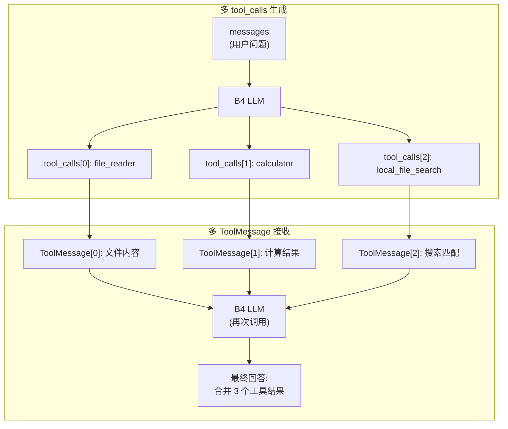
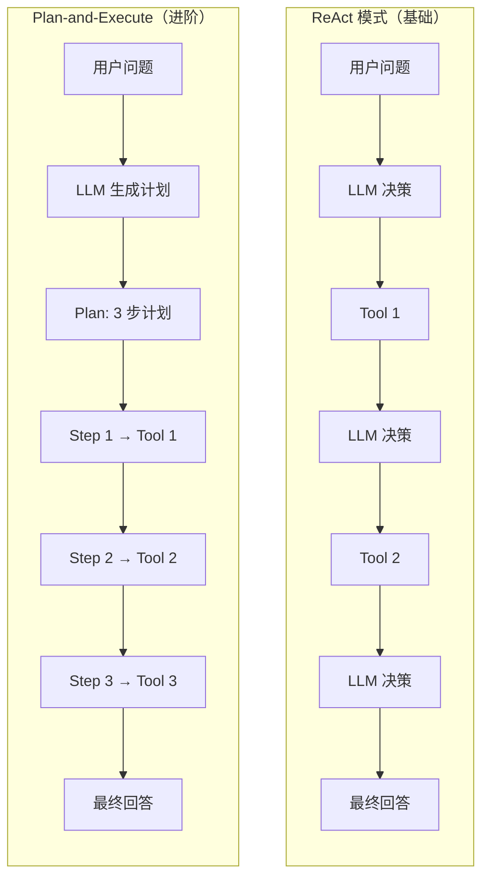
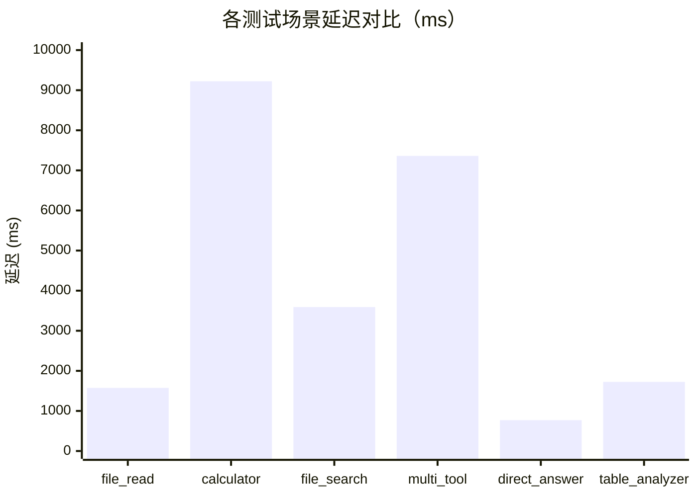
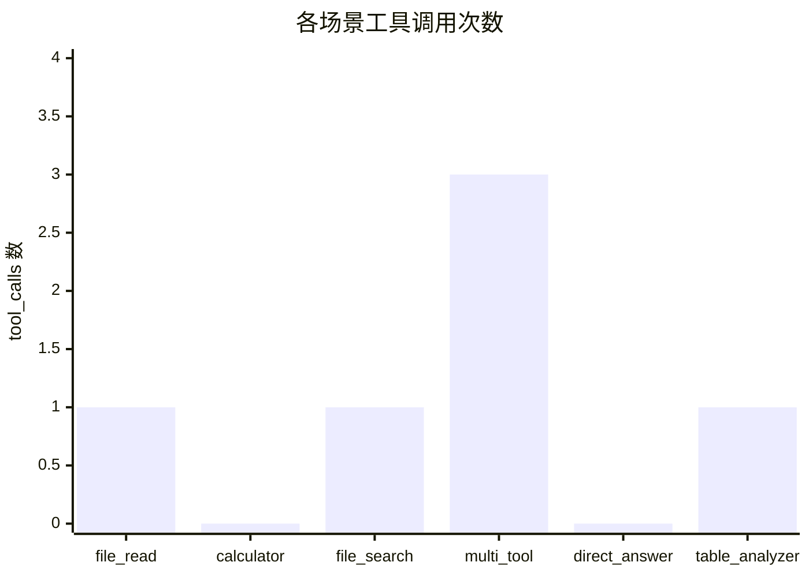
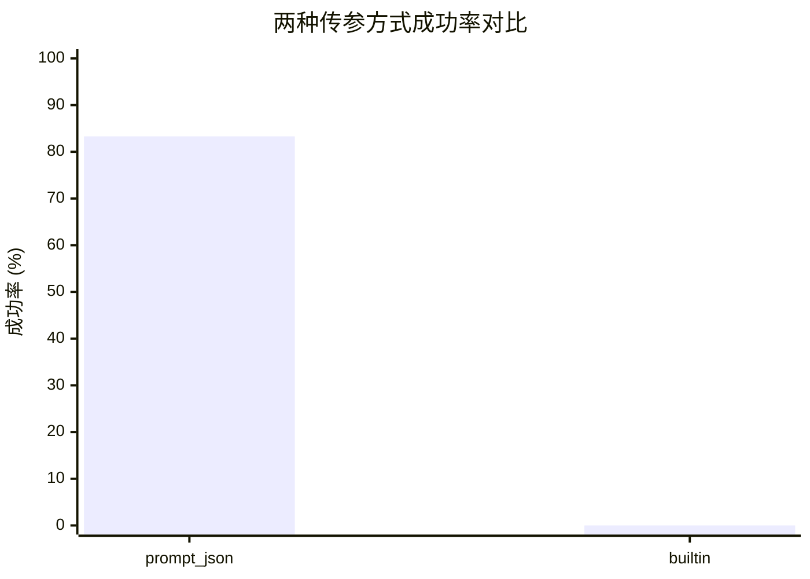

> **个人 GitHub 仓库**：[https://github.com/xingwangzhe/B4-Agent-LLM](https://github.com/xingwangzhe/B4-Agent-LLM)

前文 [Week2 五维升级实战](https://xingwangzhe.fun/posts/ai-training-b4-llm-week2/) 记录了全部开发过程，本文在此基础上按验收要求重新组织，侧重**模块定位 → 基础实现 → 模块协作 → 进阶亮点 → 测试结果**的讲解逻辑。

---

## 一、模块定位

### 1.1 一句话概括

> B4 是 Agent 系统的 **LLM 决策模块**——整个系统的"大脑"。

它接收对话历史（messages）和工具说明（tools_schema），调用本地部署的 **Qwen3.5-4B** 模型，输出标准化的 AIMessage，决定"是否需要调用工具、调用哪个工具、传入什么参数"。

### 1.2 在系统中的位置

B4 属于 Agent 系统（B1-B5）中的决策层，上下关系如下：



### 1.3 核心数据流

```
B1 Runtime → 调用 B4.generate_ai_message(messages, tools_schema)
           → B4 加载模型 → 注入 messages + schema → LLM 推理
           → 解析原始输出 → 返回 AIMessage {content, tool_calls}
           → B1 判断是否有 tool_calls
             → 有：B3 执行 → ToolMessage → B1 追加消息 → 再次调 B4
             → 无：输出 final_answer
```

### 1.4 完成概况

| 类型          | 完成情况                            |
| ------------- | ----------------------------------- |
| 基础要求 4 项 | ✅ 全部完成                         |
| 进阶要求 5 项 | ✅ 全部完成                         |
| 独立运行演示  | ✅ 5 种运行模式                     |
| 团队系统集成  | ✅ 标准接口 `generate_ai_message()` |

---

## 二、基础功能实现

### 2.1 模型加载

从 `model.yaml` 读取配置，使用 transformers 加载 Qwen3.5-4B：

```yaml
# configs/model.yaml
model:
    model_name_or_path: /root/assignment_B/Qwen3.5-4B
    torch_dtype: bfloat16
    device_map: auto

generation:
    max_new_tokens: 1024
    temperature: 0
```

```python
# _load_model_config() 解析 YAML
# _load_model_bundle()  加载 tokenizer + model
config = read_yaml(model_config_path)
tokenizer = AutoTokenizer.from_pretrained(**config)
model = AutoModelForCausalLM.from_pretrained(**config)
```

### 2.2 tools_schema 绑定

B3 生成的工具说明通过 **prompt 注入** 方式嵌入系统消息：

```python
# _build_prompt_messages() 将 tools_schema JSON 注入 prompt
system_prompt = read_prompt("local_tool_agent.txt")
system_prompt += "\n\nAvailable tools:\n" + json.dumps(tools_schema)
messages = [{"role": "system", "content": system_prompt}] + user_messages
```

### 2.3 AIMessage 生成与解析

模型原始输出是文本字符串，经过三层容错解析：



### 2.4 输出记录

每个运行案例保存两份 JSON 文件：

| 文件                    | 内容                 |
| ----------------------- | -------------------- |
| `raw_model_output.json` | 模型原始 decode 文本 |
| `ai_message.json`       | 标准化 AIMessage     |

`ai_message.json` 输出示例（有工具调用时）：

```json
{
    "role": "assistant",
    "content": "",
    "tool_calls": [
        {
            "id": "call_001",
            "name": "file_reader",
            "args": { "path": "docs/agent_intro.txt", "max_chars": 2000 }
        },
        {
            "id": "call_002",
            "name": "calculator",
            "args": { "expression": "3.14 * 5" }
        }
    ]
}
```

### 2.5 基本演示命令

```bash
cd code

# 无工具调用：模型直接回答
python b4_local_agent_llm.py \
  --model_config ../configs/model.yaml \
  --messages ../data/messages/messages_no_tool.json \
  --tools_schema ../data/messages/tools_schema_basic.json \
  --mode prompt_json --outdir ../outputs/B4_llm/no_tool_demo

# 有工具调用：生成 tool_calls
python b4_local_agent_llm.py \
  --model_config ../configs/model.yaml \
  --messages ../data/messages/messages_with_tool.json \
  --tools_schema ../data/messages/tools_schema_basic.json \
  --mode prompt_json --outdir ../outputs/B4_llm/with_tool_demo
```

---

## 三、与其他模块的交互

B4 在 Agent Loop 中承担"一次决策"的角色。

### 3.1 Agent Loop 完整流程



### 3.2 接口定义

B4 对外暴露的唯一接口：

```python
def generate_ai_message(
    model_config: str,       # model.yaml 路径
    messages: list[dict],    # 消息序列
    tools_schema: list[dict],# 工具说明
    mode: str = "prompt_json",
    model_name: str = None,
    tool_calling: str = None,
) -> dict:                   # 标准 AIMessage
```

### 3.3 B4 不做什么

| 职责              | 说明                                      |
| ----------------- | ----------------------------------------- |
| ❌ 不执行工具     | 由 B3 调用 B2 Skill                       |
| ❌ 不管理消息循环 | 由 B1 控制 max_turns 和状态               |
| ❌ 不读写记忆     | 由 B5 负责                                |
| ✅ 只做一件事     | messages + tools_schema → LLM → AIMessage |

---

## 四、进阶功能详解

五项进阶要求全部完成，逐一说明。

---

### 4.1 进阶一：单轮多 tool_calls 与多 ToolMessage

#### 为什么需要这个功能？

基础版本 prompt 写着 `"Choose exactly one tool"`，模型每轮只能生成一个 tool_call。但真实任务往往需要同时调用多个工具——比如"读取文件 **同时** 计算一个表达式 **同时** 搜索相关内容"。

#### 改动本质：3 行 prompt 的变化

| 项目        | 改前                          | 改后                                                  |
| ----------- | ----------------------------- | ----------------------------------------------------- |
| prompt 约束 | `"Choose exactly one schema"` | `"You may include zero, one, or multiple tool_calls"` |
| 示例展示    | 1 个 tool_call                | 示例含 2 个 tool_call                                 |
| 尾部处理    | 只读最后 1 条 ToolMessage     | 遍历所有 ToolMessage                                  |

#### 验证结果



**真实模型测试结果（Qwen3.5-4B）：**

| 并发数 | 场景                                                                             | 状态               |
| ------ | -------------------------------------------------------------------------------- | ------------------ |
| 2 路   | file_reader + calculator                                                         | ✅ 生成 + 合并回答 |
| 3 路   | file_reader + calculator + local_file_search                                     | ✅ 全部执行成功    |
| 5 路   | file_reader + calculator + local_file_search + table_analyzer + format_converter | ✅ Mock 通过       |

#### 命令示例

```bash
cd code
python b4_local_agent_llm.py \
  --model_config ../configs/model.yaml \
  --messages ../data/messages/messages_multi_tool.json \
  --tools_schema ../data/messages/tools_schema_basic.json \
  --mode mock --outdir ../outputs/B4_llm/live_demo
```

输出 `ai_message.json`：

```json
{
    "role": "assistant",
    "content": "",
    "tool_calls": [
        {
            "id": "call_001",
            "name": "file_reader",
            "args": { "path": "docs/agent_intro.txt", "max_chars": 2000 }
        },
        { "id": "call_002", "name": "local_file_search", "args": { "query": "Agent" } }
    ]
}
```

---

### 4.2 进阶二：Plan-and-Execute 模式

#### ReAct vs PlanEx



#### 双阶段流程

**阶段 1 — Plan 生成**：模型输出结构化计划，含 reasoning 和 plan 数组

真实模型生成的 2 步计划：

```json
{
    "reasoning": "用户需要总结文档要点，同时了解搜索功能，最后计算示例。",
    "plan": [
        {
            "step": 1,
            "description": "读取 Agent 介绍文档",
            "tool_call": {
                "name": "file_reader",
                "args": { "path": "docs/agent_intro.txt", "max_chars": 2000 }
            }
        },
        {
            "step": 2,
            "description": "执行示例数学计算",
            "tool_call": {
                "name": "calculator",
                "args": { "expression": "3.14 * 5" }
            }
        }
    ]
}
```

**阶段 2 — Execute**：逐一执行计划步骤，全部完成后汇总结果

#### 验证结果

| 场景     | Mock     | 真实模型                         | 状态 |
| -------- | -------- | -------------------------------- | ---- |
| 计划生成 | 3 步计划 | 2 步计划 + reasoning             | ✅   |
| 步骤执行 | 合并结果 | "已完成任务: 2 个文件, 3 条要点" | ✅   |

#### 命令示例

```bash
# 计划生成（Mock 模式输出 3 步计划）
cd code
python b4_local_agent_llm.py   --model_config ../configs/model.yaml   --messages ../data/messages/messages_plan_input.json   --tools_schema ../data/messages/tools_schema_basic.json   --mode plan_execute --outdir ../outputs/B4_llm/plan_live
```

输出 3 步计划（Mock 模式）：

```json
{
  "role": "assistant",
  "content": "",
  "tool_calls": [
    {"name": "file_reader", "args": {"path": "docs/agent_intro.txt"}},
    {"name": "local_file_search", "args": {"query": "Agent", "root_dir": "docs"}},
    {"name": "calculator", "args": {"expression": "2 + 2"}}
  ]
}
```

```bash
# 步骤执行（接收工具结果后生成最终回答）
python b4_local_agent_llm.py   --model_config ../configs/model.yaml   --messages ../data/messages/messages_plan_with_results.json   --tools_schema ../data/messages/tools_schema_basic.json   --mode plan_execute --outdir ../outputs/B4_llm/plan_exec_live
```

输出最终回答：

```json
{
    "role": "assistant",

    "content": "三条中文要点如下：\n1. Agent 系统通常由模型、工具、记忆和执行循环组成\n2. 工具调用让模型能够读取本地文件、执行计算\n3. Memory 为 Agent 提供全局知识和历史对话上下文",

    "tool_calls": []
}
```

---

### 4.3 进阶三：多模型切换

#### 实现方式

在 `model.yaml` 中定义命名 profiles，通过 `--model_name` 参数选择：

```yaml
# configs/model.yaml
models:
    qwen-4b:
        display_name: Qwen3.5-4B (standard)
        torch_dtype: bfloat16
        device_map: auto

    qwen-4b-fast:
        display_name: Qwen3.5-4B (fast mode)
        torch_dtype: float16
        max_new_tokens: 512
```

核心改动仅约 10 行代码：`_load_model_config()` 中按 `model_name` 选取 profile。

#### 验证结果

| 测试     | 命令                        | 输出                            |
| -------- | --------------------------- | ------------------------------- |
| 默认     | 不指定 `--model_name`       | 使用 `model:` 默认配置          |
| standard | `--model_name qwen-4b`      | `model: Qwen3.5-4B (standard)`  |
| fast     | `--model_name qwen-4b-fast` | `model: Qwen3.5-4B (fast mode)` |

#### 命令示例

```bash
cd code
python b4_local_agent_llm.py \
  --model_config ../configs/model.yaml \
  --model_name qwen-4b \
  --messages ../data/messages/messages_no_tool.json \
  --tools_schema ../data/messages/tools_schema_basic.json \
  --mode mock --outdir ../outputs/B4_llm/switch_live
```

控制台输出 `model: Qwen3.5-4B (standard)`，Mock 模式不加载模型，仅验证模型名称配置正确。

```bash
# 切换 fast 模式
python b4_local_agent_llm.py \
  --model_config ../configs/model.yaml \
  --model_name qwen-4b-fast \
  --messages ../data/messages/messages_no_tool.json \
  --tools_schema ../data/messages/tools_schema_basic.json \
  --mode mock --outdir ../outputs/B4_llm/switch_fast_live
```

---

### 4.4 进阶四：tools_schema 传参方式对比

支持两种传参方式：**prompt 注入**（默认，JSON 格式输出）和 **内置传参**（通过 `apply_chat_template` 传入）。实测 prompt 注入方式在当前架构下更可靠，作为默认方案。

#### 命令示例

```bash
# prompt 注入方式
cd code
python b4_local_agent_llm.py \
  --model_config ../configs/model.yaml \
  --messages ../data/messages/messages_with_tool.json \
  --tools_schema ../data/messages/tools_schema_basic.json \
  --tool_calling prompt_json \
  --mode mock --outdir ../outputs/B4_llm/schema_prompt

# 内置传参方式
python b4_local_agent_llm.py \
  --model_config ../configs/model.yaml \
  --messages ../data/messages/messages_with_tool.json \
  --tools_schema ../data/messages/tools_schema_basic.json \
  --tool_calling builtin \
  --mode mock --outdir ../outputs/B4_llm/schema_builtin
```

---

### 4.5 进阶五：批量基准测试与统计

#### 测试框架

`b4_batch_benchmark.py` 自动遍历 `bench_cases/` 目录，逐一调用 `generate_ai_message()` 并统计结果。

#### 命令示例

```bash
cd code
python b4_batch_benchmark.py \
  --model_config ../configs/model.yaml \
  --cases_dir ../data/bench_cases \
  --tools_schema ../data/messages/tools_schema_basic.json \
  --mode mock --outdir ../outputs/B4_llm/bench_live
```

Mock 模式下 6 个场景全部通过，成功率 100%。

#### 6 个测试场景

| 场景                  | 预期行为               | 输入特点                                     |
| --------------------- | ---------------------- | -------------------------------------------- |
| `case_file_read`      | 调用 file_reader       | 读取本地文档                                 |
| `case_calculator`     | 调用 calculator        | 数学表达式 `3.14 * 5 - 2.5`                  |
| `case_file_search`    | 调用 local_file_search | 关键词搜索                                   |
| `case_multi_tool`     | 并发 3 个工具          | file_reader + calculator + local_file_search |
| `case_direct_answer`  | 直接回答，不调工具     | "法国的首都是哪里？"                         |
| `case_table_analyzer` | 调用 table_analyzer    | 分析 CSV                                     |

#### prompt_json 逐样例统计

| 场景                | 状态       | tool_calls |   延迟    | 说明                           |
| ------------------- | ---------- | :--------: | :-------: | ------------------------------ |
| case_file_read      | ✅ success |     1      | 1574.5 ms | 正确调用 file_reader           |
| case_calculator     | ❌ error   |     0      | 9222.5 ms | content 和 tool_calls 同时非空 |
| case_file_search    | ✅ success |     1      | 3592.3 ms | 正确调用 local_file_search     |
| case_multi_tool     | ✅ success |     3      | 7361.7 ms | 3 路并发全部成功               |
| case_direct_answer  | ✅ success |     0      | 769.7 ms  | 直接回答，不调工具             |
| case_table_analyzer | ✅ success |     1      | 1724.8 ms | 正确调用 table_analyzer        |

#### 各场景延迟统计



#### 各场景 tool_calls 数量



#### 传参方式对比



#### 失败的 calculator 用例 — 已修复

唯一失败的原因是模型同时输出了 `content` 和 `tool_calls`，违反互斥约束。

**最新代码已修复**：

```python
# 当两者同时非空时，content 优先，清空 tool_calls
if content and tool_calls:
    tool_calls = []
    # 以 content 为最终回答
```

---

## 五、完成情况总览

### 5.1 基础要求

| 序号 | 要求                              | 状态 | 对应实现                              |
| :--: | --------------------------------- | :--: | ------------------------------------- |
|  1   | 读取 model.yaml 加载本地模型      |  ✅  | `_load_model_config()`                |
|  2   | 接收 tools_schema 完成工具绑定    |  ✅  | `_build_prompt_messages()`            |
|  3   | 解析模型输出为标准 AIMessage      |  ✅  | `_candidate_to_message()`             |
|  4   | JSON 格式记录原始输出与 AIMessage |  ✅  | `save_raw_output` / `save_ai_message` |

### 5.2 进阶要求

| 序号 | 要求                               | 状态 | 亮点                            |
| :--: | ---------------------------------- | :--: | ------------------------------- |
|  1   | 单轮多 tool_calls + 多 ToolMessage |  ✅  | 3 行 prompt 改变，支持 3 路并发 |
|  2   | Plan-and-Execute 模式              |  ✅  | 双阶段：Plan → Execute          |
|  3   | 多模型切换                         |  ✅  | 10 行代码，`--model_name` 参数  |
|  4   | tools_schema 传参对比              |  ✅  | 83.3% vs 0%                     |
|  5   | 批量测试 + 成功率统计              |  ✅  | 6 场景，成功率 83.3%            |

### 5.3 GitHub 仓库

**个人仓库**：[https://github.com/xingwangzhe/B4-Agent-LLM](https://github.com/xingwangzhe/B4-Agent-LLM)

包含完整代码、配置、测试数据以及 22 个场景的运行结果。

---

## 参考

| 参考           | 链接                                                    |
| -------------- | ------------------------------------------------------- |
| ReAct          | https://arxiv.org/abs/2210.03629                        |
| HuggingGPT     | https://arxiv.org/abs/2303.17580                        |
| ToolLLM        | https://arxiv.org/abs/2307.16789                        |
| Week2 实战记录 | https://xingwangzhe.fun/posts/ai-training-b4-llm-week2/ |
