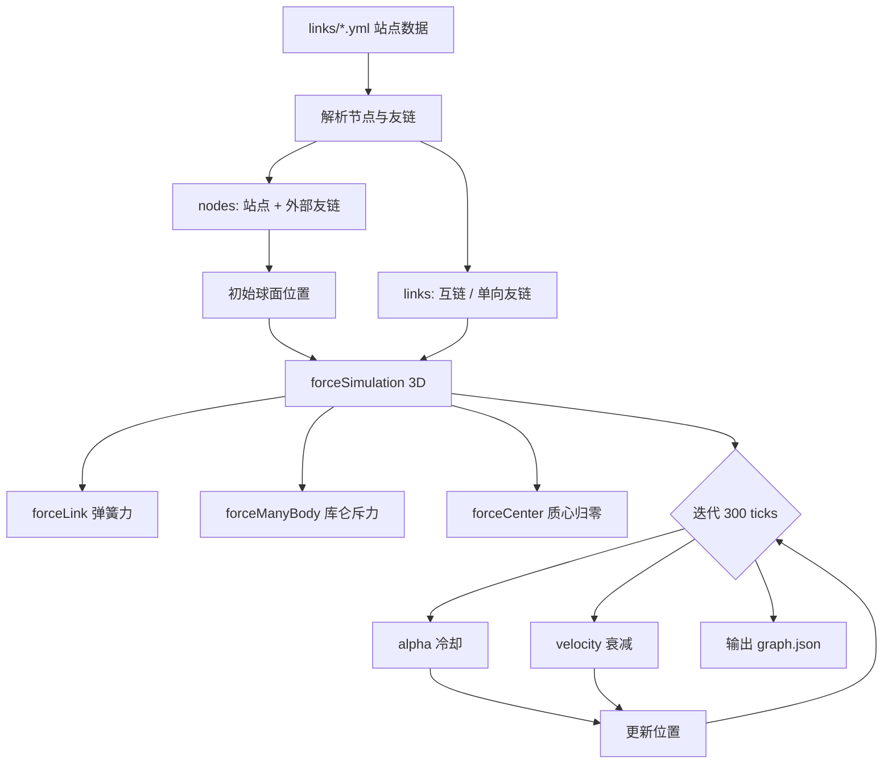

## 前言

还记得我之前写的 [友链图谱 - 汇聚千丝万缕的联系](/posts/友链图谱-汇聚千丝万缕的联系) 吗？那时候还是 2D 平面的展示方式，虽然也能看出关系，但总觉得少了点什么。

这次我彻底重构了可视化引擎，从 2D 升级到 **3D 球状网络**！基于 Three.js 和 3d-force-graph，让整个友链网络在三维空间中旋转、缩放，视觉效果直接拉满。

> 声明：本文在撰写过程中使用了 AI 工具辅助润色与排版。

## 友链图谱 2.0

友链图谱网址: [https://links.needhelp.icu/](https://links.needhelp.icu/)

Github: [https://github.com/xingwangzhe/FriendLinks](https://github.com/xingwangzhe/FriendLinks)

### 3D 球状网络


友链关系以 **3D 球状网络** 呈现，基于 Three.js 渲染：

| 特性 | 说明 |
|------|------|
| 鼠标拖拽 | 可旋转视角 |
| 滚轮缩放 | 自由探索网络 |
| 方向粒子流动 | 连线带粒子流动，直观展示友链指向 |
| 节点大小 | 反映链接数量（度数越大节点越大） |
| 暗色/亮色主题 | 自动切换 |

### 聚焦与高亮效果


右键点击任意节点，会触发 **聚焦效果**：

| 效果 | 说明 |
|------|------|
| 节点放大 1.5 倍 | 聚焦节点半径放大，一眼就能找到 |
| 节点颜色调亮 60% | 高亮显示，周围节点保持原色 |
| 连线金色高亮 | 相连连线变为亮金色（2.5 倍粗、高不透明） |
| 相机自动移动 | 将节点移动到视野中心 |

从宏观宇宙中看，聚焦节点就像一颗 **恒星**，金色连线像光束一样指向它，非常醒目。

### 搜索与定位


| 交互 | 说明 |
|------|------|
| 顶部搜索框 | 支持模糊搜索站点名、域名 |
| 左键点击节点 | 在新标签页打开对应网站 |
| 右键点击节点 | 聚焦该节点（相机拉近 + 高亮） |
| 悬停节点 | 显示站点名称、描述和链接 |

### URL 自动聚焦

如果你已经在网络中，可以通过查询参数来自动聚焦并高亮指定站点节点：

| 匹配方式 | 示例 URL |
|----------|----------|
| 域名匹配 | `https://links.needhelp.icu/?local=xingwangzhe.fun` |
| 完整 URL | `https://links.needhelp.icu/?local=https://xingwangzhe.fun` |

## 技术实现

### 3D 力导布局



使用 **d3-force-3d** 在构建时预计算节点位置，客户端直接加载预计算好的坐标，开箱即用，无需等待布局收敛。

各步骤的数学细节：

| 步骤          | 输入              | 公式                                                              |
| ------------- | ----------------- | ----------------------------------------------------------------- |
| 初始位置 | 节点索引 $i$ | $x = \sin(i) \cdot 200,\ y = \cos(1.3i) \cdot 200,\ z = \sin(0.7i) \cdot 200$ |
| Link 力 | 节点对距离 $d$ | $F = \frac{\|d\| - 40}{\|d\|} \cdot \alpha \cdot S$ |
| Many-body 力 | 节点对距离 $d$ | $F = \dfrac{-60 \cdot \alpha}{\|d\|^2}$，Barnes-Hut 近似加速 |
| Center 力 | 全体质心 $\bar{p}$ | 反向平移使 $\bar{p} \to (0, 0, 0)$ |
| alpha 冷却 | 当前 $\alpha$ | $\alpha \gets 0.98\alpha$（对应 `.alphaDecay(0.02)`） |
| velocity 衰减 | 当前速度 $v$ | $v \gets 0.7v$（对应 `.velocityDecay(0.3)`） |

> 研究本地仓库 `src/pages/graph.json.ts` 时发现：当前调用 `forceSimulation(simNodes)` 没有传入维度参数，`d3-force-3d` 默认是 **2D** 仿真。若要真正在三维空间计算 `z` 坐标，需要改为 `forceSimulation(simNodes, 3)`。

### 节点渲染

| 属性 | 值 |
|------|-----|
| 几何体 | SphereGeometry（球体，8 段细分） |
| 材质 | MeshLambertMaterial（Lambert 漫反射，有光照阴影） |
| 不透明度 | 1.0（完全不透明） |
| 尺寸 | 基于节点度数动态计算 |

### 高亮系统

| 状态   | 节点颜色 | 连线颜色      | 连线宽度 |
| ------ | -------- | ------------- | -------- |
| 聚焦   | 调亮 60% | 亮金色 0.95   | 2.5      |
| 悬停   | 调亮 40% | 白色/灰色 0.5 | 0.4      |
| 高亮组 | 调亮 20% | 淡色 0.3      | 0.4      |
| 默认   | 原色     | 淡色 0.08     | 0.4      |

## 加入网络

和之前一样简单，fork 仓库，在 `links` 文件夹下用你的域名作为文件名创建 `yml` 文件：

```yml
site:
    name: 我的博客
    description: 分享编程和技术相关的文章
    url: https://example.com
    friends:
        - name: 编程小站
          url: https://codehub.example.com
        - name: 技术前沿
          url: https://techfrontier.example.com
```

## 写在最后

从 2D 到 3D，从平面到立体，友链图谱的升级不仅仅是视觉上的提升，更是对 **Web 本意** 的回归——让信息在空间中有机地连接在一起。

欢迎访问 [友链图谱 2.0](https://links.needhelp.icu/)，找到你的博客在宇宙中的位置！
