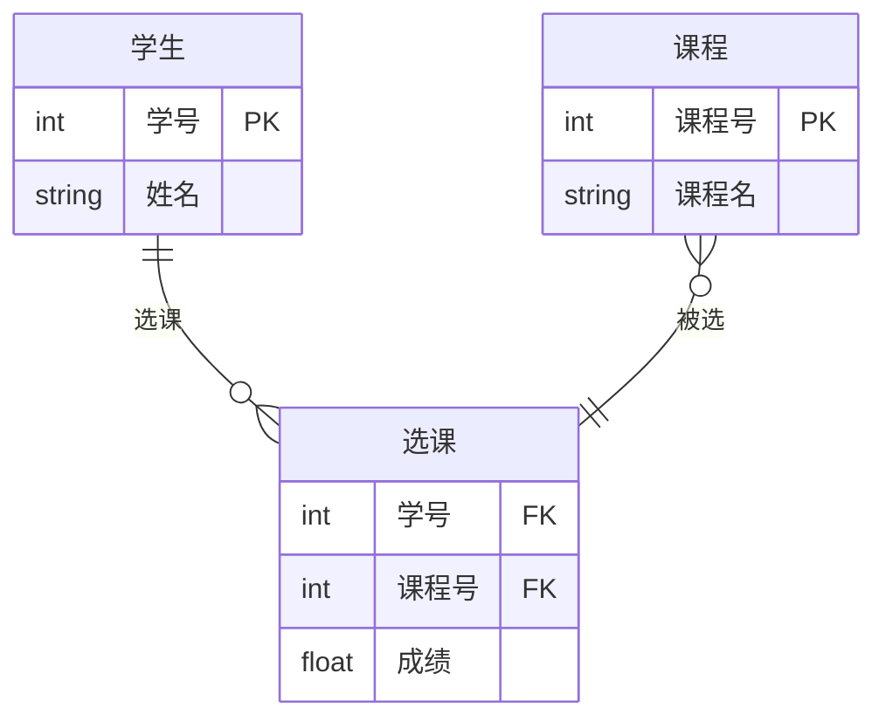
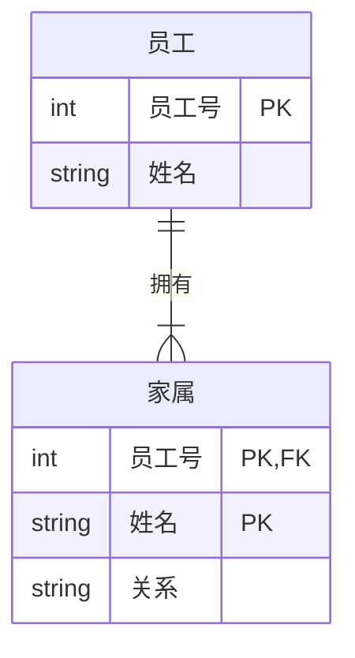
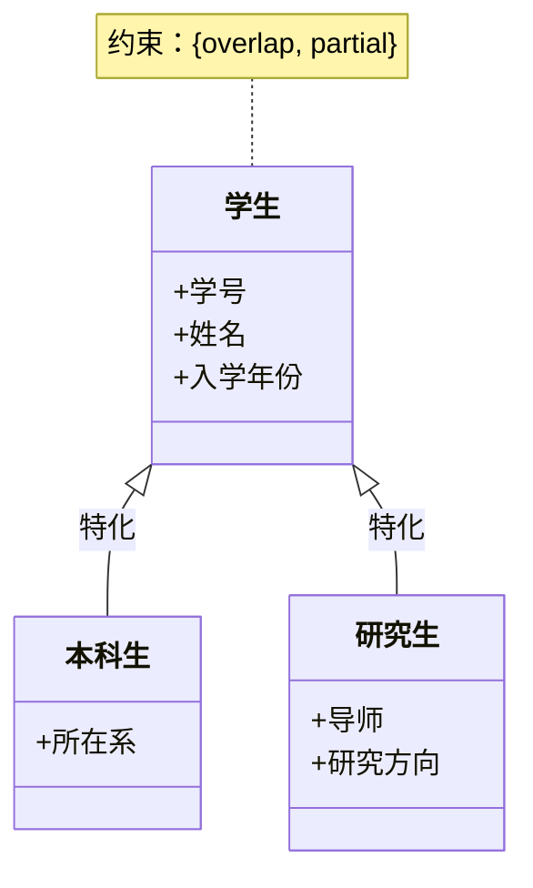
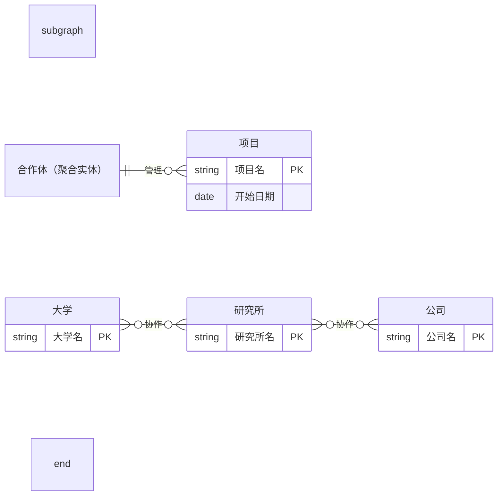
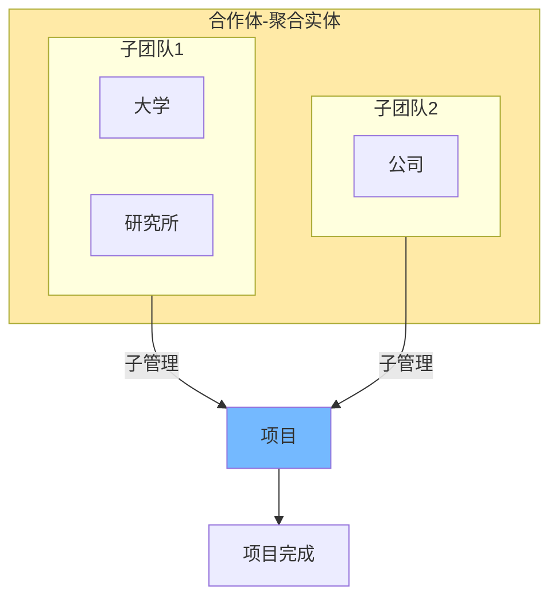

:::tip

含有ai生成内容

AI整理文本

:::

我写笔记总是晚好长时间来写，希望我复习的时候别弄错时间段...

## 基本E-R模型概念

**概念模型** 是现实世界到机器世界的一个中间层次，概念模型中最常用的是E-R模型，E-R(实体联系)模型中的主要概念如下

| 概念名称             | 解释                                                                                                                                                              |
| -------------------- | ----------------------------------------------------------------------------------------------------------------------------------------------------------------- |
| **实体(Entity)**     | 客观存在并且可以相互区分的事物叫实体。（例如一个个`学生`，一辆辆`汽车`）                                                                                          |
| **属性(Attribute)**  | 实体一般具有若干特征，称之为实体的属性。（例如学生的姓名、学号、班级等）                                                                                          |
| 域(Domain)           | 一个属性可能取值的范围称为这个属性的域。例如 性别域为`男`或者`女`                                                                                                 |
| 候选码               | 能够唯一标识实体的**属性**或者最小**属性组**,称为候选码，可能存在多个候选码，设计者必需指明一个候选码做主码(关键字)，我个人理解就是**id**.                        |
| 实体型(Entity type)  | 具有相同属性的实体具有共同的特征和性质，用实体名及其属性集合来抽象，刻画同类实体，称为实体型                                                                      |
| 实体集 (Entity set)  | 同型实体的集合（即某一实体型在特定环境或时间点上的所有实例的集合）。                                                                                              |
| 关系 (Relationship)  | 现实世界的事物之间是有联系的，这种联系在信息世界中反映为实体之间的关联。关系可以表示为实体型(集)之间的联系，也可以表示实体型(集)内部的联系（例如组成/包含关系）。 |
| 两个实体型之间的联系 | 二元关系的常见基数有：一对一（1:1，例如 部门 — 经理）、一对多（1:n，例如 部门 — 雇员）、多对多（m:n，例如 学生 — 课程）。                                         |

## 扩展E-R模型

### 参与约束（Participation Constraints）

- 定义：描述实体在特定联系中参与的最小和最大次数，通常用 (min, max) 表示。
- 部分参与（Partial Participation）：最小值 min = 0，表示实体可不参与该联系。
- 全参与（Total Participation）：最小值 min > 0，表示实体必须参与该联系。
- 图示：在 ER 图中，全参与用双实线表示；部分参与用单实线表示。
- 示例：学生选课中，学生对选课联系可能是部分参与（min=0），课程对被选联系可能是全参与（min=1）。

### 弱实体（Weak Entity）

- 定义：依赖于强实体（identifying entity）存在的实体，不能独立唯一标识。
- 特点：
    - 弱实体没有完整的主键，通过强实体的主键 + 弱实体的部分码（partial key）组合标识。
    - 与强实体的识别关系为一对多（1:N），且弱实体对该关系必须是全参与。
    - 不能独立存在，总是依附于强实体。
- 图示：弱实体用双矩形表示，识别关系用双菱形或加强调记号。
- 示例：家属（弱实体）依赖职工（强实体），主键为 (职工ID, 家属名)。

### 类层次（Class Hierarchy: Specialization / Generalization）

- 定义：将实体组织成超类（superclass）和子类（subclass）的层次结构，子类继承超类的属性。
- 特化（Specialization）：从超类到子类的自顶向下过程，强调子类间的区别。
- 概括（Generalization）：从子类到超类的自底向上过程，抽取共性。
- 约束：
    - Overlap：子类间是否有交集（可重叠或互斥）。
    - Covering：子类是否完全覆盖超类（总覆盖或部分覆盖）。
- 图示：用 ISA 连线表示，标注 D/O（disjoint/overlap）和 T/P（total/partial）。
- 示例：学生（超类）特化为本科生和研究生（子类），本科生和研究生可重叠（overlap）且部分覆盖（partial）。

### 聚合（Aggregation）

- 定义：将联系及其参与实体视为一个更高层次的抽象实体，使其参与其他联系。
- 用途：描述复杂多方关系，避免使用多元联系。
- 图示：将被聚合的联系和实体用框圈起来，作为新实体参与更高层联系。
- 示例：大学、研究所、公司合作项目（聚合为“合作体”），然后“合作体”参与“项目管理”联系。

### 嵌套聚合示例（使用 Flowchart 模拟）

由于 Mermaid 的 ER 图不支持直接嵌套聚合，我们可以使用 Flowchart 来模拟嵌套结构（例如，合作体内部进一步聚合子团队）：

---
