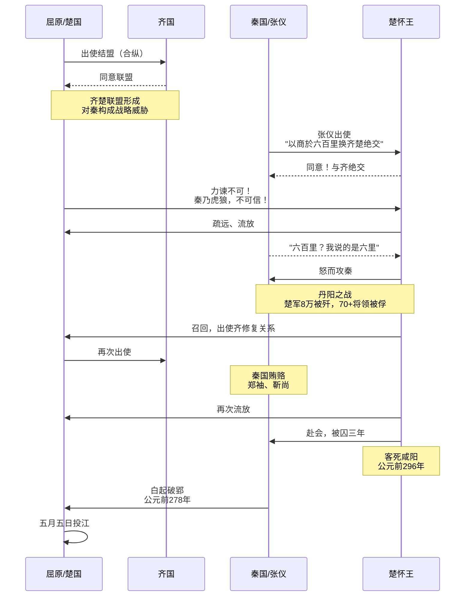
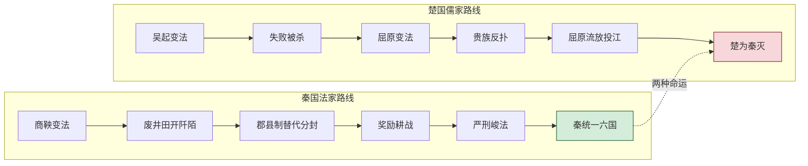

> **声明**：本文含有大量 AI 生成/采信内容。

## 被遮蔽的历史另一面

**屈原是中国历史上最具符号化意义的文化偶像之一。** 每年端午，龙舟竞渡、粽叶飘香，华夏大地几乎一律以"纪念爱国诗人屈原"来统摄这个古老节日的文化叙事。然而，在这片幅员辽阔的文明版图上，是否存在不随之附和的声音？是否存在另一种截然相反的历史记忆？答案是肯定的——**在关中（今陕西）大地，在曾经是秦国王畿腹地的黄土高原上，千百年来流传着一套与主流叙事背道而驰的"反屈原"记忆体系。** 从乾县外婆送给外孙的"屈原馍"（寓意"屈原没了"），到白居易"独醒从古笑灵均"的嘲弄，再到关中方言中以"骚情"讥讽自作多情之人——秦地对屈原的态度，构成了一幅与楚地温情脉脉的纪念截然不同的冷峻图景。

这种记忆并非简单的地域偏见，而是根植于战国时代秦楚争霸的血火历史、法家与儒家的思想对决、以及秦人务实精神与楚人浪漫气质的文化冲突之中。本文将从食物、节俗、语言、诗歌、思想、当代解构六个层面，辅以详实的历史文献与田野调查资料，系统梳理秦地对屈原这一"敌国知识分子"的千年态度谱系，揭示被主流叙事长期遮蔽的历史另一面。


<!--more-->

---

## 第一章 食物层面的敌意：乾县"屈原馍"——"屈原没了"

### 1.1 端午节不吃粽子吃馍

**在全国绝大多数地区，端午节的标志性食物是粽子。** 糯米包裹在竹叶或苇叶中，以丝线捆扎，或甜或咸，象征着人们对屈原的追思——据说当年楚人投粽子入江，是为了让鱼虾饱食而不伤害屈原的遗体。然而，在陕西省咸阳市乾县一带，端午节的餐桌上是见不到粽子的。这里的节日食物是一种独特的面食——**"屈原馍"**（又称"油曲连""油曲轮馍"）。

这种面食的起源传说，与全国主流的"纪念屈原"叙事截然相反。据乾县当地民间传说与《乾县志》记载，屈原并非被纪念的对象，而是被"庆祝"消失的象征。2011年出版的《乾县志》记载："端午即农历五月初五，这天外家要给不满十二岁的外甥们送'油曲连'（用面食烙成的各式花型的饼，中间有孔，可以戴在儿童的手臂上）、粽子等。"这里的"油曲连"（外地所没有的民间习俗）是关中乾县、礼泉一带在端午节所做的一种独特面花，用剪刀、梳子等工具在面团上雕刻出花草虫鱼等图案，然后烘烤而成。之所以做成花草鱼虫图案，就是为了驱邪保平安。


### 1.2 "屈原馍"的含义：庆祝敌仇之死

**"屈原馍"这个名称本身就蕴含着深刻的历史记忆。** 关于这一习俗的起源，乾县民间流传着这样的传说：战国时期，楚国是秦国的最大威胁，而屈原是楚国主张抗秦的核心大臣。当屈原投江而死的消息传到秦地时，正值关中麦子成熟的季节。秦国人为了庆祝这一"敌国心头大患"的消除，做成各种形状的馍，让孩子们吃掉——寓意"屈原没了"。这一习俗经过两千多年的演变，逐渐固化为乾县端午节外婆给外孙送"屈原馍"的节俗。

当地民俗学者指出："陕西乾县端午节制作'油曲轮馍'，传说是民间庆祝屈原投江的大型活动之一。战国时代，秦国疆域最大，驻地咸阳，乾县作为秦国腹地，地理位置险要。当时楚国是秦国最大的威胁，而屈原又是楚国抗秦的力挺者，抗秦策略对秦国构成直接威胁。而后，楚王昏庸，屈原被贬，跳江而死，秦国解除心头大患，朝野上下，举国欢庆。秦国人四处庆祝，民间又把屈原做成各种形状的馍，戴在手上或脖子上，让孩子们吃掉，以示记住这段难忘的历史。"

关中名村陕西乾县马兰寨村当地流传的民谣生动地描绘了这一习俗："**五月单（端），送圈圈（指'油曲轮馍'），送来拥肚笘肚间。花花绳戴在手腕腕，香包包胸前挂串串。雄花药抹在屁股眼，汤汤面香得打颤颤……**"

### 1.3 从"屈原馍"到"油曲连"：名称的蜕变与记忆的重构

值得注意的是，"屈原馍"这一原始名称在流传过程中逐渐被改称为"油曲连"或"油曲轮馍"。这种名称的转变本身就是一种文化记忆的自我修正——随着秦楚敌对状态的终结、秦汉统一后"中华民族"认同的形成，赤裸裸的"庆祝敌国之臣死亡"的表述变得不再适宜。然而，节俗的形式（送馍给外孙、馍的形状、佩戴方式）却顽固地保留了下来，成为历史记忆的"活化石"。

| **维度** | **楚地（湖北湖南）** | **关中（秦地）** |
|---------|-------------------|----------------|
| **节日食物** | 粽子（糯米包裹，投入江中喂鱼虾） | 屈原馍/油曲连（小麦面粉制作，"吃掉屈原"） |
| **核心象征** | 保护屈原遗体不被侵害 | 庆祝敌国威胁消除 |
| **赠送关系** | 无特定赠送仪式 | 外婆/舅舅送给外甥 |
| **食用方式** | 煮食，象征投江祭祀 | 佩戴在手腕或脖颈，后食用 |
| **名称演变** | 始终称"粽子" | "屈原馍"→"油曲连"（去敌意化） |
| **记忆编码** | 纪念与哀思 | 胜利与庆祝 |

---

## 第二章 节俗层面的割裂：插柳戴绳吃花馍，无龙舟无粽子

### 2.1 关中端午：一个与屈原"无关"的节日

**关中地区的端午节俗呈现出与全国主流截然不同的面貌。** 在乾县、礼泉、西安周至等地，端午节的习俗主要包括：点抹雄黄酒、戴"花花绳"（五彩丝线）、送"裹肚"（红色绣花肚兜）、插柳枝（而非艾草）、以及送"屈原馍"。值得注意的是，**这些习俗中完全找不到龙舟竞渡和吃粽子的踪影**——这两项被全国其他地区视为"纪念屈原"核心符号的活动，在关中大地几乎不存在。

据《西安本地宝》等地方志资料记载，西安地区的端午传统风俗包括："抹雄黄酒、戴五彩绳、裹肚兜、吃粽子等"。但进一步考察会发现，即使在西安市区，吃粽子的习俗也是近代以来受全国主流文化影响才逐渐传入的，传统的关中端午食物仍然是面食类。而在更偏远的乾县、礼泉等地，粽子则完全缺席。


### 2.2 插柳不插艾：秦地端午的植物符号

**在全国多数地区，端午节门前悬挂的是艾草和菖蒲。** 然而，在关中地区，端午节的植物符号却有所不同——部分地区插柳枝代替艾草。

这种差异并非偶然。柳树在秦地文化中具有特殊的象征意义——它既是"留"的谐音（寓意留住福气），也是秦国本土常见的植物。相比之下，艾草更常见于南方潮湿地区。更重要的是，插柳不插艾的选择，也暗含着对屈原叙事的主动疏离：艾草与屈原传说紧密相连，而柳枝则与这一叙事无涉。

| **习俗** | **全国主流（楚地为代表）** | **关中（秦地）** | **核心态度差异** |
|---------|------------------------|----------------|----------------|
| **龙舟竞渡** | 核心活动，象征打捞屈原遗体 | 完全不存在 | 纪念 vs 无关联 |
| **粽子** | 核心食物，象征投江祭祀 | 近代才传入，传统食物为馍 | 哀思 vs 日常 |
| **门前植物** | 艾草、菖蒲 | 部分地区插柳枝 | 驱邪护魂 vs 纳福辟邪 |
| **五彩绳** | 存在，称为"长命缕" | 高度发达，称"花花绳" | 共同辟邪传统 |
| **赠送礼物** | 无特定赠送关系 | 外婆/舅舅送外甥馍、裹肚 | 公共纪念 vs 亲情传递 |
| **屈原关联度** | 极高，节日起源归于屈原 | 极低，刻意疏离屈原 | 崇拜 vs 冷淡/敌意 |

---

## 第三章 语言层面的讥讽：关中方言"骚情"=瞎操心、自作多情

### 3.1 "骚情"的词源：从屈原的"抒情"到关中的"瞎操心"

**"骚情"是关中方言中使用频率极高的词汇，通常用来形容"瞎操心""自作多情""轻浮张狂"等负面行为。** 令人惊讶的是，这个词的词源与屈原有着直接的关系。

屈原是中国文学史上"抒情"传统的开创者。"抒情"一词本身就出自屈原的作品。据台湾大学杨儒宾教授的研究："'抒情'这个词语出自屈原，而且再三出现，现在看来不可能是无意识的。'抒'意味着卷出、抒发之意，亦即'内在的东西使之明白化'的意思，而这种'内在化'指的正是'情'。"

然而，在关中方言中，"骚情"（发音sáo qing）却成为一个贬义词。蓝田学者雷树萱在《不是骚情，是梢轻》一文中指出："关中方言里有个常用词叫sáo轻，在吾乡口语里，它主要有以下几种意思：1、轻浮、轻佻；2、献媚、讨好；3、不知好歹，张狂；4、多嘴、多事（以致于坏事）。"

### 3.2 从"梢轻"到"骚情"：一场文字误读的文化隐喻

雷树萱的研究进一步指出，"骚情"的正确写法应该是"**梢轻**"。"梢"指树梢、枝头，"轻"指轻浮不实在。"梢轻"原指谷物穗子轻、颗粒少（甘肃定西俗语"梢轻没颗子"），后引申形容人的言行举止轻浮、不踏实。

然而，从"梢轻"到"骚情"的误写并非偶然。这种"误写"本身构成了一种深刻的文化隐喻——**秦地人将屈原式的情感表达（"骚"——离骚）与"瞎操心""自作多情"等负面评价联系在一起。** 屈原在《离骚》中反复申诉自己的忠心不被理解、理想无法实现，在秦地人看来，这恰恰是"不识时务""多管闲事"的典型表现。

| **层面** | **屈原的"抒情"** | **关中方言"骚情/梢轻"** |
|---------|----------------|---------------------|
| **词源** | "抒"=抒发，"情"=内在情感 | "梢"=枝头，"轻"=轻浮 |
| **情感色彩** | 正面、崇高、真挚 | 负面、轻浮、多事 |
| **行为指向** | 为国忧民、追求理想 | 瞎操心、自作多情、不识时务 |
| **文化态度** | 赞美、同情、崇敬 | 否定、嘲弄、冷淡 |
| **精神内核** | 儒家理想主义 | 法家务实精神 |

---

## 第四章 诗歌层面的否定：从白居易到欧阳修——"独醒从古笑灵均"

### 4.1 白居易"独醒从古笑灵均"：醉酒对独醒的嘲弄

**唐代大诗人白居易对屈原的态度，集中体现了中原知识分子对这位"独醒者"的复杂评价。** 白居易在《咏家酝十韵》中写下了流传千古的名句："**独醒从古笑灵均，长醉如今敩伯伦。**"这两句诗的意思非常明确：自古以来，人们都嘲笑屈原独自清醒；如今我要效仿刘伶，长久地沉醉于酒中。

这种态度在白居易的另一首诗《咏怀》中表现得更加直接："**自从委顺任浮沉，渐觉年多功用深。面上减除忧喜色，胸中消尽是非心。……长笑灵均不知命，江蓠丛畔苦悲吟。**"在这首诗中，白居易不仅"笑"屈原，更是"长笑"——持久地、深深地嘲笑屈原"不知命"。

### 4.2 欧阳修"可笑灵均楚泽畔"：北宋文人的历史俯视

**北宋文坛领袖欧阳修在《啼鸟》一诗中，对屈原发出了更加直白的嘲弄：**"**可笑灵均楚泽畔，离骚憔悴愁独醒。**"

"可笑"二字的分量极重——它不仅仅是个人情感的表达，更代表了北宋士大夫阶层对屈原的历史俯视。在欧阳修看来，屈原的行为模式是不可理喻的：明明可以随遇而安、与花鸟为友，却偏偏要"独醒"、要"忧国忧民"、要"憔悴愁苦"——这不是"可笑"又是什么呢？

| **诗人** | **朝代** | **诗句** | **核心态度** |
|---------|---------|---------|------------|
| **白居易** | 唐 | "独醒从古笑灵均，长醉如今敩伯伦" | 嘲笑独醒，选择沉醉 |
| **白居易** | 唐 | "长笑灵均不知命，江蓠丛畔苦悲吟" | 嘲笑不知命，否定悲吟 |
| **欧阳修** | 宋 | "可笑灵均楚泽畔，离骚憔悴愁独醒" | 直接嘲弄，认为可笑 |
| **赵冬曦** | 唐 | "勿学灵均远问天" | 劝人不要学屈原 |
| **元稹** | 唐 | "哀哉徇名士，没命求所难" | 同情但认为不值得 |

---

## 第五章 思想层面的对立：法家务实 vs 儒家理想主义

### 5.1 屈原：一个"南方的儒者"

郭沫若先生在《屈原思想》一文中提出了影响深远的观点："屈原思想明显有儒家风貌，注重民生，倡导德政，注重修己以安人，所以，**屈原是一位南方的儒者**。"

中国屈原学会会长方铭教授进一步指出："与其说屈原是法家或者改革家，毋宁说他是一个坚守传统的儒家思想家。他的思想价值，不在于他在战国时期体现了怎样的改革意识，而在于他知道人民的幸福依靠回归'选贤举能'的美政。"


### 5.2 法家精神：秦国的立国之本

**秦国的崛起，离不开法家思想的指导。** 从商鞅变法开始，秦国就走上了一条与楚国截然不同的道路。法家的核心主张是"不别亲疏，不殊贵贱，一断于法"（司马迁语），强调以严刑峻法来治理国家，以功利实效来评价政策。法家不相信感情，只相信利益；不相信文化，只相信刀剑。

商鞅在秦国的变法包括：废井田、开阡陌，重农抑商，实行郡县制，迁都咸阳，统一度量衡，奖励耕织和战斗，实行连坐之法。这些措施的共同特点是将贵族和百姓一视同仁，以法律为唯一准绳。

郭沫若先生曾对比吴起与商鞅的命运："假使让吴起在楚国多做得几年，使他的政治得以固定下来，就像商鞅日后在秦的一样，行了法22年，虽然死了，法也没有变动，那么战国时代的中国，恐怕就不必等到秦国来统一了。"

| **对比维度** | **法家（秦国）** | **儒家/屈原（楚国）** |
|-----------|---------------|-------------------|
| **核心主张** | 严刑峻法、富国强兵 | 仁政德治、选贤举能 |
| **人性观** | 人性本恶，需法律约束 | 人性本善，需道德教化 |
| **政治手段** | 赏罚分明、以势压人 | 修身齐家、以德服人 |
| **改革策略** | 彻底废除贵族特权 | 有限度的改良 |
| **对屈原的评价** | "政治幼稚""不识时务" | "忠贞爱国""理想崇高" |
| **实践结果** | 秦统一六国 | 楚为秦所灭 |

---

## 第六章 当代解构："阻碍统一""战胜国何必纪念"

### 6.1 "屈原阻碍统一"论的历史渊源

学者郭维森在《屈原》一书中提出了有力的反驳："我们不能认为只有秦来统一才是进步，否则就是倒退。事实上，战国时代的具体情况是：第一，当时各国都已进入了封建社会，七国中秦国并非是先进生产关系的唯一代表。第二，当时流行着'从合则楚王，横成则秦帝'的说法，这说明秦、楚、齐都有统一中国的可能。第三，秦在军事上取得相对优势后，采取了分化瓦解、各个击破的策略，因此楚、齐等国就有联合抵抗的必要。"

更重要的是，秦国的统一战争充满了掠夺性和破坏性。秦赵长平之战中，秦将白起坑杀赵国降卒四十万人；白起攻破楚国郢都后，焚烧了楚王历代陵墓。这种暴行使得"统一"的正义性大打折扣。

### 6.2 "战胜国何必纪念战败国之臣"

**网络时代兴起了一种更为极端的解构声音："秦国是战胜国，楚国是战败国，战胜国何必纪念战败国的臣子？"** 这种观点虽然缺乏学术严谨性，却在社交媒体上有一定市场。

这种观点的荒谬之处在于，它将政治立场完全凌驾于文化价值之上。屈原之所以被纪念，不是因为他是"楚国的政治家"，而是因为他代表了人类对理想的坚守、对正义的追求、对自由的向往。1953年，世界和平理事会将屈原列为世界四大文化名人之一（另外三位是哥白尼、拉伯雷、何塞·马蒂），正是对其普世价值的国际认可。

---

## 第七章 历史根源：屈原为何成为秦人的"敌国符号"

### 7.1 秦楚争霸：血火中结下的世仇

**要理解秦地对屈原的敌意，必须回到战国时代秦楚两大强国争霸的历史现场。** 楚国是战国时期疆域最大的国家，"地方五千里，带甲百万"，雄踞长江以南。秦国则通过商鞅变法迅速崛起，成为军事最强国。两国之间的冲突贯穿了整个战国中后期。

屈原担任楚国左徒期间，正是秦楚斗争最激烈的时期。他主张"联齐抗秦"，积极组织合纵联盟对抗秦国扩张。在屈原的努力下，齐国与楚国一度结盟，形成对秦国的战略威慑。

### 7.2 张仪欺楚：秦国谋略对屈原理想的碾压

**张仪欺楚事件是屈原政治生涯的转折点。** 秦国派张仪出使楚国，以"商於之地六百里"为诱饵，成功离间了齐楚联盟。楚怀王贪图便宜与齐国绝交后，张仪却只承认"六里"而非"六百里"。楚怀王大怒攻秦，结果在丹阳之战中损失惨重——**楚军8万余人被歼，70多名将领被俘，屈氏家族的军事领袖屈丐自杀。**

### 7.3 白起破郢：压垮屈原的最后一击

**公元前278年，秦国大将白起率军攻破楚国都城郢都，这是屈原投江的直接导火索。** 白起不仅占领了郢都，还焚烧了楚国历代先王的陵墓夷陵。对于一个以宗法制度为核心的国家而言，祖坟被焚是不可饶恕的奇耻大辱。

屈原此时已被流放到沅湘流域多年。当郢都沦陷的消息传来时，屈原的复国希望彻底破灭。在农历五月初五这一天，他怀抱大石投入汨罗江，以死明志。


---

## 结语：多元记忆与历史和解

**秦地"恨"屈原，是一种真实存在的历史记忆，不应被简单否定或遮蔽。** 从乾县的"屈原馍"到白居易的"笑灵均"，从关中方言的"骚情"到法家对儒家理想主义的批判，这套"反屈原"记忆体系有着深厚的历史根源和完整的逻辑自洽。它提醒我们：历史从来不是单声部的合唱，而是多声部的交响。

然而，承认这种记忆的合理性，并不意味着我们要放弃对屈原的崇敬。恰恰相反，正是在这种多元记忆的对话中，屈原的形象才更加丰满、更加真实。他不是被供奉在神坛上的完美偶像，而是一个有血有肉、有爱有恨的历史人物——楚人爱他，秦人恨他，中原人笑他，而两千年后的我们，在这一切情感的交织中，最终理解了一个真理：**理想主义者的悲剧，不在于他的理想是否实现，而在于他为理想付出的一切，本身就是人类文明最珍贵的财富。**

端午节，当我们吃粽子、赛龙舟时，不妨也想一想乾县的"屈原馍"——那个以面粉塑形、佩戴在孩童手腕上的圆圈。它提醒着我们：**历史的另一面，同样值得被聆听。**


---

## 附录：Mermaid 图表

### 图1：秦地对屈原态度的传承体系

```mermaid
graph TD
    A[秦地对屈原的否定态度] --> B[食物层面]
    A --> C[节俗层面]
    A --> D[语言层面]
    A --> E[诗歌层面]
    A --> F[思想层面]
    
    B --> B1[乾县屈原馍<br/>"屈原没了"]
    C --> C1[无龙舟无粽子<br/>插柳戴绳吃花馍]
    D --> D1[方言"骚情"<br/>讥讽自作多情]
    E --> E1[白居易"独醒笑灵均"<br/>欧阳修"可笑灵均"]
    F --> F1[法家务实<br/>否定儒家理想主义]
    
    G[历史根源] --> G1[秦楚争霸<br/>血火世仇]
    G --> G2[屈原联齐抗秦<br/>秦国最大威胁]
    G --> G3[白起破郢<br/>屈原投江]
    
    G1 --> A
    G2 --> A
    G3 --> A
```

### 图2：屈原"联齐抗秦"战略与秦国反制



### 图3：法家vs儒家思想对比框架



---

## 参考文献

1. 司马迁. 史记·屈原贾生列传[M]. 北京: 中华书局, 1959.
2. 白居易. 白氏长庆集[M]. 上海: 上海古籍出版社, 1988.
3. 欧阳修. 欧阳文忠公集[M]. 北京: 中华书局, 1990.
4. 郭沫若. 屈原思想[J]. 郭沫若全集, 1942.
5. 方铭. 正道直行的屈原[N]. 光明日报, 2021-06-11.
6. 雷树萱. 不是骚情，是梢轻[J]. 樹諼草微信公众号, 2025-08-18.
7. 乾县志编纂委员会. 乾县志[M]. 西安: 陕西人民出版社, 2011.
8. 杨儒宾. 屈原为什么抒情[J]. 台大中文学报, 2015.
9. 许田波. 战争与国家形成：春秋战国与近代早期欧洲之比较[M]. 上海: 上海人民出版社, 2009.
10. 梁涛. 屈原变法与楚国政治[J]. 中国社会科学院研究生院学报, 2003.
