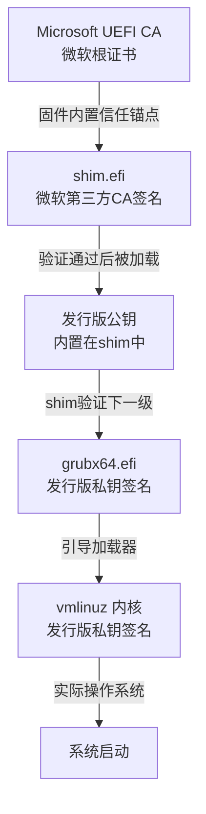

## 前言

最近看到一个技术新闻：微软的 **UEFI CA 2011** 证书将于 **2026年6月27日** 过期。这对于 Windows 用户来说可能没啥感知，毕竟微软会通过 **Windows Update** 自动推送新的证书到固件中。但作为一名把原厂 Windows 笔记本完全刷成 **Ubuntu 单系统**的用户，我突然意识到一个问题——我失去了 OEM 厂商的固件推送通道，需要自己动手维护 UEFI 安全基础设施了。

说实话，之前还真没关注过这个证书问题。经过一番研究，我发现这确实是纯 Linux 主机需要面对的一个现实问题。今天就来分享一下如何在没有 Windows 生态支持的情况下，手动更新 UEFI 证书。

## 背景：证书过期意味着什么

### 微软 UEFI CA 证书是什么

要理解这个证书的来龙去脉，得从 **UEFI Secure Boot** 的历史说起。2012年微软发布 Windows 8 时，为了应对日益严重的引导级恶意软件（如 rootkit），在 **Windows 8 认证要求**中规定预装 Windows 的 OEM 设备必须**支持 Secure Boot** 功能。这个机制的原理是在固件中植入受信任的公钥，只有用对应私钥签名的引导程序才能被执行。

值得澄清的是，微软的要求并不禁止用户关闭 Secure Boot——对于 **x86/x64 设备**，OEM 必须提供在 BIOS 中关闭该功能的选项（只有 ARM 设备被强制锁定，但这与 PC Linux 关系不大）。不过，频繁进入 BIOS 开关设置对普通用户来说确实麻烦，而且双系统用户也需要保持启动链的一致性。

更深层的问题是：当时的 PC 市场几乎被 Windows 垄断，各大 OEM 厂商的固件只内置了微软的证书。这意味着 Linux 发行版如果想在 Secure Boot 开启的状态下启动，就必须让自己的引导程序也得到微软的签名——这显然与自由软件的精神相悖。

经过自由软件社区与微软的协商，一个折中方案诞生了：微软同意提供 **第三方 UEFI CA 服务**，但 Linux 发行版不直接提交整个 GRUB 和内核去签名，而是提交一个极小的中间程序——`shim`。这个设计的精妙之处在于：



**shim 的核心价值**在于：微软只签名 shim 这一个程序，而 shim 内置了发行版自己的公钥。这样发行版可以**自主更新 GRUB 和内核**，无需每次改动都找微软重新签名。这种"委托信任"的机制既满足了 Secure Boot 的安全要求，又保留了发行版的自主权。这个用于签名 shim 的证书就是 `Microsoft UEFI CA`。

目前，`Microsoft 3rd Party UEFI CA 2011` 证书将于 **2026年6月27日** 到期，而新的 `Windows UEFI CA 2023` 证书（有效期至 **2035年6月13日**）已经签发，多数现代 Linux 发行版（Ubuntu、Fedora、Debian 等）的 shim 也已更新使用新证书。

### 对现有系统的影响

**现有系统将继续正常启动**。证书过期只影响**签署新二进制文件**的能力，不影响已安装系统的启动。在过期日期前签名的 `shim` 会保持永久有效。

但是，未来如果你要全新安装使用新证书签名的 Linux 发行版、升级到新版本的 `shim`，或者在 Secure Boot 开启的情况下启动新签名的安装介质，这些操作都可能需要设备固件中包含 **2023 证书**。

## 问题：Linux 用户的固件断层

### 原厂设备的困境

很多 Linux 用户（包括我）都是从 Windows 笔记本转过来的。当我们把机器完全刷成 Linux 单系统后，就失去了以下通道：

| 通道               | 原本作用                 | Linux 下的现状         |
| ------------------ | ------------------------ | ---------------------- |
| **Windows Update** | 自动推送固件更新和证书   | 无法使用               |
| **OEM 固件工具**   | 厂商提供的 BIOS 更新工具 | 多数无 Linux 版本      |
| **LVFS/fwupd**     | Linux 厂商固件服务       | 依赖厂商支持，覆盖有限 |

### 为什么这很重要

如果设备固件中没有 **Microsoft UEFI CA 2023** 证书，2026年后你可能面临无法安装使用新证书签名的 Linux 发行版、无法启动使用新 `shim` 的系统，或者 Secure Boot 验证失败导致启动被拒绝等问题。

## 解决方案：手动导入 2023 证书

经过一番研究，我找到了一个可行的方案：手动将 `Windows UEFI CA 2023` 证书导入 UEFI 的 **MOK（Machine Owner Key）** 数据库。

### 准备工作

首先确保系统已安装必要的工具：

```bash title="安装 mokutil 和 openssl"
sudo apt update
sudo apt install mokutil openssl
```

### 下载证书

从微软官方下载 **Windows UEFI CA 2023** 证书：

```bash title="下载证书文件"
wget https://go.microsoft.com/fwlink/?linkid=2239872 -O win2023.crt
```

你也可以从 [Microsoft PKI 文档页面](https://learn.microsoft.com/en-us/windows-hardware/manufacture/desktop/windows-secure-boot-key-creation-and-management-guidance) 了解详情。

### 导入 MOK 数据库

`mokutil` 可以直接导入 `.crt` 格式的证书，无需格式转换：

```bash title="注册证书到 MOK 队列"
sudo mokutil --import win2023.crt
```

系统会提示你设置一个 **临时密码**（建议用简单的数字，比如 `12345678`），这个密码在下一步确认时会用到。

### 重启确认导入

```bash title="重启进入 MokManager"
sudo reboot
```

重启后，系统会自动进入 **MokManager**（蓝色字符界面），按以下步骤操作：

| 步骤 | 操作                   |
| ---- | ---------------------- |
| 1    | 选择 `Enroll MOK`      |
| 2    | 选择 `Continue`        |
| 3    | 选择 `Yes` 确认导入    |
| 4    | 输入之前设置的临时密码 |
| 5    | 选择 `Reboot` 重启     |

> 注意：不同设备的 MokManager 界面可能略有差异，但核心流程一致。

### 验证导入结果

重启回到系统后，验证证书是否成功导入：

```bash title="查看已注册的 MOK 证书"
sudo mokutil --list-enrolled
```

如果看到包含 `Microsoft Windows UEFI CA 2023` 或类似名称的证书，说明导入成功

你也可以检查当前的 Secure Boot 状态：

```bash title="检查 Secure Boot 状态"
sudo mokutil --sb-state
```

## 为什么要保留 Secure Boot

说到这里，可能有读者会问：**Linux 用户直接禁用 Secure Boot 不就行了？**

确实，很多 Linux 发行版甚至建议关闭 Secure Boot 以获得更好的兼容性。但保留它有以下几个好处：

| 好处               | 说明                                                                          |
| ------------------ | ----------------------------------------------------------------------------- |
| **商业软件兼容性** | 某些游戏反作弊系统、企业安全软件会检测 Secure Boot 状态，关闭可能导致无法运行 |
| **双系统一致性**   | 与 Windows 双启动时保持启动链一致                                             |
| **纵深防御**       | 作为系统安全的一层保护，防止未签名的引导程序被加载                            |

当然，如果你对上述场景没有需求，禁用 Secure Boot 确实是最简单的方案。

## 总结

通过手动导入 `Windows UEFI CA 2023` 证书，我们**保持了兼容性**（未来使用新证书签名的 `shim` 可以正常启动）、**避免了启动危机**（防止 2026 年后证书过期导致的启动失败）、**维护了自主权**（不依赖 OEM 的 Windows 推送，自主管理固件安全），就是这样，完成我们的自主性.

> 考虑到Windows用户对禁止更新的顽固性，微软推送强制更新的日子迫在眉睫

保持系统更新，保持折腾精神 😊

---

## 附录

```bash title="附录:签名信息"
Owner: 605dab50-e046-4300-abb6-3dd810dd8b23
SHA1 Fingerprint: 45:a0:fa:32:60:47:73:c8:24:33:c3:b7:d5:9e:74:66:b3:ac:0c:67
Certificate:
    Data:
        Version: 3 (0x2)
        Serial Number:
            33:00:00:00:1a:88:8b:98:00:56:22:84:c1:00:00:00:00:00:1a
        Signature Algorithm: sha256WithRSAEncryption
        Issuer: C=US, ST=Washington, L=Redmond, O=Microsoft Corporation, CN=Microsoft Root Certificate Authority 2010
        Validity
            Not Before: Jun 13 18:58:29 2023 GMT
            Not After : Jun 13 19:08:29 2035 GMT
        Subject: C=US, O=Microsoft Corporation, CN=Windows UEFI CA 2023
        Subject Public Key Info:
            Public Key Algorithm: rsaEncryption
                Public-Key: (2048 bit)
                Modulus:
                    00:bc:b2:35:d1:54:79:b4:8f:cc:81:2a:6e:b3:12:
                    d6:93:97:30:7c:38:5c:bf:79:92:19:0a:0f:2d:0a:
                    fe:bf:e0:a8:d8:32:3f:d2:ab:6f:6f:81:c1:4d:17:
                    69:45:cf:85:80:27:a3:7c:b3:31:cc:a5:a7:4d:f9:
                    43:d0:5a:2f:d7:18:1b:d2:58:96:05:39:a3:95:b7:
                    bc:dd:79:c1:a0:cf:8f:e2:53:1e:2b:26:62:a8:1c:
                    ae:36:1e:4f:a1:df:b9:13:ba:0c:25:bb:24:65:67:
                    01:aa:1d:41:10:b7:36:c1:6b:2e:b5:6c:10:d3:4e:
                    96:d0:9f:2a:a1:f1:ed:a1:15:0b:82:95:c5:ff:63:
                    8a:13:b5:92:34:1e:31:5e:61:11:ae:5d:cc:f1:10:
                    e6:4c:79:c9:72:b2:34:8a:82:56:2d:ab:0f:7c:c0:
                    4f:93:8e:59:75:41:86:ac:09:10:09:f2:51:65:50:
                    b5:f5:21:b3:26:39:8d:aa:c4:91:b3:dc:ac:64:23:
                    06:cd:35:5f:0d:42:49:9c:4f:0d:ce:80:83:82:59:
                    fe:df:4b:44:e1:40:c8:3d:63:b6:cf:b4:42:0d:39:
                    5c:d2:42:10:0c:08:c2:74:eb:1c:dc:6e:bc:0a:ac:
                    98:bb:cc:fa:1e:3c:a7:83:16:c5:db:02:da:d9:96:
                    df:6b
                Exponent: 65537 (0x10001)
        X509v3 extensions:
            X509v3 Key Usage: critical
                Digital Signature, Certificate Sign, CRL Sign
            1.3.6.1.4.1.311.21.1:
                ...
            X509v3 Subject Key Identifier:
                AE:FC:5F:BB:BE:05:5D:8F:8D:AA:58:54:73:49:94:17:AB:5A:52:72
            1.3.6.1.4.1.311.20.2:
                .
.S.u.b.C.A
            X509v3 Basic Constraints: critical
                CA:TRUE
            X509v3 Authority Key Identifier:
                D5:F6:56:CB:8F:E8:A2:5C:62:68:D1:3D:94:90:5B:D7:CE:9A:18:C4
            X509v3 CRL Distribution Points:
                Full Name:
                  URI:http://crl.microsoft.com/pki/crl/products/MicRooCerAut_2010-06-23.crl

            Authority Information Access:
                CA Issuers - URI:http://www.microsoft.com/pki/certs/MicRooCerAut_2010-06-23.crt
    Signature Algorithm: sha256WithRSAEncryption
    Signature Value:
        9f:c9:b6:ff:6e:e1:9c:3b:55:f6:fe:8b:39:dd:61:04:6f:d0:
        ad:63:cd:17:76:4a:a8:43:89:8d:f8:c6:f2:8c:5e:90:e1:e4:
        68:a5:15:ec:b8:d3:60:0c:40:57:1f:fb:5e:35:72:61:de:97:
        31:6c:79:a0:f5:16:ae:4b:1c:ed:01:0c:ef:f7:57:0f:42:30:
        18:69:f8:a1:a3:2e:97:92:b8:be:1b:fe:2b:86:5e:42:42:11:
        8f:8e:70:4d:90:a7:fd:01:63:f2:64:bf:9b:e2:7b:08:81:cf:
        49:f2:37:17:df:f1:f9:72:d3:c3:1d:c3:90:45:4d:e6:80:06:
        bd:fd:e5:6a:69:ce:b3:7e:4e:31:5b:84:73:a8:e8:72:3f:27:
        35:c9:7c:20:ce:00:9b:4f:e0:4c:b4:36:69:cb:f7:34:11:11:
        74:12:7a:a8:8c:2e:81:6c:a6:50:ad:19:fa:a8:46:45:6f:b1:
        67:73:c3:6b:e3:40:e8:2a:69:8f:24:10:e1:29:6e:8d:16:88:
        ee:8e:7f:66:93:02:6f:5b:9e:04:8c:cc:81:1c:ad:97:54:f1:
        18:2e:7e:52:90:bc:51:de:2a:0e:ae:66:ea:bc:64:6e:a0:91:
        64:e4:2f:12:a8:bc:e7:6b:ba:c7:1b:9b:79:1a:64:66:f1:43:
        b4:d1:c3:46:21:38:81:79:4c:fa:f0:31:0d:d3:79:ff:7a:12:
        a5:1d:d9:dd:ac:a2:0f:71:82:f7:93:ff:5c:a1:61:ae:65:f2:
        14:81:ed:79:5a:9a:87:ea:60:7b:cb:b3:4f:75:34:ca:ba:a1:
        ef:a2:f6:a2:80:45:a1:8b:27:81:cd:d5:77:38:3e:ca:4e:dd:
        28:ea:58:ba:c5:a0:29:de:86:8c:88:fc:95:27:51:dd:ab:d3:
        d0:5b:0d:77:c7:6c:8f:55:d7:d4:a2:0e:5b:e4:34:46:14:16:
        1d:e3:1c:d6:6d:99:ad:4c:ec:71:73:2f:ab:ce:b2:b4:29:de:
        55:30:53:39:3a:32:8b:f0:ea:9c:88:12:3b:05:68:19:bf:cf:
        87:52:10:fb:d6:13:60:f3:41:64:f4:08:57:81:cb:9d:11:a5:
        8e:f4:e5:27:f5:a3:3a:ec:e4:3d:4a:b7:ce:f9:88:0d:9f:bd:
        ca:6d:d2:4a:bc:58:76:8e:32:04:94:6e:dd:f4:cf:6d:47:6d:
        c2:d7:6a:dc:87:71:ea:a4:bf:ef:67:97:9c:b8:c7:80:36:2a:
        2a:59:c9:c0:0c:a7:44:a0:73:b5:8c:cf:38:5a:ae:f8:bb:86:
        95:f0:44:ad:66:7a:33:ed:71:e4:45:87:83:e5:a7:ce:a2:40:
        d0:72:d2:48:00:fa:f9:1a
```

| 字段                 | 数值                                                                                                  |
| -------------------- | ----------------------------------------------------------------------------------------------------- |
| **证书用途**         | UEFI 安全启动第三方 CA                                                                                |
| **证书名称**         | Windows UEFI CA 2023                                                                                  |
| **持有者 (Subject)** | C=US, O=Microsoft Corporation, CN=Windows UEFI CA 2023                                                |
| **颁发者 (Issuer)**  | C=US, ST=Washington, L=Redmond, O=Microsoft Corporation, CN=Microsoft Root Certificate Authority 2010 |
| **序列号**           | 33:00:00:00:1a:88:8b:98:00:56:22:84:c1:00:00:00:00:00:1a                                              |
| **SHA1 指纹**        | 45:a0:fa:32:60:47:73:c8:24:33:c3:b7:d5:9e:74:66:b3:ac:0c:67                                           |
| **Subject Key ID**   | AE:FC:5F:BB:BE:05:5D:8F:8D:AA:58:54:73:49:94:17:AB:5A:52:72                                           |
| **有效期起**         | 2023-06-13 18:58:29 GMT                                                                               |
| **有效期止**         | 2035-06-13 19:08:29 GMT                                                                               |
| **公钥算法**         | RSA-2048                                                                                              |
| **签名算法**         | sha256WithRSAEncryption                                                                               |
| **密钥用途**         | Digital Signature, Certificate Sign, CRL Sign                                                         |
| **基本约束**         | CA:TRUE (可作为证书颁发机构)                                                                          |
| **CRL 分发点**       | <http://crl.microsoft.com/pki/crl/products/MicRooCerAut_2010-06-23.crl>                               |
| **Owner ID**         | 605dab50-e046-4300-abb6-3dd810dd8b23                                                                  |
