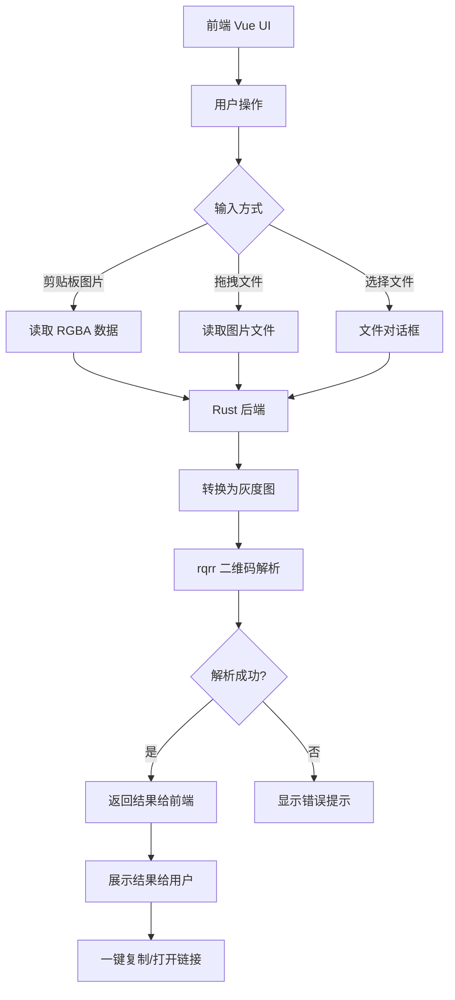

## 前言

不知道你有没有遇到过这样的场景：在电脑上看到一个二维码，想要扫码识别内容，却不得不——

1. 把图片保存下来
2. 通过微信/QQ发到手机上,或者找第三方网站工具去解析
3. 再重新发回电脑上打开链接

整个流程非常繁琐，让人烦躁。为什么我们不能直接在桌面上识别二维码呢？带着这个痛点，我开发了 **ClipQR**——一个专门为桌面设备设计的二维码快速识别工具。

## 需求与灵感

日常使用中，二维码无处不在,但当二维码出现在电脑屏幕上时，我们依旧不得不依赖手机或者第三方网页工具完成识别。这明明应该是桌面应用就能搞定的事情！所以我决定自己动手，**丰衣足食**

### 应用截图


### 演示视频

<video controls src="https://clipqr.needhelp.icu/%E6%BC%94%E7%A4%BA%E8%A7%86%E9%A2%91.mp4"></video>

## 技术选型

### 为什么选择 Tauri?

在选择技术栈时，我考虑了几个方案：

| 方案              | 优点                                               | 缺点                             |
| ----------------- | -------------------------------------------------- | -------------------------------- |
| Electron          | 生态成熟，前端开发友好                             | 体积大（动辄上百MB），内存占用高 |
| 原生开发 (GTK/Qt) | 性能好，体积小                                     | 开发效率低，跨平台适配麻烦       |
| **Tauri**         | **体积小（~10MB），Rust 性能好，跨平台，前端灵活** | 生态相对较新，但已经足够成熟     |

最终我选择了 **Tauri 2.x**，它完美符合我的需求：

编译后的应用只有不到 10MB，相比 Electron 小一个数量级,Rust 后端性能强劲，二维码解析几乎是瞬间完成,可以继续使用我熟悉的 Vue 做前端开发,这点最**重要**,跨平台支持，Linux/macOS/Windows 一套代码编译

### 二维码解析库选择

选择 **`rqrr`**，纯 Rust 无依赖，编译简单，解析速度快，对于普通二维码识别率完全够用。

### 整体架构选择

采用 **Vue 前端 + Rust 后端** 的经典 Tauri 架构：

前端负责交互展示：剪贴板读取按钮、拖拽区域、结果展示,后端负责图片处理和二维码解析：利用 rqrr 进行识别,通过 Tauri 的命令调用机制前后端通信

## 整体架构流程



## 关键代码展示

### 前端：从剪贴板读取图片

前端通过 Tauri 的 `clipboard-manager` 插件读取剪贴板中的图片，然后将 RGBA 数据传给 Rust 后端解析：

```ts title="src/utils/qr.ts"
export async function parseClipboardImage(): Promise<string | null> {
    const { readImage } = await import("@tauri-apps/plugin-clipboard-manager");
    const image = await readImage();
    const { width, height } = await image.size();
    const rgbaData = await image.rgba();

    const result = await invoke<string | null>("decode_qr", {
        rgba: Array.from(rgbaData),
        width,
        height,
    });

    return result;
}
```

对应的按钮组件很简单：

```vue title="src/components/ReadPaste.vue"
<template>
    <div class="w-full flex flex-col items-center space-y-4">
        <button @click="() => handleRead().catch((err) => console.error(err))" class="...">
            读取剪贴板
        </button>

        <div v-if="qrResult" class="...">
            <div class="...">识别结果:</div>
            <div class="...">{{ qrResult }}</div>
            <button @click="copyToClipboard" class="...">
                {{ copied ? "已复制" : "复制" }}
            </button>
        </div>
    </div>
</template>

<script setup lang="ts">
import { ref } from "vue";
import { parseClipboardImage, copyToClipboard as copyToClipboardUtil } from "../utils/qr";

const qrResult = ref<string | null>(null);
const copied = ref(false);

const copyToClipboard = async () => {
    if (!qrResult.value) return;
    await copyToClipboardUtil(qrResult.value);
    copied.value = true;
    setTimeout(() => {
        copied.value = false;
    }, 2000);
};

const handleRead = async () => {
    qrResult.value = null;
    try {
        const result = await parseClipboardImage();
        qrResult.value = result;
    } catch (e) {
        qrResult.value = "读取失败，剪贴板中没有图片";
    }
};
</script>
```

### 后端：Rust 二维码解析逻辑

> 我不会Rust，~~我不太会~~,所以AI代劳了，rust编译器的**负反馈带来的正循环**倒是方便ai优化迭代

Rust 后端接收 RGBA 数据，转换为灰度图后使用 rqrr 解析：

```rust title="src-tauri/src/lib.rs"
use image::{ImageBuffer, Luma};
use rqrr::PreparedImage;

#[tauri::command]
fn decode_qr(rgba: Vec<u8>, width: u32, height: u32) -> Option<String> {
    // Convert RGBA to 8-bit grayscale for rqrr
    let mut pixels = Vec::with_capacity((width * height) as usize);
    for chunk in rgba.chunks(4) {
        // RGBA -> luminance: 0.299*R + 0.587*G + 0.114*B
        let r = chunk[0] as f32;
        let g = chunk[1] as f32;
        let b = chunk[2] as f32;
        let gray = (0.299 * r + 0.587 * g + 0.114 * b) as u8;
        pixels.push(gray);
    }

    // Create grayscale image
    let img_buffer = ImageBuffer::<Luma<u8>, Vec<u8>>::from_vec(width, height, pixels)
        .expect("Failed to create image buffer");

    // Prepare image for QR detection
    let mut prepared = PreparedImage::prepare(img_buffer);
    let grids = prepared.detect_grids();

    // Try to decode each detected grid
    for grid in grids {
        if let Ok((_, content)) = grid.decode() {
            return Some(content);
        }
    }

    None
}
```

对于文件直接读取的情况，我们还需要验证文件类型：

```rust title="src-tauri/src/lib.rs"
/// Check if file is an image based on extension and magic numbers
fn is_image_file(path: &str, data: &[u8]) -> bool {
    // Check extension
    let lower = path.to_lowercase();
    let has_image_ext = lower.ends_with(".png")
        || lower.ends_with(".jpg")
        || lower.ends_with(".jpeg")
        || lower.ends_with(".gif")
        || lower.ends_with(".bmp")
        || lower.ends_with(".webp")
        || lower.ends_with(".ico");

    if !has_image_ext {
        return false;
    }

    // Check magic number
    if data.len() < 4 {
        return false;
    }

    match &data[0..4] {
        [0x89, 0x50, 0x4E, 0x47] => true,        // PNG
        [0xFF, 0xD8, 0xFF, _] => true,            // JPEG
        [0x47, 0x49, 0x46, 0x38] => true,        // GIF
        [0x42, 0x4D, _, _] => true,              // BMP
        [0x52, 0x49, 0x46, 0x46] => true,        // WEBP
        [0x00, 0x00, 0x01, 0x00] => true,        // ICO
        _ => false,
    }
}

#[tauri::command]
fn decode_qr_from_file(path: String) -> Option<String> {
    match std::fs::read(&path) {
        Ok(data) => {
            if !is_image_file(&path, &data) {
                return None;
            }

            match image::load_from_memory(&data) {
                Ok(img) => {
                    let gray_img = img.to_luma8();
                    let mut prepared = rqrr::PreparedImage::prepare(gray_img);
                    let grids = prepared.detect_grids();
                    for grid in grids {
                        if let Ok((_, content)) = grid.decode() {
                            return Some(content);
                        }
                    }
                    None
                }
                Err(e) => {
                    eprintln!("Failed to load image from {}: {}", path, e);
                    None
                }
            }
        }
        Err(e) => {
            eprintln!("Failed to read file {}: {}", path, e);
            None
        }
    }
}
```

### 拖拽文件处理

Tauri 2.x 有自己的拖拽事件系统，我们需要使用 Tauri 提供的事件而不是原生 DOM 事件：

详情可以回顾我之前的文章 [解决Tauri2.x拖拽事件问题](https://xingwangzhe.fun/posts/aed59aad/)

```ts title="src/utils/drag.ts"
import { listen } from "@tauri-apps/api/event";
import { parseFile, processQrContent } from "./qr";

export interface DragListeners {
    onResult: (result: string | null) => void;
    onDragStateChange: (isDragging: boolean) => void;
}

export async function initFileDrop({
    onResult,
    onDragStateChange,
}: DragListeners): Promise<Array<() => void>> {
    const unlistens: Array<() => void> = [];

    unlistens.push(
        await listen("tauri://drag-drop", async (event) => {
            onDragStateChange(false);
            const { paths } = event.payload as { paths: string[] };
            if (paths.length === 0) return;

            const filePath = paths[0];
            try {
                const result = await parseFile(filePath);
                if (result) {
                    processQrContent(result);
                }
                onResult(result);
            } catch (e) {
                console.error("解析失败:", e);
                onResult("解析失败: " + e);
            }
        }),
    );

    unlistens.push(
        await listen("tauri://drag-enter", () => {
            onDragStateChange(true);
        }),
    );

    unlistens.push(
        await listen("tauri://drag-leave", () => {
            onDragStateChange(false);
        }),
    );

    return unlistens;
}
```

在主组件中初始化拖拽监听：

```ts title="App.vue"
import { initFileDrop } from "./utils/drag";

let unlistens: Array<() => void> = [];

onMounted(async () => {
    unlistens = await initFileDrop({
        onResult: (result) => {
            if (result) {
                qrResult.value = result;
            } else {
                qrResult.value = "未找到二维码";
            }
        },
        onDragStateChange: (state) => {
            isDragging.value = state;
        },
    });
});

onUnmounted(() => {
    unlistens.forEach((unlisten) => unlisten());
});
```

## 使用方式

ClipQR 提供三种识别方式：

1. **剪贴板识别**：按下 `Ctrl+C` 复制二维码图片，点击「读取剪贴板」即可识别
2. **拖拽识别**：直接将图片文件拖拽到窗口中
3. **文件选择**：点击「选择文件」按钮从文件管理器选择

事实上，我更侧重于**托盘菜单**带来的快速解析，所以前端更像是手动化的。

## 总结与下载

ClipQR 解决了我日常使用中的一个小痛点，让桌面二维码识别变得便捷。整个项目代码不多，但是通过 Tauri + Rust + Vue 的组合，得到了一个体积小、速度快的跨平台应用。

如果你也有同样的痛点，欢迎下载使用：

**GitHub 地址：** [https://github.com/xingwxg/ClipQR](https://github.com/xingwxg/ClipQR)

**宣传页 地址:** [ClipQR](https://clipqr.needhelp.icu/)

下载可以在 Release 页面找到对应平台的安装包：[https://github.com/xingwxg/ClipQR/releases](https://github.com/xingwxg/ClipQR/releases)

欢迎 Star，欢迎提 Issue！
