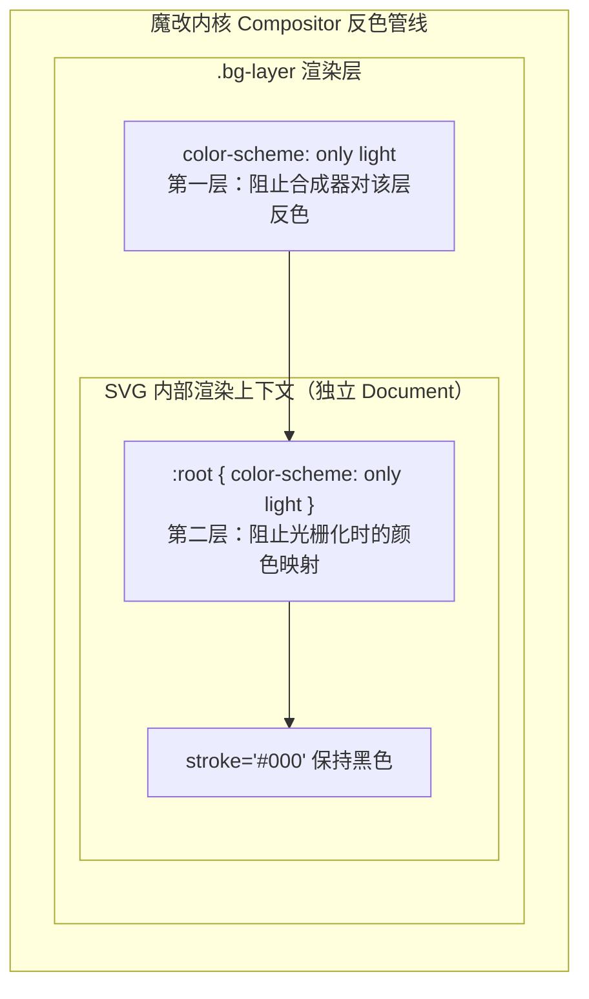

## 一个好几个月前在 QQ 里发现的 Bug

大概几个月前，我在 **QQ 上把自己的博客链接分享给朋友**。朋友点开后说"你这个网站背景怎么全是白的？"我当时还以为他在开玩笑——我精心挑的 42 张 SVG 图案当背景，怎么可能是白的？

结果我自己在 QQ 里点开链接——确实全白了。QQ 内置浏览器（X5 内核 WebView）把整站的 SVG 背景图案**全部渲染成了白色**，图案的黑色线条像是被人用漂白剂洗过一样。

我的第一反应不是怀疑自己的代码。我用手机上的 **Firefox** 打开 ——正常。**Edge** ——正常。就连 **Chrome** 也是好的。唯独在 QQ 内置浏览器和夸克这种第三方 App 里渲染出来是白的。

这就很明确了——不是我的 CSS 写错了，是**这些 App 内置的魔改内核搞的鬼**。如果是标准 Chromium 的 Bug，Chrome 原版也应该复现。

不过当时手头有别的事，这个问题就被搁置了。一直到今天才想起来，不过这次我换了种思路——不是自己闷头调试，而是**让 AI 帮我把魔改内核的具体技术细节搜出来**，然后根据搜到的信息来修复。

> 本文中关于魔改内核的反色层级、Chromium 的 force-dark 源码实现等技术细节，均来自 AI 搜索结果。我只是把问题的发现过程和排查思路用自己的话整理出来。

## 为什么一定是魔改内核的锅

AI 帮我搜到的信息印证了几个月前我的直觉判断。国内主流移动浏览器的内核全是基于 Chromium 或 WebKit 的**魔改版本**，它们在标准内核之上加了自己的"强制暗色模式"：

| 浏览器 | 内核代号 | 魔改基础 | 强制暗色模式实现方式 |
|---|---|---|---|
| **QQ 浏览器** | X5 内核 | Chromium（版本滞后的 fork） | 合成器层注入 `filter: invert()` |
| **夸克浏览器** | 夸克自研渲染引擎 | Blink + 自研暗色引擎 | CIELAB 空间色彩映射 + 选择性反转 |
| **UC 浏览器** | U3 内核 | WebKit 魔改分支 | Viewport 级反色滤镜 |
| **360 浏览器** | 极速/兼容双核 | Chromium + Trident | 极速模式下走 Chromium 原生 force-dark |
| **搜狗浏览器** | 高速内核 | Chromium 魔改 | 类似 QQ X5 的合成器层反色 |
| **华为浏览器** | 华为 WebView | Chromium + HMS 覆盖层 | Android WebView Algorithmic Darkening |
| **小米 MIUI 浏览器** | 系统 WebView | Chromium + MIUI 注入 | 系统级强制暗色（勾选"强制深色"后） |
| **微信内置浏览器** | X5 WebView | 腾讯魔改 Chromium | 跟随系统暗色模式，自定义反色策略 |

这解释了为什么手机上的 Firefox / Edge / Chrome 原版都正常——它们走的是标准渲染管线，没有被注入额外的强制暗色逻辑。

## 魔改内核的三个"反色层级"

通过 AI 搜索 Chromium 源码和 StackOverflow 上的相关讨论，我发现魔改内核实现强制暗色模式时会按"激进程度"分三个层级：

| 层级 | 名称 | 实现方式 | 激进程度 | 采用方 |
|---|---|---|---|---|
| 1 | CSS 层 | 监听 `@media (prefers-color-scheme: dark)`，替换颜色变量；仅影响声明了 `color-scheme` 的元素 | 温和 | 标准浏览器 |
| 2 | 样式计算层 | hook Blink 的 StyleResolver，对所有计算出的颜色值做 CIELAB 空间映射：`#000` 映射到暗色空间变成非纯黑，`#fff` 保持白色保护可读性 | 中等 | Chromium 原版 `chrome://flags/#enable-force-dark` |
| 3 | 合成器层 | 在 Compositor 线程上对整个页面注入 `filter: invert(1) hue-rotate(180deg)`，对所有像素无条件反转，再对 `` `<video>` 做二次反转试图"还原"图片 | 激进 | **QQ 浏览器 / 夸克** |

**问题出在第 3 层**。AI 搜到的 Chromium issue tracker 讨论指出，当魔改内核在合成器层对整个页面做 `invert()` 时：

| 内容类型 | 反转行为 | 结果 |
|---|---|---|
| 普通 `` 标签的位图（PNG/JPEG） | 内核再套一层 `invert()` 来"还原" | 颜色大致正常 |
| 内联文字 | 同样被二次处理 | 保持可读 |
| **`background-image: url(...)` 中的 SVG** | 只做单次反转，**没有还原步骤** | 图案颜色被反转 |

因为 SVG 通过 `background-image` 加载时，它在渲染管线中的身份是"背景图层"而非"图片元素"。**魔改内核的反色逻辑在遍历渲染树时找不到这个 SVG——它已经变成了一个离屏渲染的位图层**。

结果就是：`stroke="#000"（黑色线条）→ invert() → #fff（白色线条）`——图案彻底"洗白"。

## AI 给出的修复方案：两层防御

知道了魔改内核的作案手法后，修复思路就很清晰了：**在反色管线接触到 SVG 之前，声明"此元素不需要颜色调整"**。

> 以下修复方案由 AI 根据搜索到的技术资料整理生成，我直接应用到实际项目中验证。

### 第一层：CSS 承载元素

在 `background-image` 的宿主元素上声明 `color-scheme: only light`：

```css title="src/styles/base/init.css"
.bg-layer {
    position: fixed;
    inset: 0;
    z-index: -10;
    background-repeat: repeat;
    background-size: auto;
    background-position: center;
    background-color: var(--stalux-bg-color, transparent);
    filter: var(--stalux-bg-filter, none);
    pointer-events: none;
    opacity: 0;
    /* 只对 Windows 高对比度模式有效，对魔改内核无效 */
    forced-color-adjust: none;
    /* 告诉所有浏览器：此元素禁止任何颜色方案调整 */
    color-scheme: only light;
}
```

View Transitions API 的过渡伪元素也要覆盖：

```css title="src/styles/base/init.css (View Transition 伪元素)"
::view-transition-old(stalux-bg),
::view-transition-new(stalux-bg) {
    position: fixed;
    inset: 0;
    z-index: -10;
    background-repeat: repeat;
    background-size: auto;
    background-position: center;
    background-color: var(--stalux-bg-color, transparent);
    filter: var(--stalux-bg-filter, none);
    pointer-events: none;
    color-scheme: only light;
    forced-color-adjust: none;
}
```

**为什么用 `only light` 而不是 `light`？** 根据 AI 搜到的 CSS Color Level 5 规范，`only` 关键字表示"强制此元素只使用指定的色彩方案，禁止浏览器做任何自动色彩调整"。如果没有 `only`，魔改内核仍可能在合成器阶段覆盖这个声明。

### 第二层：SVG 文件内部

**这是最容易被跳过但最关键的一步**。CSS 的 `color-scheme` 只能保护当前元素的渲染上下文，但 `background-image: url(...)` 加载的 SVG 是一个**独立的渲染上下文**——它在浏览器内部被解析为一个独立的 SVG Document，光栅化为位图后再贴到背景上。宿主元素的 `color-scheme` 声明无法穿透到这个独立上下文内部。

必须在 SVG 自身的 `<style>` 块中声明：

```html title="pattern-1.min.svg"
<svg version="1.1" xmlns="http://www.w3.org/2000/svg"
     viewBox="0 0 1125 2436" xml:space="preserve">
<style>
    :root{color-scheme:only light}
    .prefix__st0,.prefix__st1{fill:none;stroke:#000;stroke-width:3.3;...}
</style>
...
</svg>
```

批量处理全部 42 个文件：

```bash title="批量注入 color-scheme"
cd src/assets/background
for f in pattern-*.min.svg; do
    sed -i 's|<style>|<style>:root{color-scheme:only light}|' "$f"
done
```

### 为什么两层缺一不可



| 防护策略 | 效果 | 遗漏风险 |
|---|---|---|
| 只做第一层（CSS） | 宿主元素被保护 | 魔改内核在光栅化 SVG 内部时仍可能触发颜色映射 |
| 只做第二层（SVG 内部） | SVG 本身安全 | 合成器阶段注入 `filter: invert()` 时整个位图都会被反色 |
| **两层都做** | 反色逻辑在两个阶段都碰壁 | 无 |

## 构建流程注意事项

如果你的构建工具（SVGO/imagemin/Vite 的 SVG 插件）在构建时会重新处理 SVG，它可能会把注入的 `:root{color-scheme:only light}` 当作"无效规则"删掉。本项目用 Astro + Vite，SVG 通过 `import.meta.glob` 直接导入，Vite 不二次处理内容，所以注入的规则能完整保留。

如果你用了会重编码 SVG 的插件（如 `gatsby-plugin-image`、`@sveltejs/enhanced-img`），建议构建后验证：

```bash title="构建后验证"
grep -l "color-scheme" dist/_astro/pattern-*.svg | wc -l
# 应输出与源文件数量一致
```

## 同类问题的排查思路

如果你的项目也遇到"某某浏览器下 SVG 颜色不对"的问题，可以按这个顺序排查：

| 步骤 | 排查内容 | 判断依据 |
|---|---|---|
| 1 | 先在 Chrome / Firefox 原版上复现 | 能复现是代码 Bug；不能复现大概率是魔改内核的锅 |
| 2 | 检查 SVG 的加载方式 | `background-image` > `` > `<object>` > inline `<svg>`，越靠左越容易被魔改内核误伤 |
| 3 | 依次加防护 | `forced-color-adjust: none` -> `color-scheme: only light`（CSS层） -> `:root{color-scheme:only light}`（SVG内部） |
| 4 | 终极方案 | 把 SVG 内联到 HTML（inline SVG），完全绕过外部文件的独立渲染上下文 |

## 总结

这个问题的排查过程其实很简单——好几个月前在 QQ 上分享博客链接，通过 QQ 内置浏览器打开时发现 SVG 图案全白，而手机上的 Firefox/Edge/Chrome 原版都正常，我就知道不是自己的代码问题，而是这些 App 内置的魔改内核在作祟。真正花时间的不是调试，而是**搞清楚魔改内核到底在哪个渲染阶段、用什么方式篡改了 SVG 的颜色**——这部分全靠 AI 搜索 Chromium 源码和社区讨论才补全。

| 要点 | 说明 |
|---|---|
| 初步判断 | 手机上的 Firefox / Edge / Chrome 都正常，一定是魔改内核的问题 |
| 关键属性 | `color-scheme: only light`，`only` 关键字是强制声明，区别于普通 `light` |
| 防护层级 | 必须两层：CSS 宿主元素 + SVG 文件内部，少一层都有漏网之鱼 |
| AI 参与 | 本文技术细节来自 AI 搜索结果，修复代码由 AI 辅助生成 |
