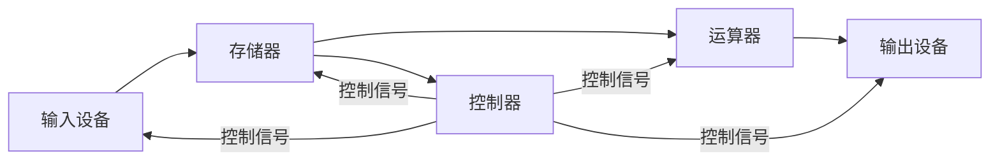
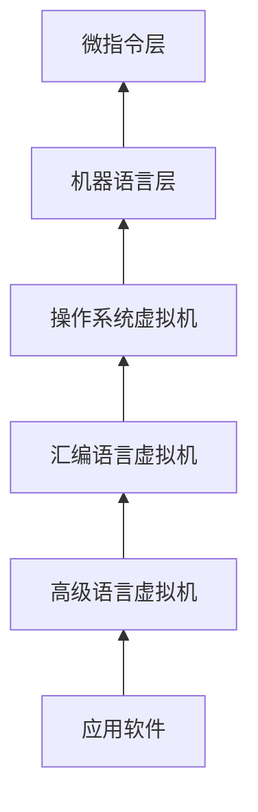

第一章 计算机系统概论,推迟了好久没写，补上

## 核心框架：**冯·诺依曼体系结构**

### 1. 核心思想

- **程序存储原理**：指令与数据共存于存储器，CPU 按序自动执行。
- **五大部件：运算器、控制器、存储器、输入设备、输出设备。**
- **二进制编码**：指令与数据均以二进制表示，指令含操作码（功能）和地址码（操作数位置）。
- **顺序执行+条件跳转**：指令默认顺序执行，运算结果可改变流程。

### 2. 关键历史节点

- **ENIAC（1946）**：首台电子计算机，无存储程序能力。
- **冯·诺依曼结构（1945）**：提出存储程序与五大部件模型，奠定现代计算机基础。

## 计算机硬件组成与工作过程

### 1. 硬件系统框图（重点）

- **运算器（ALU）**：执行算术/逻辑运算，核心为算术逻辑单元。
- **控制器**：发出时序信号，协调各部件（取指 → 译码 → 执行）。
- **存储器**：主存（内存）存储当前程序/数据，辅存（外存）长期存储。
- **总线**：地址总线（寻址）、数据总线（传输）、控制总线（操作同步）。

### 2. 工作过程详解（以计算 ax² + bx + c 为例）

1. **取指令**：控制器从存储器读取指令（如取数、乘法、加法）。
2. **译码**：解析操作码（如乘法操作）和地址码（操作数地址）。
3. **执行**：
   - 从存储器加载 a, x 到运算器，计算 ax；
   - 加载 b，计算 ax + b；
   - 乘以 x 后加 c，结果存回存储器。
4. **写回**：将最终结果输出或存储。

## 计算机系统层次结构

### 层次意义：

- 高级语言 → 汇编语言 → 机器语言 → 微指令，逐层翻译/解释执行。
- **操作系统层**：管理硬件资源

## 计算机性能指标

| 指标     | 公式/说明                         | 意义               |
| -------- | --------------------------------- | ------------------ |
| **主频** | $f = \frac{1}{T}$（T 为时钟周期） | CPU 工作频率       |
| **CPI**  | 总时钟周期数 / 指令条数           | 单指令耗时         |
| **MIPS** | 指令数 / (执行时间 × 10⁶)         | 每秒百万指令       |
| 存储容量 | 1KB = 2¹⁰B, 1MB = 2²⁰B            | 内存/外存容量      |
| **字长** | 32/64 位（影响精度与并行能力）    | 一次处理的数据位数 |

## 计算机分类与应用 （略）

### 分类：

- **超级计算机**（神威·太湖之光、天河系列）：科学计算（如气候模拟、核物理）。
- **嵌入式系统**（SOC）：智能设备核心（如物联网终端）。

### 应用领域：

- **实时控制**（工业自动化）
- **数据处理**（大数据）
- **人工智能**（机器学习）

---

第一章都是概述性内容，非常地水 💦💦💦
