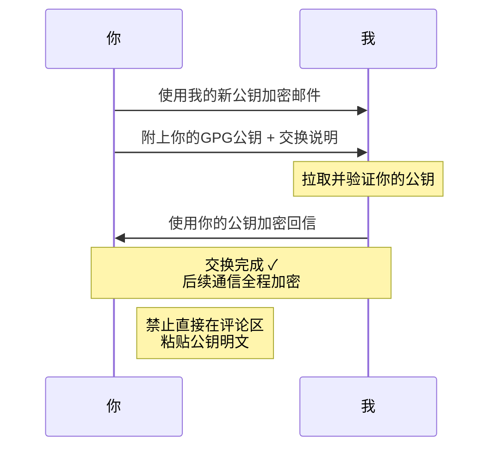

## 重要通知

我已废弃旧的 **GPG 公钥**，更换原因主要有两点：

1. 之前使用 **RSA** 加密算法，从中长期来看，量子计算机的发展会对其构成威胁；目前业界主流正在推进 **ECC (椭圆曲线加密)** 算法，我也跟进更换
2. 之前的公钥设置为**永久有效**，这不符合安全最佳实践，因此新公钥设置了**半年有效期**

基于以上原因，我决定重新生成 GPG 密钥，同时我也**废弃了教育邮箱的 GPG 密钥**，并且今后**不再为学生邮箱设置 GPG**——因为学校邮箱目前已经禁止第三方客户端登录使用了。

新公钥信息如下：

### 新公钥信息

- **邮箱**: `xingwangzhe@outlook.com`

- **密钥 ID**:

    ```
    3067B770E2103FA6
    ```

- **指纹**:

    ```
    3F18 8883 8EAA E1A4 EA68 D2D7 3067 B770 E210 3FA6
    ```

- **创建时间**: `2026-03-23`
- **有效期至**: `2026-09-23`

新公钥已上传至 [keys.openpgp.org](https://keys.openpgp.org/vks/v1/by-fingerprint/3F1888838EAAE1A4EA68D2D73067B770E2103FA6) 公钥托管服务器，你可以直接通过以下命令从服务器拉取：

```bash
gpg --keyserver keys.openpgp.org --recv-keys 3F1888838EAAE1A4EA68D2D73067B770E2103FA6
```

你也可以[直接下载此公钥](/xingwangzhe_public.asc)。

### 公钥交换说明

很抱歉无法逐一通知所有联系人，因此通过博客发布此公告。

如果你希望与我**交换 GPG 公钥**进行加密通信，请**不要**直接将你的公钥发在评论区。正确流程如下：


